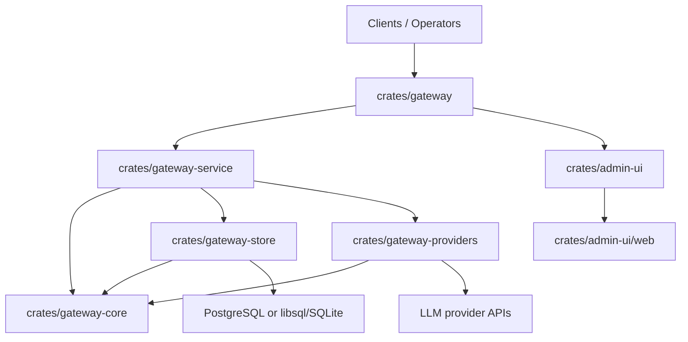

# Contributing

`Owns`: contributor setup, day-to-day repo workflow, CI/workflow map, and the workspace primer for maintainers.
`Depends on`: [README.md](README.md), [docs/index.md](docs/index.md), [mise.toml](mise.toml)
`See also`: [.github/pull_request_template.md](.github/pull_request_template.md), [.github/ISSUE_TEMPLATE/feature_request.md](.github/ISSUE_TEMPLATE/feature_request.md), [.github/ISSUE_TEMPLATE/bug_report.md](.github/ISSUE_TEMPLATE/bug_report.md), [docs/adr/2026-03-06-release-versioning-and-ghcr-publishing.md](docs/adr/2026-03-06-release-versioning-and-ghcr-publishing.md), [docs/reference/e2e-contract-tests.md](docs/reference/e2e-contract-tests.md)

This guide is the entry point for contributing to the repository. It intentionally links to source files for task definitions, workflow details, and architecture decisions instead of restating them here.

## Environment Setup

The repository standardizes local tooling through [`mise.toml`](mise.toml).

1. Install `mise`.
2. Activate it in your shell.
3. Install the repo toolchain.
4. Install admin UI dependencies.

```bash
eval "$(mise activate zsh)"
mise install
mise run ui-install
```

Notes:

- `mise activate zsh` is the upstream interactive-shell recommendation from the official mise docs. Using the full path is only necessary when `mise` is not already on `PATH`.
- `mise run` executes tasks with the repo's tool and environment context loaded, and mise will auto-install missing tools defined in [`mise.toml`](mise.toml) when needed.
- If `mise` warns that this repo config is untrusted on first use, run `mise trust` once for the workspace and rerun the command.

## Daily Workflow

Use [`mise.toml`](mise.toml) as the task catalog instead of memorizing ad hoc commands.

- Discover tasks: `mise run`
- Full local validation: `mise run lint` and `mise run test`
- Rust/Postgres-focused validation: `mise run check-rust-postgres`, `mise run test-rust-postgres`, `mise run test-gateway-postgres-smoke`
- Local runtime commands: `mise run dev-stack`, `mise run gateway-serve`, `mise run gateway-migrate`, `mise run gateway-bootstrap-admin`, `mise run gateway-seed-config`, `mise run gateway-seed-local-demo`, `mise run gateway-reset-local-demo`
- Production-shaped local runtime commands: `mise run prod-stack`, `mise run gateway-migrate-prod`, `mise run gateway-bootstrap-admin-prod`, `mise run gateway-seed-config-prod`
- Admin UI workflows: `mise run ui-dev`, `mise run ui-check`, `mise run ui-build`
- End-to-end suite: `mise run e2e-test`
- Docs site workflows: `mise run docs-install`, `mise run docs-dev`, `mise run docs-build`, `mise run docs-verify`

For local stack startup and runtime entry points, see [README.md](README.md). For deploy-oriented runs, see [deploy/README.md](deploy/README.md).

## Admin UI Local Development

The admin UI dev loop is more coupled to the gateway than a standalone SPA:

- direct `:3001` development still depends on gateway-backed admin APIs
- same-origin gateway proxying is the normal production contract
- backend route changes can require a gateway restart even when the UI server is already running

## System Primer

The workspace is split into a small set of Rust crates plus one web app. The gateway is the source of truth for API behavior, identity, budgets, routing, and admin APIs.

| Package | Purpose |
| --- | --- |
| [`crates/gateway`](crates/gateway) | HTTP runtime, CLI entry points, config loading, route wiring, and same-origin control-plane serving |
| [`crates/gateway-core`](crates/gateway-core) | shared domain types, protocol DTOs, traits, and cross-crate error contracts |
| [`crates/gateway-store`](crates/gateway-store) | PostgreSQL/libsql stores, migrations, and persistence adapters |
| [`crates/gateway-service`](crates/gateway-service) | business logic for auth, routing, accounting, request logging, and admin workflows |
| [`crates/gateway-providers`](crates/gateway-providers) | provider adapters and transport/client integrations |
| [`crates/admin-ui`](crates/admin-ui) | Rust reverse-proxy integration that mounts the web app behind `/admin*` |
| [`crates/admin-ui/web`](crates/admin-ui/web) | TanStack Start + React admin UI |



Canonical architecture docs:

- [docs/access/identity-and-access.md](docs/access/identity-and-access.md)
- [docs/configuration/model-routing-and-api-behavior.md](docs/configuration/model-routing-and-api-behavior.md)
- [docs/operations/budgets-and-spending.md](docs/operations/budgets-and-spending.md)
- [docs/operations/observability-and-request-logs.md](docs/operations/observability-and-request-logs.md)
- [docs/reference/data-relationships.md](docs/reference/data-relationships.md)

## Pull Requests And Issues

Follow the repository's GitHub scaffolding instead of inventing a parallel process.

- Pull requests should use [.github/pull_request_template.md](.github/pull_request_template.md).
- PR titles must follow Conventional Commits. The enforced pattern is defined in [.github/workflows/pr-title.yml](.github/workflows/pr-title.yml).
- Feature work should start from [.github/ISSUE_TEMPLATE/feature_request.md](.github/ISSUE_TEMPLATE/feature_request.md) when an issue is needed.
- Bugs should use [.github/ISSUE_TEMPLATE/bug_report.md](.github/ISSUE_TEMPLATE/bug_report.md).

General GitHub guidance verified against GitHub Docs:

- Keep pull requests small and single-purpose when possible.
- Review your own pull request before asking for review.
- Provide explicit context, linked issues, and reviewer guidance in the PR body.
- Re-request review after substantial updates.
- Track out-of-scope review feedback in a follow-up issue instead of silently expanding scope.

## GitHub Actions

The CI contract lives in the workflow files under [.github/workflows](.github/workflows).

| Workflow | Purpose |
| --- | --- |
| [.github/workflows/rust-ci.yml](.github/workflows/rust-ci.yml) | Rust linting, workspace tests, and PostgreSQL-backed checks |
| [.github/workflows/ui-ci.yml](.github/workflows/ui-ci.yml) | admin UI lint, test, and build via `mise run ui-check` |
| [.github/workflows/e2e-ci.yml](.github/workflows/e2e-ci.yml) | Playwright contract suite via `mise run e2e-test` |
| [.github/workflows/docs-ci.yml](.github/workflows/docs-ci.yml) | VitePress docs graph checks and static-site build via `mise run docs-verify` |
| [.github/workflows/pr-title.yml](.github/workflows/pr-title.yml) | PR title validation against Conventional Commit format |
| [.github/workflows/release.yml](.github/workflows/release.yml) | tag-driven image build, GHCR publish, provenance, and GitHub release steps |

Release rationale and the local-to-CI handoff are documented in [docs/adr/2026-03-06-release-versioning-and-ghcr-publishing.md](docs/adr/2026-03-06-release-versioning-and-ghcr-publishing.md).

## Pitchfork

There is no checked-in `pitchfork` configuration in this repository.

If you use Pitchfork locally, treat it as a personal Git workflow layer rather than a repo contract:

- keep branches and pull requests aligned with the repo's GitHub templates and workflow checks,
- rely on [`mise.toml`](mise.toml) and `.github/workflows/*` as the source of truth for validation,
- do not assume other contributors are using the same local Git automation.

## VS Code

Helpful extensions verified against official docs or marketplace pages:

- `rust-lang.rust-analyzer`: the recommended Rust extension; VS Code explicitly notes that `rust-lang.rust` is deprecated.
- `tamasfe.even-better-toml`: strong TOML support for files like [`mise.toml`](mise.toml).
- `github.vscode-github-actions`: workflow authoring, validation, and run inspection for `.github/workflows/*`.

Optional community additions:

- a Markdown/Mermaid preview extension if you want richer local rendering than GitHub's built-in Markdown preview.

## Where To Add Docs

Keep the docs site structure intact when you document new behavior:

- update [README.md](README.md) only for top-level product and local-run entry points,
- update [docs/index.md](docs/index.md) and [docs/.vitepress/config.mts](docs/.vitepress/config.mts) when adding a new canonical page,
- update the canonical doc that owns the behavior instead of copying policy into several files,
- add or update an ADR in [docs/adr](docs/adr) when the change is architectural,
- link to source files and workflow files when those are the true source of operational detail.

## Docs Maintenance

When behavior changes, update the owning page instead of adding a second explanation.

- startup flow, bootstrap admin, seeded API keys:
  - [docs/setup/runtime-bootstrap-and-access.md](docs/setup/runtime-bootstrap-and-access.md)
- topology, same-origin runtime model, local-vs-prod differences:
  - [docs/setup/deploy-and-operations.md](docs/setup/deploy-and-operations.md)
- recovery and upgrade steps:
  - [docs/operations/operator-runbooks.md](docs/operations/operator-runbooks.md)
- config syntax and defaults:
  - [docs/configuration/configuration-reference.md](docs/configuration/configuration-reference.md)
- identity lifecycle and ownership rules:
  - [docs/access/identity-and-access.md](docs/access/identity-and-access.md)
- OIDC and SSO boundary:
  - [docs/access/oidc-and-sso-status.md](docs/access/oidc-and-sso-status.md)
- admin contract generation and drift rules:
  - [docs/reference/admin-api-contract-workflow.md](docs/reference/admin-api-contract-workflow.md)
- request routing, pricing, spend, and logging as one path:
  - [docs/reference/request-lifecycle-and-failure-modes.md](docs/reference/request-lifecycle-and-failure-modes.md)

Run `mise run docs-check` after touching Markdown in the canonical docs set.
