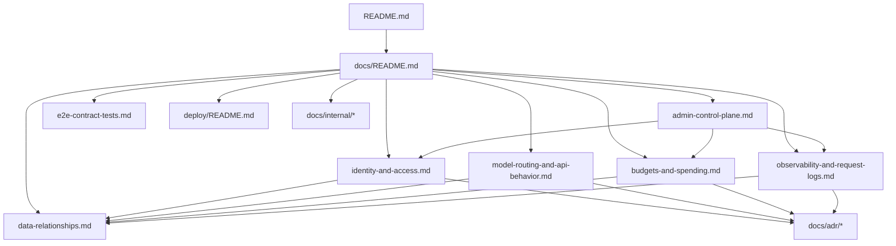

# Documentation Hub

`Owns`: the documentation map, canonical doc graph, and doc maturity overview.
`Depends on`: [../README.md](../README.md)
`See also`: [adr/](adr/), [internal/](internal/)

This repository uses a documentation graph instead of repeating the same policy in many files.

- Canonical docs own facts.
- ADRs explain why a decision was made.
- Internal docs capture background research and inception context.

## Start Here

| Type | Document | Owns |
| --- | --- | --- |
| Guide | [Identity and Access](identity-and-access.md) | bootstrap admin, users, teams, onboarding, OIDC status, access overlays |
| Guide | [Model Routing and API Behavior](model-routing-and-api-behavior.md) | model aliases, `tag:` selection, capabilities, `/v1/*` behavior |
| Guide | [Budgets and Spending](budgets-and-spending.md) | ledger semantics, budget enforcement, spend APIs, current deferrals |
| Guide | [Observability and Request Logs](observability-and-request-logs.md) | OTLP model, metrics/logging, payload capture, observability APIs |
| Reference | [Data Relationships](data-relationships.md) | tables, ownership graph, schema-level relationships |
| Guide | [Admin Control Plane](admin-control-plane.md) | what the admin UI can do today, and what is still preview-backed |
| Guide | [End-to-End Contract Tests](e2e-contract-tests.md) | test harness scope and extension rules |
| Guide | [../deploy/README.md](../deploy/README.md) | deploy compose usage |

## Graph

## Admin Surface Maturity

The admin UI is intentionally mixed maturity right now:

- Live gateway-backed surfaces: Identity, Spend Controls, Usage Costs, Request Logs, auth/session flows
- Preview-backed surfaces: API Keys, Models

That distinction is part of the current product contract. See [Admin Control Plane](admin-control-plane.md) for the operator-facing view and linked follow-up issues.

## ADRs

Use ADRs for decision history and rationale, not as the primary operator manual.

Suggested starting points:

- [Identity Foundation](adr/2026-03-05-identity-foundation.md)
- [Admin Team Management Flow](adr/2026-03-08-admin-team-management-flow.md)
- [Model Aliases and Provider Route Config](adr/2026-03-10-model-aliases-and-provider-route-config.md)
- [Capability-Aware Route Gating](adr/2026-03-13-capability-aware-route-gating.md)
- [V1 Runtime Simplification](adr/2026-03-15-v1-runtime-simplification.md)
- [Spend Control Plane Reporting and Team Hard Limits](adr/2026-03-15-spend-control-plane-reporting-and-team-hard-limits.md)
- [OTLP Observability and Request Log Payloads](adr/2026-03-15-otlp-observability-and-request-log-payloads.md)

## Internal Background

The docs in [internal/](internal/) remain useful background for maintainers:

- front-end stack evaluation
- provider API research
- inception architecture and MVP framing

Treat them as background context, not as the canonical operator contract.
