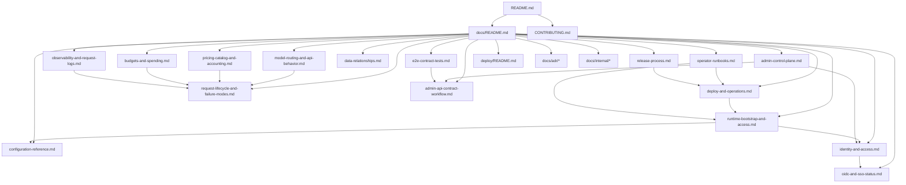

# Documentation Hub

`Owns`: the documentation map, the canonical doc graph, and the audience-level entry points into the repo docs.
`Depends on`: [../README.md](../README.md)
`See also`: [adr/](adr/), [internal/](internal/)

This repo uses a docs graph instead of repeating the same policy in many places.

- Canonical docs explain current behavior.
- ADRs explain why a decision was made.
- Internal notes hold background research that should not be treated as the live contract.

## Operator Guides

| Document | Owns |
| --- | --- |
| [Runtime Bootstrap and Access](runtime-bootstrap-and-access.md) | startup behavior, first access, bootstrap admin, seeded API keys |
| [Deploy and Operations](deploy-and-operations.md) | runtime topology, same-origin contract, local-vs-prod differences |
| [Operator Runbooks](operator-runbooks.md) | first deploy, upgrade, recovery, rotation checkpoints |
| [Configuration Reference](configuration-reference.md) | gateway YAML shape, defaults, validation, auth modes |
| [Identity and Access](identity-and-access.md) | users, teams, onboarding, ownership, access overlays |
| [OIDC and SSO Status](oidc-and-sso-status.md) | current OIDC boundary, hardened direction, missing test-IdP story |
| [Model Routing and API Behavior](model-routing-and-api-behavior.md) | model identity, selectors, planner inputs, `/v1/*` behavior |
| [Request Lifecycle and Failure Modes](request-lifecycle-and-failure-modes.md) | end-to-end request path across routing, logging, pricing, and spend |
| [Pricing Catalog and Accounting](pricing-catalog-and-accounting.md) | pricing inputs, effective-dated pricing rows, exact-only coverage |
| [Budgets and Spending](budgets-and-spending.md) | spend ledger rules, hard limits, budget alerts, spend APIs |
| [Observability and Request Logs](observability-and-request-logs.md) | OTLP model, request-log shape, payload policy, observability APIs |
| [Data Relationships](data-relationships.md) | schema-level relationships and cross-table invariants |
| [Admin Control Plane](admin-control-plane.md) | what the admin UI can do today and what is still preview-backed |
| [../deploy/README.md](../deploy/README.md) | compose quick start for GHCR deploys |

## Maintainer Guides

| Document | Owns |
| --- | --- |
| [../CONTRIBUTING.md](../CONTRIBUTING.md) | contributor setup, repo workflow, CI map |
| [Admin API Contract Workflow](admin-api-contract-workflow.md) | generated admin contract artifacts, drift rules, same-origin client boundary |
| [End-to-End Contract Tests](e2e-contract-tests.md) | E2E harness intent, scope rules, extension rules |
| [Release Process](release-process.md) | release authoring flow, tag-triggered CI, release verification |

## Decision History

Start here when the current docs are clear but the reasons are not.

- [Identity Foundation](adr/2026-03-05-identity-foundation.md)
- [Model Aliases and Provider Route Config](adr/2026-03-10-model-aliases-and-provider-route-config.md)
- [Capability-Aware Route Gating](adr/2026-03-13-capability-aware-route-gating.md)
- [OTLP Observability and Request Log Payloads](adr/2026-03-15-otlp-observability-and-request-log-payloads.md)
- [Generated Admin API Contract and Typed Same-Origin Client](adr/2026-03-28-generated-admin-api-contract-and-typed-same-origin-client.md)
- [Live Admin API-Key Management and Contract Coverage](adr/2026-03-29-live-admin-api-key-management-and-contract-coverage.md)

## Internal Background

The docs in [internal/](internal/) stay useful for maintainers:

- front-end stack research
- provider API research
- inception architecture notes

They are context, not policy.

## Common Questions

Use the map. Do not hunt through unrelated pages.

- Model shows up but fails:
  - [Model Routing and API Behavior](model-routing-and-api-behavior.md)
  - [Request Lifecycle and Failure Modes](request-lifecycle-and-failure-modes.md)
- Request succeeds but is not charged:
  - [Pricing Catalog and Accounting](pricing-catalog-and-accounting.md)
  - [Budgets and Spending](budgets-and-spending.md)
  - [Request Lifecycle and Failure Modes](request-lifecycle-and-failure-modes.md)
- Compose boot finishes but admin access is unclear:
  - [Runtime Bootstrap and Access](runtime-bootstrap-and-access.md)
  - [Deploy and Operations](deploy-and-operations.md)
  - [Operator Runbooks](operator-runbooks.md)
- Live admin contract changed and the UI drifted:
  - [Admin API Contract Workflow](admin-api-contract-workflow.md)
  - [End-to-End Contract Tests](e2e-contract-tests.md)

## Graph

