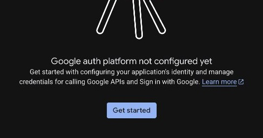
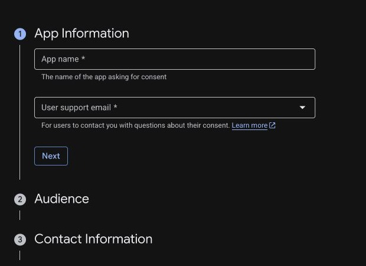

# Google OAuth 2.0 / OIDC SSO Setup for Admins

`See also`: [OIDC and SSO](oidc-and-sso-status.md), [Identity and Access](identity-and-access.md), [Configuration Reference](../configuration/configuration-reference.md)

Oceans LLM can use a Google Auth Platform **OAuth 2.0 Client** for admin sign-in today. Configure Google through Oceans' existing generic OIDC provider; no gateway code changes or separate Google provider type are required.

Google documents this authentication flow in [OpenID Connect](https://developers.google.com/identity/openid-connect/openid-connect).

## Before You Start

You need:

- a Google Cloud project where you can configure Google Auth Platform
- a public HTTPS URL for Oceans LLM, such as `https://oceans.example.com`
- permission to store the Google client secret in your deployment secret manager
- a decision about who may sign in and whether Oceans should create users through JIT provisioning

The callback URL for one deployment is:

```text
https://<your-oceans-host>/api/v1/auth/oidc/callback
```

Google requires an exact redirect URI match. Do not use a wildcard, change the path, or add a trailing slash.

## Choose the Google Audience

Choose the audience before creating the OAuth client. Google describes the account and publishing boundaries in [Manage App Audience](https://support.google.com/cloud/answer/15549945):

- **Internal** is recommended when Oceans is only for one Google Workspace or Cloud Identity organization. Google limits authorization to accounts in that organization. The Google Cloud project must belong to the organization for this option to be available.
- **External** permits Google Accounts outside your organization. Keep Oceans JIT provisioning disabled unless you intentionally want any Google identity accepted by the provider to be eligible for account creation.

::: warning External is not an Oceans access policy
Oceans requests only the basic `openid`, `email`, and `profile` identity scopes. Google states that users do not need to be on the External audience's test-user list when an app requests only these basic identity scopes. Use invited users with `jit.enabled: false`, or explicitly accept the broader JIT behavior.
:::

Oceans validates Google's stable `sub`, `email`, and `email_verified` claims. It does not enforce Google's Workspace `hd` claim and generic OIDC providers do not support `allowed_email_domains`. Use an Internal audience when Google must enforce organization membership.

## Configure Google Auth Platform

Open [Google Auth Platform](https://console.cloud.google.com/auth/overview) and select the project that will own the OAuth client.

If the project has not configured Google Auth Platform, choose **Get started**.



Complete the project configuration:

1. Under **App Information**, enter the name users should see, such as `Oceans LLM`, and select a monitored support email.
2. Under **Audience**, choose **Internal** or **External** using the access guidance above.
3. Under **Contact Information**, add an email that Google can use for project notifications.
4. Review the settings and choose **Create**.



In **Data Access**, keep the requested identity data limited to:

- `openid`
- `email`
- `profile`

Oceans does not need Google Drive, Gmail, Calendar, or other Google API scopes for SSO.

## Create the OAuth 2.0 Client

Open [Google Auth Platform → Clients](https://console.cloud.google.com/auth/clients), then:

1. Choose **Create client**.
2. Select **Web application** as the application type.
3. Enter an admin-recognizable name, such as `Oceans LLM production`.
4. Leave **Authorized JavaScript origins** empty. Oceans performs the authorization-code exchange on the gateway, not in browser JavaScript.
5. Under **Authorized redirect URIs**, add exactly:

   ```text
   https://<your-oceans-host>/api/v1/auth/oidc/callback
   ```

6. Choose **Create**.
7. Record the client ID and copy the client secret into your deployment secret manager. Do not put the secret in `gateway.yaml` or commit it to the repository.

Create a separate OAuth client for each Oceans deployment that has a different public callback URL.

## Store the Google Credentials

Expose the client secret and public Oceans URL to the gateway using deployment secrets or environment variables:

```text
GOOGLE_OIDC_CLIENT_SECRET=<google client secret>
GATEWAY_PUBLIC_BASE_URL=https://<your-oceans-host>
```

`GATEWAY_PUBLIC_BASE_URL` must resolve to the same public origin used in Google's authorized redirect URI.

Copy the Google client ID into the provider configuration. Google client IDs are public identifiers; generic OIDC `client_id` does not resolve an `env.*` reference in the current configuration contract.

## Configure Oceans LLM

Add Google under `auth.oidc.providers`:

```yaml
auth:
  oidc:
    public_base_url: env.GATEWAY_PUBLIC_BASE_URL
    providers:
      - key: google
        label: Google
        issuer_url: https://accounts.google.com
        client_id: <google client id>
        client_secret: env.GOOGLE_OIDC_CLIENT_SECRET
        scopes:
          - openid
          - email
          - profile
        enabled: true
        jit:
          enabled: false
          global_role: user
          request_logging_enabled: true
```

Keep `jit.enabled: false` for invite-only access. Admins can invite a user and select the `google` OIDC provider; the invited user activates the account on the first successful Google sign-in.

If you enable JIT:

- an Internal Google audience makes every eligible identity in the Google organization a potential Oceans user
- an External Google audience can make any eligible Google Account a potential Oceans user
- `global_role` and any configured team membership apply to every JIT-created Google user
- existing password users are not automatically linked by matching email

Do not grant `platform_admin` through JIT unless every identity allowed by the Google audience should receive that role.

## Validate Sign-In

After restarting or deploying the gateway:

1. Open `https://<your-oceans-host>/api/v1/auth/oidc/providers` and confirm the response includes the enabled `google` provider.
2. Open `https://<your-oceans-host>/admin/login`.
3. Choose **Sign in with Google**.
4. Complete Google sign-in with an eligible account.
5. Confirm the browser returns to `/admin` with an Oceans session.

For invite-only access, complete the test with an invited user whose normalized email matches the verified email returned by Google.

## Troubleshooting

### Google reports `redirect_uri_mismatch`

Compare Google's authorized redirect URI with the callback Oceans derives from `auth.oidc.public_base_url`. The scheme, host, port, path, case, and trailing slash must match exactly.

### Sign in with Google is not shown

Confirm the provider is enabled, its client secret resolves successfully, and the provider appears at `/api/v1/auth/oidc/providers`.

### Google sign-in succeeds but Oceans rejects the identity

Check the Oceans user policy:

- with JIT disabled, the user must have an invitation or config-declared OIDC link for provider key `google`
- a password user with the same email is not automatically converted or linked to Google SSO
- Google must return both `email` and `email_verified: true`
- disabled Oceans users remain denied

### A user outside the organization can reach Google sign-in

Confirm the Google audience is **Internal** and that the project belongs to the intended Google Workspace or Cloud Identity organization. Oceans does not enforce Google's `hd` claim itself.

## Security Notes

- Prefer an Internal audience for organization-only deployments.
- Keep JIT disabled unless the Google audience and assigned Oceans role are intentionally broad enough for automatic user creation.
- Keep the Google scopes limited to `openid`, `email`, and `profile`.
- Store the client secret in a secret manager and rotate it if it is exposed.
- Use HTTPS in production; Google permits HTTP redirect URIs only for localhost development.
- Treat Google audience configuration and Oceans user/JIT policy as separate controls and review both before enabling sign-in.
