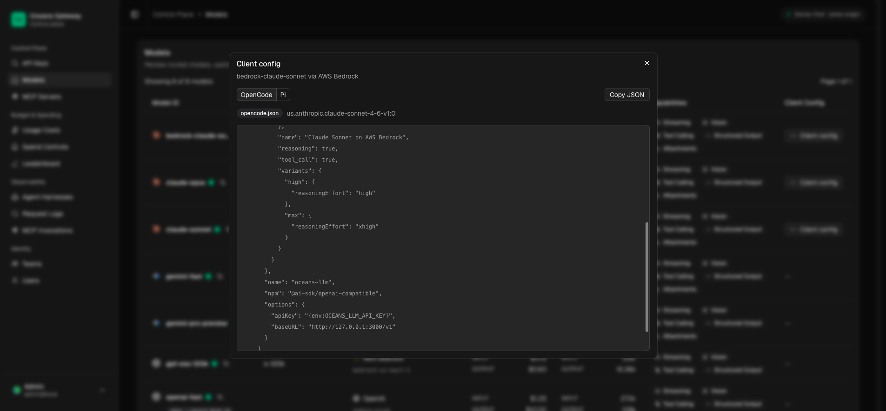

# Client Harness Configuration

`See also`: [Model Routing and API Behavior](model-routing-and-api-behavior.md), [Budgets](../access/budgets.md), [Budgets and Spending](../operations/budgets-and-spending.md)

Oceans generates client configuration snippets from the live model catalog so users can point local agent harnesses at the gateway without hand-writing model metadata.

Open `/admin/models`, select one or more configurable models, then click **Generate config**. You can also use the row-level client config action to generate a one-model snippet.

Generated snippets are available for:

- [OpenCode]
- [Pi]
- [Claude Code]

The snippets use the gateway model ids shown in the Models table. API keys are still created and governed in Oceans; the local client config only tells the harness which gateway URL, key variable, and model ids to use.

By default, snippets use the local development gateway base URL `http://127.0.0.1:3000/v1`. Production deployments should set `GATEWAY_CLIENT_CONFIG_BASE_URL` on the gateway process, or `gateway.clientConfigGatewayBaseUrl` in the Helm chart, to the public gateway API base URL users can reach, for example `https://gateway.example.com/v1`.

OpenCode and Pi can include multiple selected models in one generated file. When the selection mixes Anthropic Messages models and OpenAI-compatible models, Oceans emits separate provider entries so each provider keeps the correct client adapter. Claude Code only includes selected models that use Anthropic Messages; non-Anthropic selections are ignored for the Claude Code tab instead of generating invalid overrides.

## Claude Code

The Claude Code tab emits `.claude/settings.json` content with the SchemaStore Claude Code schema URL. The gateway settings block includes:

- `ANTHROPIC_AUTH_TOKEN`, set to a replaceable gateway API token placeholder
- `ANTHROPIC_BASE_URL`, set to the Claude-compatible gateway base URL
- `CLAUDE_CODE_ENABLE_GATEWAY_MODEL_DISCOVERY`, so Claude Code can discover gateway-routed models
- `ANTHROPIC_MODEL`, `ANTHROPIC_SMALL_FAST_MODEL`, and the matching default model class variable
- `modelOverrides`, mapping Claude Code's Anthropic model ids to the selected gateway model ids

Claude Code appends Anthropic endpoints such as `/v1/messages` and `/v1/models` to `ANTHROPIC_BASE_URL`. Do not include `/v1/messages` in the configured gateway URL. OpenCode and Pi still use the OpenAI-compatible `/v1` base URL, grouped by client API style when needed.

The same dialog also shows a second `settings.json` block for a smaller local Claude Code experience. It disables telemetry, experimental betas, 1M context, and related UI/reporting behavior, and sets a lower auto-compact window.

## Budgets And Access

Client snippets do not grant access by themselves. A request is accepted only when the gateway API key is active, the caller has model access, and any applicable hard budget still has room.

Budget scopes are independent of the client harness:

- human users can have an overall user budget
- service accounts must have an active service-account budget before active service-account API keys can be used
- human users can also have user model budgets for one gateway model or one upstream model name

Use `/admin/spend-controls` to configure those budgets. For the full taxonomy and setup workflow, see [Budgets](../access/budgets.md).

[opencode]: https://opencode.ai/
[pi]: https://pi.dev/
[claude code]: https://code.claude.com/docs/en/settings
