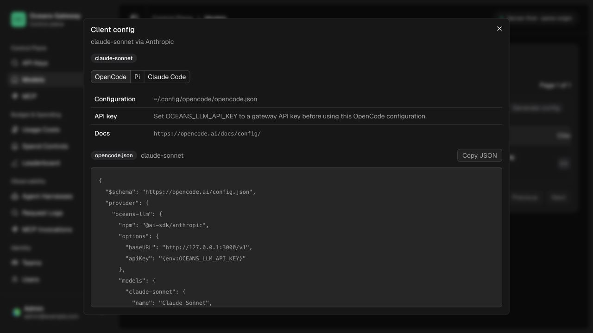

# Client Harness Configuration

`See also`: [Model Routing and APIs](model-routing-and-api-behavior.md), [Budgets](../access/budgets.md), [Budgets and Spending](../contributing/operations/budgets-and-spending.md)

Oceans generates client config snippets from the live model catalog. Users can point local agent harnesses at the gateway without writing model data by hand.

Open `/admin/models`, select one or more configurable models, then click **Generate config**. You can also use the row-level client config action to generate a one-model snippet.

Generated snippets are available for:

- [OpenCode]
- [Pi]
- [Claude Code]
- [Codex]

The snippets use the gateway model ids shown in the Models table. Users still create and manage API keys in Oceans. The local client config only tells the harness which gateway URL, key variable, and model ids to use.

By default, snippets use the local development gateway base URL `http://127.0.0.1:3000`. Production deployments should set `GATEWAY_CLIENT_CONFIG_BASE_URL` on the gateway process, or `gateway.clientConfigGatewayBaseUrl` in the Helm chart, to the public gateway URL users can reach, for example `https://api.oceans-llm.com`.

Base URL can change depending on API format and client harness. Experiment with adding or removing `/v1` if requests initially fail.

For a gateway hosted at `https://api.oceans-llm.com`, generated client configs use:

| Client harness | API format or provider | Generated base URL |
| --- | --- | --- |
| Claude Code | Anthropic Messages | `https://api.oceans-llm.com` |
| Codex | Responses API | `https://api.oceans-llm.com/v1` |
| OpenCode | `@ai-sdk/anthropic` | `https://api.oceans-llm.com` |
| OpenCode | `@ai-sdk/openai-compatible` | `https://api.oceans-llm.com/v1` |
| Pi | `anthropic-messages` | `https://api.oceans-llm.com` |
| Pi | `openai-completions` | `https://api.oceans-llm.com/v1` |

OpenCode and Pi can include many selected models in one generated file. When the selection mixes Anthropic Messages and OpenAI-compatible models, Oceans emits a provider entry for each client adapter. Claude Code includes only selected models that use Anthropic Messages. The Claude Code tab skips other selections instead of creating invalid overrides. Codex snippets require one Responses-capable model.

## OpenCode

The OpenCode tab emits `opencode.json` content for the user-level OpenCode configuration at `~/.config/opencode/opencode.json`. The dialog shows the configuration path, gateway API key environment variable, and [OpenCode configuration docs] before the copied JSON block.

## Pi

The Pi tab emits `models.json` content for Pi custom provider/model configuration. Pi settings are separate configuration: use `~/.pi/agent/settings.json` for global settings and `.pi/settings.json` for project overrides. The dialog shows those paths together with the generated provider configuration path and links to the [Pi settings docs].

Generated model data uses effective route pricing and conservative logical-model context limits from the Models API. Pi receives `cost.cacheRead` and `cost.cacheWrite` when those rates exist. A missing rate falls back to zero only when the effective route pricing omits it. OpenCode receives its supported input, output, and cache-read fields. If selectable routes have different prices, the Models API marks `pricing_varies_by_route`. Generated snippets use the primary display route's effective rates.

### Shell guardrail hook

The Oceans harness integration fixture adds a gateway pre-tool hook for Pi and an OpenCode `tool.execute.before` plugin hook. Both call `POST /api/v1/guardrails/evaluate` with the same `OCEANS_API_KEY` and `OCEANS_BASE_URL` used for model traffic. Install the generated hook beside the normal harness configuration and keep those environment variables out of checked-in files.

The hook must run directly before shell execution. A deny or evaluation failure prevents process creation. Audit decisions permit execution and return a decision ID for correlation. See [Gateway Guardrails](../operations/gateway-guardrails.md).

## Claude Code

The Claude Code tab emits `.claude/settings.json` content with the SchemaStore Claude Code schema URL. The gateway settings block includes:

- `ANTHROPIC_AUTH_TOKEN`, set to a replaceable gateway API token placeholder
- `ANTHROPIC_BASE_URL`, set to the Claude-compatible gateway base URL
- `CLAUDE_CODE_ENABLE_GATEWAY_MODEL_DISCOVERY`, so Claude Code can discover gateway-routed models
- `ANTHROPIC_MODEL`, `ANTHROPIC_SMALL_FAST_MODEL`, and the matching default model class variable
- `modelOverrides`, mapping Claude Code's Anthropic model ids to the selected gateway model ids

Claude Code appends Anthropic endpoints such as `/v1/messages` and `/v1/models` to `ANTHROPIC_BASE_URL`. Do not include `/v1/messages` in the configured gateway URL. OpenCode and Pi still use the OpenAI-compatible `/v1` base URL, grouped by client API style when needed.

The same dialog also shows a second `settings.json` block for a smaller local Claude Code experience. It disables telemetry, experimental betas, 1M context, and related UI/reporting behavior, and sets a lower auto-compact window.

## Codex

The Codex tab emits `config.toml` content for the user-level Codex configuration at `~/.codex/config.toml`. Codex ignores provider, auth, and telemetry keys from project-local `.codex/config.toml` files, so copy this block into the user-level config unless the Codex docs say otherwise.

Oceans includes Codex only when the selection contains one Responses-capable model. The generated TOML uses the selected gateway model id, configured gateway base URL, Oceans provider id/name, and gateway API-key environment variable. It also sets `wire_api = "responses"`, disables OpenAI auth for the proxy provider, disables analytics, disables OTEL prompt logging, and sets `model_reasoning_effort = "medium"` for a predictable default.

Responses-compatible Bedrock routes can still support only a subset of OpenAI-hosted tools. For example, Bedrock Mantle GPT-5.5 is usable through Codex over the Responses API but does not support the OpenAI-hosted `image_generation` tool; see [Provider API Compatibility](../reference/provider-api-compatibility.md#hosted-responses-tools).

## Budgets And Access

Client snippets do not grant access by themselves. The gateway accepts a request only when the API key is active, the caller has model access, and each hard budget still has room.

Budget scopes are independent of the client harness:

- human users can have a user budget
- service accounts must have an active service-account budget before their active API keys can make calls
- human users can also have user model budgets for one gateway model or one upstream model name

Use `/admin/spend-controls` to configure those budgets. For the full taxonomy and setup workflow, see [Budgets](../access/budgets.md).

[opencode]: https://opencode.ai/docs/config/
[pi]: https://github.com/earendil-works/pi/blob/main/packages/coding-agent/docs/settings.md
[opencode configuration docs]: https://opencode.ai/docs/config/
[pi settings docs]: https://github.com/earendil-works/pi/blob/main/packages/coding-agent/docs/settings.md
[claude code]: https://code.claude.com/docs/en/settings
[codex]: https://developers.openai.com/codex/config-reference
