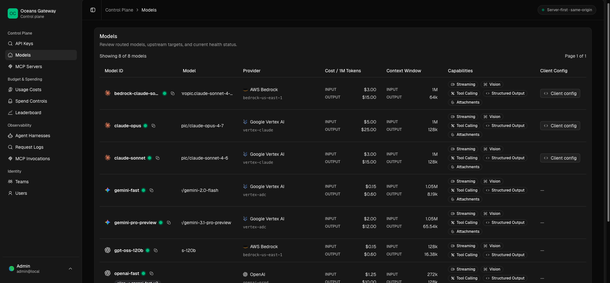

# Configuration Reference

`See also`: [Oceans LLM Gateway](../../README.md), [Runtime Bootstrap and Access](../setup/runtime-bootstrap-and-access.md), [Service Accounts](../access/service-accounts.md), [Model Routing and API Behavior](model-routing-and-api-behavior.md), [Pricing Catalog and Accounting](pricing-catalog-and-accounting.md), [OIDC and SSO](../access/oidc-and-sso-status.md)

This page owns config syntax and parse-time rules. It does not own the full runtime story after a request starts moving.



## Source of Truth

- config parsing and validation:
  - [../crates/gateway/src/config.rs](../../crates/gateway/src/config.rs)
- provider capability defaults:
  - [../crates/gateway-core/src/domain.rs](../../crates/gateway-core/src/domain.rs)
- checked-in examples:
  - [../gateway.yaml](../../gateway.yaml)
  - [../gateway.prod.yaml](../../gateway.prod.yaml)
  - [../deploy/config/gateway.yaml](../../deploy/config/gateway.yaml)

## Top-Level Sections

- `server`
- `database`
- `auth`
- `budget_alerts`
- `request_logging`
- `providers`
- `models`
- `teams`
- `users`

## Value Sources

The config supports literal values and env references.

Common patterns:

- `literal.admin`
- `env.OPENAI_API_KEY`
- `env.POSTGRES_URL`

The YAML holds structure. Secrets and deploy-specific values usually come from the environment.

## Minimal Local Example

```yaml
server:
  bind: "127.0.0.1:8080"

database:
  kind: libsql
  path: "./var/oceans.db"

auth:
  bootstrap_admin:
    email: "admin@local"
    password: "literal.admin"
    require_password_change: false

providers:
  - id: openai
    type: openai_compat
    base_url: "https://api.openai.com/v1"
    pricing_provider_id: openai
    auth:
      kind: bearer
      token: env.OPENAI_API_KEY

models:
  - id: gpt-4o-mini
    routes:
      - provider: openai
        upstream_model: gpt-4o-mini
```

## Production-Shaped Example

```yaml
server:
  bind: "0.0.0.0:8080"

database:
  kind: postgres
  url: env.POSTGRES_URL

auth:
  bootstrap_admin:
    email: "admin@local"
    password: env.GATEWAY_BOOTSTRAP_ADMIN_PASSWORD
    require_password_change: true

providers:
  - id: vertex
    type: gcp_vertex
    project_id: env.GCP_PROJECT_ID
    location: global
    auth:
      mode: service_account
      credentials_path: env.GCP_SERVICE_ACCOUNT_JSON

teams:
  - key: platform
    name: Platform
    budget:
      cadence: monthly
      amount_usd: "500.0000"
      hard_limit: true
      timezone: UTC

users:
  - name: Platform Admin
    email: ops@example.com
    auth_mode: password
    global_role: platform_admin
    membership:
      team: platform
      role: admin
    budget:
      cadence: monthly
      amount_usd: "100.0000"
      hard_limit: true
      timezone: UTC

models:
  - id: gemini-2.0-flash
    routes:
      - provider: vertex
        upstream_model: google/gemini-2.0-flash
```

The checked-in examples are opinionated. They are not the full config space.

## Defaults That Matter

Important defaults from config parsing and domain deserialization:

- model `rank` defaults to `100`
- route `priority` defaults to `100`
- route `weight` defaults to `1.0`
- route `enabled` defaults to `true`
- route capability flags default to all enabled
- Vertex `location` defaults to `global`
- Vertex `api_host` defaults to `aiplatform.googleapis.com`
- `request_logging.payloads.capture_mode` defaults to `redacted_payloads`
- `request_logging.payloads.request_max_bytes` defaults to `65536`
- `request_logging.payloads.response_max_bytes` defaults to `65536`
- `request_logging.payloads.stream_max_events` defaults to `128`
- `request_logging.purge.enabled` defaults to `false`
- `request_logging.purge.retention` defaults to `7d`

The startup meaning of bootstrap-admin lives in [runtime-bootstrap-and-access.md](../setup/runtime-bootstrap-and-access.md). Non-human data-plane access is managed through [service accounts](../access/service-accounts.md), not config-seeded legacy runtime keys.

## `server`

Important fields:

- `bind`
- `log_format`
- `otel_endpoint`
- `otel_metrics_endpoint`
- `otel_export_interval_secs`

For collector assumptions and request-log implications, see [observability-and-request-logs.md](../operations/observability-and-request-logs.md).

## `request_logging`

`request_logging.payloads` controls chat-completion request-log payload persistence.

```yaml
request_logging:
  payloads:
    capture_mode: redacted_payloads
    request_max_bytes: 65536
    response_max_bytes: 65536
    stream_max_events: 128
    redaction_paths: []
  purge:
    enabled: false
    retention: 7d
    schedule: "0 0 * * *"
```

Important fields:

- `capture_mode`
  - `disabled`: skip chat-completion request-log persistence
  - `summary_only`: write summary rows with `has_payload=false` and no payload row
  - `redacted_payloads`: write summary rows and sanitized payload rows
- `request_max_bytes`: final persisted request payload budget
- `response_max_bytes`: final persisted response payload budget
- `stream_max_events`: maximum stored stream events; stream usage and error parsing still sees later frames
- `redaction_paths`: additive admin-configured redaction paths anchored from the wrapped payload root

Purge fields:

- `purge.enabled`
  - defaults to `false`
  - when `true`, the gateway starts a recurring request-log purge worker
- `purge.retention`
  - defaults to `7d`
  - valid values are `1d`, `3d`, and `7d`
- `purge.schedule`
  - standard 5-field cron expression for the recurring purge worker
  - defaults to `0 0 * * *`
  - must describe a daily or less frequent schedule

Validation rules:

- byte limits must be greater than zero
- `stream_max_events` must be greater than zero
- `redaction_paths` use dot-separated object keys plus `*` as a full-segment wildcard
- malformed paths such as `body..messages` or indexed paths such as `body.messages[0]` are rejected at config parse time
- purge retention windows outside `1d`, `3d`, and `7d` are rejected
- recurring purge schedules more frequent than daily are rejected, and the runtime guard also prevents more than one purge per day

The runtime redaction/truncation policy, purge command, and admin display behavior are owned by [observability-and-request-logs.md](../operations/observability-and-request-logs.md).

## `database`

The checked-in configs use two runtime shapes:

- local development:
  - libsql or SQLite with `path`
- production-shaped and deploy flows:
  - PostgreSQL with `kind: postgres` and `url`

Important fields:

- `kind`
  - `libsql`
  - `postgres`
- `path`
  - libsql or SQLite database path
  - defaults to `./gateway.db`
- `url`
  - PostgreSQL connection URL
  - supports literal and env reference values
- `max_connections`
  - PostgreSQL pool size
  - defaults to `10`

If `kind` is omitted, the gateway infers `postgres` when `url` is present and `libsql` otherwise. `database.url` is required when `kind: postgres`.

## `auth`

Important fields:

- `bootstrap_admin`
- `oidc.public_base_url`
- `oidc.providers`
- `oauth.public_base_url`
- `oauth.providers`

Important distinctions:

- `bootstrap_admin` creates control-plane access
- `bootstrap_admin.require_password_change` changes first-login behavior
- `bootstrap_admin.password` must be `literal.*` or `env.*`

Seeded API keys are gateway caller credentials. They are useful for bootstrap automation and service-account workloads, but they are not upstream cloud provider service-account credentials. Each seeded key creates or reconciles an explicit gateway service account with an owning team and active budget.

Example seeded gateway key:

```yaml
auth:
  seed_api_keys:
    - name: ci-indexer
      value: env.CI_INDEXER_GATEWAY_API_KEY
      service_account:
        key: ci-indexer
        name: CI Indexer
        team: platform
        budget:
          cadence: daily
          amount_usd: "25.0000"
          hard_limit: true
          timezone: UTC
      allowed_models:
        - gpt-4o-mini
        - gemini-fast
```

Operational guidance:

- store gateway API-key values in the deployment secret manager, not in YAML
- grant only the gateway models the workload needs
- declare the owning team in `teams`
- set a service-account budget before activating service-account traffic
- rotate by creating or seeding a replacement key, moving the caller, then revoking or removing the old key

OIDC providers use authorization-code login with provider discovery and ID-token verification:

```yaml
auth:
  oidc:
    public_base_url: env.GATEWAY_PUBLIC_BASE_URL
    providers:
      - key: authentik
        label: Authentik
        issuer_url: https://auth.example.com/application/o/oceans-llm/
        client_id: oceans-llm
        client_secret: env.AUTHENTIK_OCEANS_LLM_CLIENT_SECRET
        scopes: [openid, email, profile]
        enabled: true
```

OAuth providers are separate from OIDC providers. GitHub is the first supported direct OAuth provider:

```yaml
auth:
  oauth:
    public_base_url: env.GATEWAY_PUBLIC_BASE_URL
    providers:
      - key: github
        label: GitHub
        provider_type: github
        client_id: env.GITHUB_OAUTH_CLIENT_ID
        client_secret: env.GITHUB_OAUTH_CLIENT_SECRET
        scopes: [read:user, user:email]
        enabled: true
        jit:
          enabled: false
```

For GitHub setup steps and callback URL rules, see [GitHub OAuth SSO Setup for Admins](../access/github-oauth-admin-setup.md).

For startup behavior and first access after boot, use [runtime-bootstrap-and-access.md](../setup/runtime-bootstrap-and-access.md).

## Declarative Teams And Users

`teams` and `users` extend the same startup seed path used for providers and models.

Important `teams` fields:

- `key`
- `name`
- `budget`

Important `users` fields:

- `name`
- `email`
- `auth_mode`
- `global_role`
- `request_logging_enabled`
- `oidc_provider_key`
- `oauth_provider_key`
- `membership.team`
- `membership.role`
- `budget`

Validation rules that matter:

- team keys must be unique
- `system-legacy` has no reserved meaning and is not a compatibility owner
- user emails are normalized and must be unique
- `admin@local` is reserved for the bootstrap admin
- `users[*].auth_mode` supports `password`, `oidc`, and `oauth`
- `oidc_provider_key` is required for `oidc` users and rejected for `password` and `oauth` users
- `oauth_provider_key` is required for `oauth` users and rejected for `password` and `oidc` users
- membership roles can be `admin` or `member`
- membership role `owner` is rejected
- budget amounts must be non-negative

Seed semantics that matter:

- listed teams are upserted by `teams[*].key`
- listed users are upserted by normalized email
- new config-seeded users are created as `invited`
- listed membership and active-budget state is reconciled for listed users and teams
- omitting a `budget` block for a listed user or team deactivates that owner's active budget
- unlisted teams and users are left untouched

OIDC and OAuth provider existence is validated at seed time against enabled runtime providers, not YAML parse time.

Service accounts are managed by admins. They are not a replacement spelling for `auth.seed_api_keys`.

## `budget_alerts`

`budget_alerts.email` controls the background email dispatcher for threshold alerts created by budget enforcement and budget updates.

```yaml
budget_alerts:
  email:
    from_email: alerts@example.com
    from_name: "Oceans LLM"
    poll_interval_secs: 30
    batch_size: 25
    transport:
      kind: sink
```

Important fields:

- `from_email`
  - defaults to `alerts@local`
  - cannot be empty
- `from_name`
  - optional display name
- `poll_interval_secs`
  - defaults to `30`
  - must be greater than zero
- `batch_size`
  - defaults to `25`
  - must be greater than zero
- `transport.kind`
  - `sink`: persist alert delivery rows without sending email
  - `smtp`: send through SMTP

SMTP transport fields:

- `host`
- `port`
  - defaults to `587`
- `username`
- `password`
- `starttls`
  - defaults to `true`

`username` and `password` must be set together when SMTP authentication is used. `password` supports the same secret-reference forms as other config secrets.

## Provider Types

Supported provider types in the checked-in configs:

- `openai_compat`
- `gcp_cloud_run_openai_compat`
- `gcp_vertex`
- `aws_bedrock`

### Provider Auth Modes

| Provider type | Auth field | Expected secret material |
| --- | --- | --- |
| `openai_compat` | `auth.token` | bearer-style token |
| `gcp_cloud_run_openai_compat` | `auth.mode: adc` | Google ADC or metadata-server identity credentials that can mint Cloud Run ID tokens |
| `gcp_cloud_run_openai_compat` | `auth.mode: service_account` | Google Cloud service-account JSON through `credentials_path` or an equivalent mounted secret path |
| `gcp_cloud_run_openai_compat` | `auth.mode: bearer` | pre-minted Cloud Run ID token for constrained debugging only |
| `gcp_vertex` | `auth.mode: adc` | ADC available in the runtime environment |
| `gcp_vertex` | `auth.mode: service_account` | upstream Google Cloud service-account JSON through `credentials_path` or an equivalent mounted secret path |
| `aws_bedrock` | `auth.mode: bearer` | Bedrock bearer token, often `env.AWS_BEARER_TOKEN_BEDROCK` |

Provider auth config controls how the gateway authenticates to upstream providers. It is separate from gateway API keys, which authenticate callers to the gateway.

### `openai_compat`

Important fields:

- `id`
- `base_url`
- `pricing_provider_id`
- `auth.kind`
- `auth.token`
- optional `display.label`
- optional `display.icon_key`

`display.icon_key` currently accepts the checked-in provider icon codes used by the admin UI:

- `openai`
- `openrouter`
- `anthropic`
- `aws`
- `vertexai`

Validation rules that matter:

- `pricing_provider_id` cannot be empty
- `pricing_provider_id` must map to a supported internal pricing family

### `gcp_cloud_run_openai_compat`

Important fields:

- `id`
- `base_url`
- `audience`
  - optional
  - defaults to the HTTPS service origin from `base_url`
- `pricing_provider_id`
- `auth.mode`
  - `adc`
  - `service_account`
  - `bearer`
- `auth_header`
  - optional
  - `authorization`
  - `x_serverless_authorization`
- optional `display.label`
- optional `display.icon_key`

Example:

```yaml
providers:
  - id: gemma-cloud-run
    type: gcp_cloud_run_openai_compat
    base_url: https://gemma-service-abc-uc.a.run.app/v1
    pricing_provider_id: google-vertex
    auth:
      mode: adc
```

Validation rules that matter:

- `base_url` must be an absolute HTTPS URL with a host
- `audience`, when set, cannot be empty
- `pricing_provider_id` cannot be empty
- `pricing_provider_id` must map to a supported internal pricing family
- `service_account.credentials_path` and `bearer.token` cannot be empty
- unknown provider or auth fields are rejected

Provider-specific examples live in [Google Cloud Run OpenAI-Compatible Models](../providers/gcp-cloud-run-openai-compat.md).

### `gcp_vertex`

Important fields:

- `id`
- `project_id`
- `location`
- `api_host`
- `auth.mode`
- optional `display.label`
- optional `display.icon_key`

Routing and pricing caveats:

- `upstream_model` must use `<publisher>/<model_id>`
- pricing identity is inferred from the publisher prefix
- Anthropic-on-Vertex pricing is only supported for `location=global`
- provider-specific configuration examples live in [Google Vertex AI](../providers/gcp-vertex.md)

### `aws_bedrock`

Important fields:

- `id`
- `region`
- `endpoint_kind`
  - required
  - `bedrock_runtime` or `bedrock_mantle`
- `endpoint_url`
  - optional
  - defaults to `https://bedrock-runtime.{region}.amazonaws.com` for `bedrock_runtime`
  - defaults to `https://bedrock-mantle.{region}.api.aws` for `bedrock_mantle`
- `auth.mode`
- `default_headers`
- `timeouts.total_ms`
- optional `display.label`
- optional `display.icon_key`

Runnable auth mode:

```yaml
providers:
  - id: bedrock-api-key
    type: aws_bedrock
    region: us-east-1
    endpoint_kind: bedrock_runtime
    auth:
      mode: bearer
      token: env.AWS_BEARER_TOKEN_BEDROCK
```

`default_chain` and `static_credentials` use IAM SigV4 signing. Runtime providers sign with service `bedrock`; Mantle providers sign with service `bedrock-mantle`. `bearer` remains available for bearer-token based Bedrock access where applicable.

Routing caveats:

- `upstream_model` should be the model identity accepted by the configured Bedrock endpoint and API style.
- every `aws_bedrock` route requires `compatibility.aws_bedrock.api_style`.
- OpenAI-shaped API styles require `compatibility.aws_bedrock.openai_base_path`, for example `/openai/v1`.
- Route `extra_headers` is the supported way to proxy provider headers such as `OpenAI-Project`; arbitrary inbound caller headers are not forwarded to providers.
- Validate documentation-only updates with `mise run docs-check`.

## Model Config

Configured gateway models are either:

- provider-backed models with `routes`
- alias-backed models with `alias_of`

A model cannot be both.

Important fields:

- `id`
- `description`
- `tags`
- `rank`
- `routes`
- `alias_of`

## Route Config

Important fields:

- `provider`
- `upstream_model`
- `priority`
- `weight`
- `enabled`
- `capabilities`
- `compatibility`
- `extra_headers`
- `extra_body`

Capability flags default permissively. A route can constrain provider capability. It cannot expand provider truth.

Compatibility metadata is separate from capabilities. Capabilities decide whether a route may execute; compatibility describes explicit request and stream-shape transforms for the selected provider route.

Capability flags include API-family gates such as `chat_completions`, `responses`, and `embeddings`, plus feature gates such as `stream`, `tools`, `vision`, `json_schema`, and `developer_role`.

OpenAI-compatible route profile:

```yaml
models:
  - id: fast
    routes:
      - provider: openrouter
        upstream_model: openai/gpt-4o-mini
        compatibility:
          openai_compat:
            supports_store: false
            max_tokens_field: max_tokens
            developer_role: system
            reasoning_effort: omit
            supports_stream_usage: true
```

AWS Bedrock route profile:

```yaml
models:
  - id: gpt-55-bedrock
    routes:
      - provider: bedrock-mantle-openai
        upstream_model: openai.gpt-5.5
        capabilities:
          chat_completions: false
          responses: true
          stream: true
          embeddings: false
          json_schema: true
        extra_headers:
          OpenAI-Project: proj_123
        compatibility:
          aws_bedrock:
            api_style: mantle_openai_responses
            openai_base_path: /openai/v1
```

`compatibility.aws_bedrock.api_style` values:

- `runtime_converse`
- `runtime_anthropic_invoke`
- `runtime_openai_chat`
- `mantle_openai_responses`
- `mantle_openai_chat`
- `mantle_anthropic_messages`

OpenAI-compatible profile defaults:

| Field | Default | Supported values |
| --- | --- | --- |
| `supports_store` | `true` | `true`, `false` |
| `max_tokens_field` | `max_completion_tokens` | `max_completion_tokens`, `max_tokens` |
| `developer_role` | `developer` | `developer`, `system` |
| `reasoning_effort` | `passthrough` | `passthrough`, `omit`, `reasoning_object` |
| `supports_stream_usage` | `false` | `true`, `false` |

The current `openai_compat` profile fields are Chat Completions transforms. `/v1/responses` is a separate supported API family and is not adapted by reusing Chat Completions compatibility shims.

Do not use `extra_body` for compatibility transforms. `extra_body` remains for additive provider-specific overrides, and the typed compatibility profile remains authoritative when a declared transform conflicts with an additive override.

## Route Examples

OpenAI direct routes usually need no compatibility overrides:

```yaml
models:
  - id: openai-direct
    routes:
      - provider: openai-prod
        upstream_model: gpt-5
```

OpenAI-compatible aggregator routes should declare known Chat Completions quirks explicitly:

```yaml
models:
  - id: openrouter-fast
    routes:
      - provider: openrouter
        upstream_model: openai/gpt-4o-mini
        compatibility:
          openai_compat:
            supports_store: false
            max_tokens_field: max_tokens
            developer_role: system
            reasoning_effort: omit
            supports_stream_usage: true
```

Vertex Google routes use the Vertex provider and a publisher-qualified upstream model:

```yaml
models:
  - id: gemini-fast
    routes:
      - provider: vertex-adc
        upstream_model: google/gemini-2.0-flash
        capabilities:
          chat_completions: true
          responses: false
          embeddings: false
```

Cloud Run vLLM routes use the Cloud Run OpenAI-compatible provider and can set tested vLLM/Gemma request controls through `extra_body`:

```yaml
models:
  - id: gemma-cloud-run
    routes:
      - provider: gemma-cloud-run
        upstream_model: google/gemma-4-12b-it
        capabilities:
          chat_completions: true
          responses: false
          embeddings: false
        extra_body:
          chat_template_kwargs:
            enable_thinking: true
          skip_special_tokens: false
```

Bedrock routes can execute Chat Completions through Claude native Messages, Converse, and ConverseStream depending on the upstream model and request shape. Keep Responses and embeddings disabled:

```yaml
models:
  - id: claude-bedrock
    routes:
      - provider: bedrock
        upstream_model: us.anthropic.claude-3-5-sonnet-20240620-v1:0
        compatibility:
          aws_bedrock:
            api_style: runtime_converse
        capabilities:
          chat_completions: true
          responses: false
          embeddings: false
          stream: true
          json_schema: false
```

OpenAI-compatible embeddings-only routes should narrow route capability so chat and Responses requests fail early:

```yaml
models:
  - id: text-embedding
    routes:
      - provider: openai-prod
        upstream_model: text-embedding-3-small
        capabilities:
          chat_completions: false
          responses: false
          embeddings: true
          stream: false
```

## Validation and Failure Boundaries

Config load catches several classes of failure up front:

- invalid or empty provider fields
- unsupported pricing-provider mappings
- invalid alias references
- invalid route or provider wiring

Later failures are usually runtime problems such as:

- request resolution failure
- missing providers
- capability mismatch
- exact-pricing gaps

## Current Boundaries

- Declarative teams, password users, OIDC users, memberships, active budgets, and OIDC providers are part of the current seed contract.
- OIDC JIT defaults are provider configuration, not claim or group mapping.
- Existing password users are not auto-linked to SSO users by email.

## What This Page Does Not Own

- startup behavior and first access:
  - [runtime-bootstrap-and-access.md](../setup/runtime-bootstrap-and-access.md)
- request routing and `/v1/*` behavior:
  - [model-routing-and-api-behavior.md](model-routing-and-api-behavior.md)
- cross-cutting request cause and effect:
  - [request-lifecycle-and-failure-modes.md](../reference/request-lifecycle-and-failure-modes.md)
- spend windows and budget policy:
  - [budgets-and-spending.md](../operations/budgets-and-spending.md)
- OIDC and SSO behavior:
  - [oidc-and-sso-status.md](../access/oidc-and-sso-status.md)
