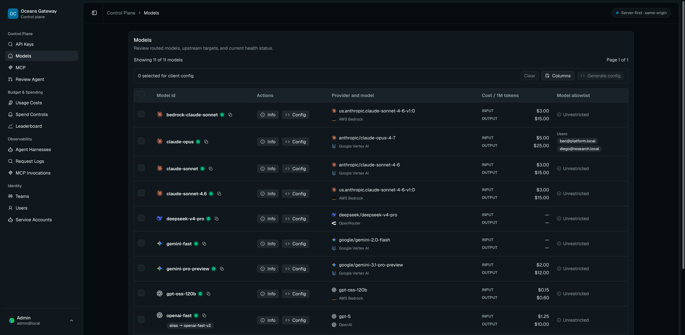

# Configuration Reference

`See also`: [Oceans LLM Gateway](../../README.md), [Runtime Bootstrap and Access](../setup/runtime-bootstrap-and-access.md), [Identity and Access](../access/identity-and-access.md), [Service Accounts](../access/service-accounts.md), [Model Routing and API Behavior](model-routing-and-api-behavior.md), [Pricing Catalog and Accounting](pricing-catalog-and-accounting.md), [OIDC and SSO](../access/oidc-and-sso-status.md), [ADR: Configurable Admin Page Permissions](../adr/2026-08-05-configurable-admin-page-permissions.md)

This page owns config syntax and parse-time rules. It does not own the full runtime story after a request starts moving.



## Source of Truth

- config parsing and validation:
  - [../crates/gateway/src/config.rs](../../crates/gateway/src/config.rs)
- provider capability defaults:
  - [../crates/gateway-core/src/domain.rs](../../crates/gateway-core/src/domain.rs)
- checked-in examples:
  - [../gateway.yaml](../../gateway.yaml)
  - [../gateway.prod.yaml](../../gateway.prod.yaml)
  - [../deploy/config/gateway.yaml](../../deploy/config/gateway.yaml)

## Top-Level Sections

- `server`
- `database`
- `auth`
- `permissions`
- `mcp`
- `budgets`
- `budget_alerts`
- `request_logging`
- `agent_analysis`
- `providers`
- `models`
- `teams`
- `users`

## Value Sources

The config supports literal values and env references.

Common patterns:

- `literal.admin`
- `env.OPENAI_API_KEY`
- `env.POSTGRES_URL`

The YAML holds structure. Secrets and deploy-specific values usually come from the environment.

## Minimal Local Example

```yaml
server:
  bind: "127.0.0.1:8080"

database:
  kind: libsql
  path: "./var/oceans.db"

auth:
  bootstrap_admin:
    email: "admin@local"
    password: "literal.admin"
    require_password_change: false

providers:
  - id: openai
    type: openai_compat
    base_url: "https://api.openai.com/v1"
    pricing_provider_id: openai
    auth:
      kind: bearer
      token: env.OPENAI_API_KEY

models:
  - id: gpt-4o-mini
    routes:
      - provider: openai
        upstream_model: gpt-4o-mini
```

### Route metadata overrides

Route metadata is deployment policy, so it lives on each `models[*].routes[*]` entry:

```yaml
models:
  - id: contracted-model
    routes:
      - provider: private-provider
        upstream_model: upstream-model
        context_window_tokens: 128000
        pricing_override:
          input_usd_per_million_tokens: "1.2500"
          output_usd_per_million_tokens: "5.0000"
          cache_read_usd_per_million_tokens: "0.1250"
          cache_write_usd_per_million_tokens: "1.5000"
```

`context_window_tokens` is an optional positive integer. It caps the effective route context but cannot raise a known catalog context limit. Startup rejects a configured cap above a known catalog limit; when catalog context is unknown, the configured value is accepted as admin policy.

`pricing_override` is optional. When present, `input_usd_per_million_tokens` and `output_usd_per_million_tokens` are required. Cache rates are optional and remain absent when omitted; they do not fall back to catalog cache rates. All rates use exact fixed-point decimal strings with at most four fractional digits. Zero is valid; negative, malformed, floating-point, and overflowing values are rejected.

## Agent Session Analysis

Use `agent_analysis` for passive collection and access gates. It also owns retention, metric groups, context limits, and cache rules:

```yaml
agent_analysis:
  enabled: true
  shadow_diagnostics_enabled: false
  calibrated_score_enabled: false
  calibration_approval_id: null
  team_admin_enabled: false
  report_retention_days: 90
  queue_retention_days: 7
  context_input_boundary_tokens: 220000
  context_reserved_output_tokens: 128000
  context_penalty_points_per_repeated_excess: 2
  metrics:
    tokens: true
    cache: true
    context: true
    tools: true
    skills: true
    reliability: true
    outcomes: true
    finish_reasons: true
  cache_profiles:
    - provider_key_contains: anthropic
      upstream_model_contains: claude-opus
      minimum_cacheable_tokens: 4096
      default_ttl: five_minutes
```

Unknown fields fail parsing. Retention can be at most 36,500 days. The input boundary must be positive. A cache minimum must also be positive. Reserved output can be zero. Each cache profile needs a provider key, model, or both. `default_ttl` accepts `five_minutes`, `thirty_minutes`, `one_hour`, or `unknown`.

Calibrated scores need a trimmed `calibration_approval_id`. It can use at most 256 bytes. Team-admin access needs calibrated scores. Older `AGENT_ANALYSIS_*` environment variables can override some fields. They cover collection, access, approval, and retention. Use YAML while new metric settings roll out. Metric, context, and cache-profile changes create a new report version. Use `mise run gateway-recompute-agent-analysis` to queue retained reports.

See [Agent Session Analysis](../operations/agent-session-analysis.md) for operator behavior. See [Agent Session Analysis Architecture](../contributing/reference/agent-session-analysis.md) for code ownership.
### GitHub Copilot provider and route evidence

GitHub App authentication requires all four identity and scope fields. `repository_id` is the numeric ID of the one repository placed in each installation-token request. It is required and must be greater than zero. If it is absent, config parsing stops with `missing field repository_id`.

`private_key` accepts a mounted file path. An `env.*` or `literal.*` value can resolve to either a PEM value or a file path. The gateway reads and parses the key when it builds the provider during startup.

Copilot route compatibility is fail-closed. Copy support only from a current `/models` response for the exact `upstream_model`. The [GitHub Copilot Installation-Token Canary](../operations/github-copilot-installation-canary.md) produces the required safe projection.

```yaml
providers:
  - id: copilot-org
    type: github_copilot
    auth:
      mode: github_app
      app_id: 123456
      private_key: /run/secrets/copilot-app-private-key.pem
      installation_id: 23456789
      repository_id: 345678901

models:
  - id: copilot-chat
    routes:
      - provider: copilot-org
        upstream_model: <exact-model-id-from-canary>
        compatibility:
          github_copilot:
            chat_api: chat_completions
            supports_responses: false
            supports_embeddings: false
            upstream_supports:
              streaming: true
              tool_calls: true
              vision: true
              structured_outputs: false
        capabilities:
          chat_completions: true
          responses: false
          embeddings: false
          stream: true
          tools: true
          vision: true
          json_schema: false
          developer_role: false
```

`chat_api` is optional for Responses-only or embeddings-only routes. For chat routes, set it to `chat_completions` only when `supported_endpoints` contains `/chat/completions`, or to `anthropic_messages` only when it contains `/v1/messages`. `supports_responses` and `supports_embeddings` default to `false`. Each `upstream_supports` field also defaults to `false`.

The `compatibility.github_copilot` fields are upstream evidence. The route `capabilities` fields are admin policy. Runtime eligibility uses their conservative intersection, so policy cannot enable support that the upstream evidence does not declare. `developer_role` remains disabled because the current Copilot model inventory does not expose evidence for it.

## Production-Shaped Example

```yaml
server:
  bind: "0.0.0.0:8080"

database:
  kind: postgres
  url: env.POSTGRES_URL

auth:
  bootstrap_admin:
    email: "admin@local"
    password: env.GATEWAY_BOOTSTRAP_ADMIN_PASSWORD
    require_password_change: true

budgets:
  users:
    default:
      cadence: daily
      amount_usd: "70.0000"
      hard_limit: true
      timezone: UTC
    model_defaults:
      - model: gemini-2.0-flash
        budget:
          cadence: daily
          amount_usd: "40.0000"
          hard_limit: true
          timezone: UTC

providers:
  - id: vertex
    type: gcp_vertex
    project_id: env.GCP_PROJECT_ID
    location: global
    auth:
      mode: service_account
      credentials_path: env.GCP_SERVICE_ACCOUNT_JSON

teams:
  - id: platform
    name: Platform

users:
  - name: Platform Admin
    email: ops@example.com
    auth_mode: password
    global_role: platform_admin
    membership:
      team: platform
      role: admin
    budget:
      cadence: monthly
      amount_usd: "100.0000"
      hard_limit: true
      timezone: UTC

models:
  - id: gemini-2.0-flash
    routes:
      - provider: vertex
        upstream_model: google/gemini-2.0-flash
        capabilities:
          chat_completions: true
          responses: false
          embeddings: false
          stream: true
          tools: false
          vision: true
          json_schema: false
```

The checked-in examples are opinionated. They are not the full config space.

## Defaults That Matter

Important defaults from config parsing and domain deserialization:

- model `rank` defaults to `100`
- route `priority` defaults to `100`
- route `weight` defaults to `1.0`
- route `enabled` defaults to `true`
- route capability flags default to all enabled
- Vertex `location` defaults to `global`
- Vertex `api_host` defaults to `aiplatform.googleapis.com`
- `request_logging.payloads.capture_mode` defaults to `redacted_payloads`
- `request_logging.payloads.request_max_bytes` defaults to `131072` and cannot exceed the `262144` absolute inline ceiling
- `request_logging.payloads.response_max_bytes` defaults to `65536`
- `request_logging.payloads.stream_max_events` defaults to `128`
- `request_logging.purge.enabled` defaults to `false`
- `request_logging.purge.retention` defaults to `7d`
- `budgets.users.default` is absent by default; when present, it creates inherited user budgets for all human users
- `budgets.users.model_defaults` is empty by default; entries create inherited user model budgets for all human users for selected gateway models
- `permissions.users.pages` defaults to the 10 shared console pages
- `permissions.team_admins.pages` has no direct default grants and inherits the user pages
- `permissions.platform_admins.pages` defaults to `mcp`, `review_agent`, and `spend_controls`, then inherits both lower groups
- `permissions.users.actions` defaults to create, update, and revoke for personal API keys
- `permissions.team_admins.actions` defaults to reveal for team service-account keys, then inherits the user actions
- `permissions.platform_admins.actions` has no direct default grants and inherits both lower groups

The startup meaning of bootstrap-admin lives in [runtime-bootstrap-and-access.md](../setup/runtime-bootstrap-and-access.md). Non-human data-plane access is managed through [service accounts](../access/service-accounts.md), not config-seeded legacy runtime keys.

## `permissions`

`permissions` controls which signed-in admin UI pages each group can open and which configured admin actions each group can use. Page grants control UI visibility only. Action grants are enforced by the API and the UI. An action grant does not remove ownership, team scope, active-session, or resource-state checks.

```yaml
permissions:
  users:
    pages:
      - api_keys
      - models
      - usage_costs
      - leaderboard
      - agent_harnesses
      - request_logs
      - mcp_invocations
      - teams
      - users
      - service_accounts
    actions:
      - create_api_key
      - update_api_key
      - revoke_api_key
    default_page: usage_costs
  team_admins:
    pages: []
    actions:
      - reveal_api_key
    default_page: usage_costs
  platform_admins:
    pages:
      - mcp
      - review_agent
      - spend_controls
    actions: []
    default_page: api_keys
```

Each `pages` list contains direct grants for that group. The gateway forms effective sets with these unions:

- `users`: `users.pages`
- `team_admins`: `users.pages` plus `team_admins.pages`
- `platform_admins`: all three `pages` lists

Each `actions` list uses the same direct-grant and inheritance rules:

- `users`: `users.actions`
- `team_admins`: `users.actions` plus `team_admins.actions`
- `platform_admins`: all three `actions` lists

Repeated page or action names are valid and appear once in the effective set. An explicit empty list removes that group's direct grants, but inherited grants still apply. If a group, `pages`, or `actions` field is absent, the gateway uses the direct defaults shown above.

The valid page names are `api_keys`, `models`, `mcp`, `review_agent`, `usage_costs`, `spend_controls`, `leaderboard`, `agent_harnesses`, `request_logs`, `mcp_invocations`, `teams`, `users`, and `service_accounts`.

The first action catalog contains `create_api_key`, `update_api_key`, `revoke_api_key`, and `reveal_api_key`. Users can receive the first three actions. Team admins and platform admins can receive all four. Other admin operations keep their existing authorization rules until they have a typed action and resource-scope policy.

The `users` and `team_admins` groups can receive only the 10 shared page names in the example. Only `platform_admins` can receive `mcp`, `review_agent`, or `spend_controls`. Users cannot receive `reveal_api_key` because personal key secrets are shown only at creation. Startup fails for an unknown field, unknown page or action, unsupported group grant, or `default_page` that is not in the final effective page set.

If `default_page` is absent, the gateway uses the normal group default when that page is available. Otherwise, it uses the first effective page in a stable order. A group with no effective pages uses the signed-in `/admin/no-access` page.

By default, a user can create, update, and revoke only keys owned by that user. A team owner or team admin can also create, update, revoke, and reveal service-account keys for that team. A platform admin keeps global key scope. Removing an action hides its UI control and makes the matching API return `403`.

Config changes take effect after a gateway restart. See [Identity and Access](../access/identity-and-access.md#admin-page-permission-groups) for group selection and data-scope rules.

## `server`

Important fields:

- `bind`
- `log_format`
- `otel_endpoint`
- `otel_metrics_endpoint`
- `otel_trace_sample_ratio` (`0.0` through `1.0`, default `1.0`)
- `otel_export_interval_secs`

For collector and Datadog setup, see [Export Traces and Metrics](../operations/observability/export-traces-and-metrics.md). For request-log storage, see [Observability and Request Logs](../operations/observability-and-request-logs.md).

## `request_logging`

`request_logging.payloads` controls chat-completion request-log payload persistence.

```yaml
request_logging:
  payloads:
    capture_mode: redacted_payloads
    request_max_bytes: 131072
    response_max_bytes: 65536
    stream_max_events: 128
    redaction_paths: []
  purge:
    enabled: false
    retention: 7d
    schedule: "0 0 * * *"
```

Important fields:

- `capture_mode`
  - `disabled`: skip chat-completion request-log persistence
  - `summary_only`: write summary rows with `has_payload=false` and no payload row
  - `redacted_payloads`: write summary rows and sanitized payload rows
- `request_max_bytes`: final persisted request payload budget, measured as uncompressed serialized JSON bytes; valid range is `1-262144`
- `response_max_bytes`: final persisted response payload budget
- `stream_max_events`: maximum stored stream events; stream usage and error parsing still sees later frames
- `redaction_paths`: additive admin-configured redaction paths anchored from the wrapped payload root

Purge fields:

- `purge.enabled`
  - defaults to `false`
  - when `true`, the gateway starts a recurring request-log purge worker
- `purge.retention`
  - defaults to `7d`
  - valid values are `1d`, `3d`, and `7d`
- `purge.schedule`
  - standard 5-field cron expression for the recurring purge worker
  - defaults to `0 0 * * *`
  - must describe a daily or less frequent schedule

Validation rules:

- byte limits must be greater than zero
- `stream_max_events` must be greater than zero
- `redaction_paths` use dot-separated object keys plus `*` as a full-segment wildcard
- malformed paths such as `body..messages` or indexed paths such as `body.messages[0]` are rejected at config parse time
- purge retention windows outside `1d`, `3d`, and `7d` are rejected
- recurring purge schedules more frequent than daily are rejected, and the runtime guard also prevents more than one purge per day

The runtime redaction/truncation policy, purge command, and admin display behavior are owned by [observability-and-request-logs.md](../operations/observability-and-request-logs.md).

## `database`

The checked-in configs use two runtime shapes:

- local development:
  - libsql or SQLite with `path`
- production-shaped and deploy flows:
  - PostgreSQL with `kind: postgres` and `url`

Important fields:

- `kind`
  - `libsql`
  - `postgres`
- `path`
  - libsql or SQLite database path
  - defaults to `./gateway.db`
- `url`
  - PostgreSQL connection URL
  - supports literal and env reference values
- `max_connections`
  - PostgreSQL pool size
  - defaults to `10`

If `kind` is omitted, the gateway infers `postgres` when `url` is present and `libsql` otherwise. `database.url` is required when `kind: postgres`.

## `auth`

Important fields:

- `bootstrap_admin`
- `oidc.public_base_url`
- `oidc.providers`
- `oauth.public_base_url`
- `oauth.providers`

Important distinctions:

- `bootstrap_admin` creates control-plane access
- `bootstrap_admin.require_password_change` changes first-login behavior
- `bootstrap_admin.password` must be `literal.*` or `env.*`

Service accounts are gateway workload identities owned by teams. They are not upstream cloud provider service-account credentials. Each declared service account must reference an existing team and define an active budget. Managed keys under the service account are gateway caller credentials.

Example service account with one managed gateway key:

```yaml
service_accounts:
  - id: ci-indexer
    name: CI Indexer
    team: platform
    budget:
      cadence: daily
      amount_usd: "25.0000"
      hard_limit: true
      timezone: UTC
    keys:
      - id: primary
        name: CI Indexer Primary
        auto_create: true
        value: env.CI_INDEXER_GATEWAY_API_KEY
        allowed_models:
          - gpt-4o-mini
          - gemini-fast
```

Important service-account fields:

- `id`: stable config key for the gateway service account; names can change
- `name`: display name; defaults to `id`
- `team`: owning `teams[*].id`; team moves are rejected by seed reconciliation
- `budget`: required active service-account budget
- `keys`: managed gateway API keys for this service account

Important managed-key fields:

- `id`: stable config key for the managed key under the service account
- `name`: display name; defaults to `id`
- `auto_create`: defaults to `true`; generated material is used only when no managed key exists yet
- `value`: optional `env.*` or `literal.*` gateway API key value, used to import or rotate a known value
- `allowed_models`: reconciled model grants for the key

Managed key material is encrypted before storage so it can be revealed later to authenticated platform admins or active team owners/admins of the owning team. Set `OCEANS_API_KEY_SECRET_ENCRYPTION_KEY` to a base64-encoded 32-byte key before using config-created managed keys or creating service-account-owned keys in the admin UI.

Operational guidance:

- store gateway API-key values in the deployment secret manager, not in YAML
- grant only the gateway models the workload needs
- declare the owning team in `teams`
- set a service-account budget before activating service-account traffic
- rotate configured values by changing `keys[*].value`; generated keys are create-only and are not rotated on restart

OIDC providers use authorization-code login with provider discovery and ID-token verification:

```yaml
auth:
  oidc:
    public_base_url: env.GATEWAY_PUBLIC_BASE_URL
    providers:
      - key: authentik
        label: Authentik
        issuer_url: https://auth.example.com/application/o/oceans-llm/
        client_id: oceans-llm
        client_secret: env.AUTHENTIK_OCEANS_LLM_CLIENT_SECRET
        scopes: [openid, email, profile]
        enabled: true
```

Google Auth Platform OAuth 2.0 clients use this generic OIDC shape with issuer `https://accounts.google.com`. For audience selection, the exact callback URL, and client creation, see [Google OAuth 2.0 / OIDC SSO Setup for Admins](../access/google-oauth-admin-setup.md).

OAuth providers are separate from OIDC providers. GitHub is the first supported direct OAuth provider:

```yaml
auth:
  oauth:
    public_base_url: env.GATEWAY_PUBLIC_BASE_URL
    providers:
      - key: github
        label: GitHub
        provider_type: github
        client_id: env.GITHUB_OAUTH_CLIENT_ID
        client_secret: env.GITHUB_OAUTH_CLIENT_SECRET
        scopes: [read:user, user:email]
        sso_email_verification_enabled: true
        allowed_email_domains:
          - example.com
        enabled: true
        jit:
          enabled: false
```

Important GitHub OAuth provider fields:

- `key`: gateway-local provider key used by invited OAuth users
- `label`: admin-login display label
- `provider_type`: must be `github`
- `client_id`
- `client_secret`
- `scopes`: must include `user:email`
- `sso_email_verification_enabled`
  - optional
  - defaults to `true`
  - when `true`, GitHub OAuth requires the account's primary email to be verified by GitHub
  - when `false`, Oceans accepts GitHub's primary email even when GitHub has not verified it
- `allowed_email_domains`
  - optional
  - defaults to an empty list, which keeps the existing invite/JIT behavior without a domain restriction
  - entries are normalized by trimming whitespace, converting to lowercase, and removing trailing dots
  - empty entries, email addresses, URLs, wildcards, single-label values, names with invalid DNS characters, and duplicates after normalization are rejected at startup
  - matching is case-insensitive and exact on the selected primary email's domain part
- `enabled`
- `jit`

For GitHub setup steps and callback URL rules, see [GitHub OAuth SSO Setup for Admins](../access/github-oauth-admin-setup.md).

Upstream MCP OAuth is separate from login OAuth and OIDC. Configure it under top-level `mcp.oauth`:

```yaml
mcp:
  oauth:
    public_base_url: https://gateway.example.com
    providers:
      - key: google
        provider_type: google
        client_id: env.OCEANS_MCP_OAUTH_GOOGLE_CLIENT_ID
        client_secret: env.OCEANS_MCP_OAUTH_GOOGLE_CLIENT_SECRET
```

`public_base_url` is required when an MCP OAuth provider is configured. It must be the external HTTPS origin used for callbacks, without a path, query, fragment, or user information. Google is the first supported provider type. Its authorization and token endpoints are fixed to the official Google endpoints. The optional endpoint fields accept only those fixed values. The server registry, not provider configuration, owns each server's OAuth resource and scopes.

`OCEANS_MCP_CREDENTIAL_ENCRYPTION_KEY` is also required when this provider list is not empty. It must contain a base64-encoded 32-byte key.

For startup behavior and first access after boot, use [runtime-bootstrap-and-access.md](../setup/runtime-bootstrap-and-access.md).

## Declarative Teams And Users

`teams` and `users` extend the same startup seed path used for providers and models.

Important `teams` fields:

- `key`
- `name`

Important `users` fields:

- `name`
- `email`
- `auth_mode`
- `global_role`
- `request_logging_enabled`
- `oidc_provider_key`
- `oauth_provider_key`
- `membership.team`
- `membership.role`
- `budget`

## `budgets`

`budgets.users` defines inherited budget policy for human users. It does not apply to service accounts.

```yaml
budgets:
  users:
    default:
      cadence: daily
      amount_usd: "70.0000"
      hard_limit: true
      timezone: UTC
    model_defaults:
      - model: fable-5
        budget:
          cadence: daily
          amount_usd: "40.0000"
          hard_limit: true
          timezone: UTC
```

Important fields:

- `users.default`: optional default user budget for all human users
- `users.model_defaults[].model`: gateway model id from `models[*].id`
- `users.model_defaults[].budget`: default user model budget applied per human user for that model

Validation rules:

- default budget amounts must be non-negative
- model-default entries must reference an existing configured gateway model
- duplicate model-default entries are rejected after model id normalization

Runtime semantics:

- defaults apply to config-seeded users, bootstrap admins, admin-created users, and JIT OIDC/OAuth users
- `users[*].budget` is a config-seeded per-user override over `budgets.users.default`
- admin UI/API edits convert inherited default rows to manual rows
- admin UI/API deactivation is the escape hatch from inheritance
- omitting a `users[*].budget` block means inherit; it does not deactivate a budget

For the full budget taxonomy and precedence rules, see [budgets.md](../access/budgets.md).

Validation rules that matter:

- team IDs must be unique
- `system-legacy` has no reserved meaning and is not a compatibility owner
- user emails are normalized and must be unique
- `admin@local` is reserved for the bootstrap admin
- `users[*].auth_mode` supports `password`, `oidc`, and `oauth`
- `oidc_provider_key` is required for `oidc` users and rejected for `password` and `oauth` users
- `oauth_provider_key` is required for `oauth` users and rejected for `password` and `oidc` users
- membership roles can be `admin` or `member`
- membership role `owner` is rejected
- budget amounts must be non-negative
- teams are not budget principals

Seed semantics that matter:

- listed teams are upserted by `teams[*].id`
- listed service accounts are upserted by `service_accounts[*].id`
- listed managed service-account keys are upserted by `service_accounts[*].keys[*].id`
- listed users are upserted by normalized email
- new config-seeded users are created as `invited`
- listed membership and explicit `users[*].budget` state is reconciled for listed users
- omitting a `budget` block for a listed user inherits global defaults or leaves manual/API state untouched
- unlisted teams, service accounts, keys, and users are left untouched

OIDC and OAuth provider existence is validated at seed time against enabled runtime providers, not YAML parse time.

For OIDC and OAuth users, config seeding creates the invited identity and its provider association. It does not generate an onboarding URL. Config-seeded OIDC and OAuth users can sign in through the shared `/admin/login` page after deployment. A per-user SSO link from the control plane is optional. Config-seeded password users still require a unique password invite URL from the control plane. See [OIDC and SSO](../access/oidc-and-sso-status.md#start-sso-sign-in) for the complete sign-in contract.

## `budget_alerts`

`budget_alerts.email` controls the background email dispatcher for threshold alerts created by budget enforcement and budget updates.

```yaml
budget_alerts:
  email:
    from_email: alerts@example.com
    from_name: "Oceans LLM"
    poll_interval_secs: 30
    batch_size: 25
    transport:
      kind: sink
```

Important fields:

- `from_email`
  - defaults to `alerts@local`
  - cannot be empty
- `from_name`
  - optional display name
- `poll_interval_secs`
  - defaults to `30`
  - must be greater than zero
- `batch_size`
  - defaults to `25`
  - must be greater than zero
- `transport.kind`
  - `sink`: persist alert delivery rows without sending email
  - `smtp`: send through SMTP

SMTP transport fields:

- `host`
- `port`
  - defaults to `587`
- `username`
- `password`
- `starttls`
  - defaults to `true`

`username` and `password` must be set together when SMTP authentication is used. `password` supports the same secret-reference forms as other config secrets.

## Provider Types

Supported provider types in the checked-in configs:

- `openai_compat`
- `gcp_cloud_run_openai_compat`
- `gcp_vertex`
- `aws_bedrock`

### Provider Auth Modes

| Provider type | Auth field | Expected secret material |
| --- | --- | --- |
| `openai_compat` | `auth.token` | bearer-style token |
| `gcp_cloud_run_openai_compat` | `auth.mode: adc` | Google ADC or metadata-server identity credentials that can mint Cloud Run ID tokens |
| `gcp_cloud_run_openai_compat` | `auth.mode: service_account` | Google Cloud service-account JSON through `credentials_path` or an equivalent mounted secret path |
| `gcp_cloud_run_openai_compat` | `auth.mode: bearer` | pre-minted Cloud Run ID token for constrained debugging only |
| `gcp_vertex` | `auth.mode: adc` | ADC available in the runtime environment |
| `gcp_vertex` | `auth.mode: service_account` | upstream Google Cloud service-account JSON through `credentials_path` or an equivalent mounted secret path |
| `aws_bedrock` | `auth.mode: bearer` | Bedrock bearer token, often `env.AWS_BEARER_TOKEN_BEDROCK` |

Provider auth config controls how the gateway authenticates to upstream providers. It is separate from gateway API keys, which authenticate callers to the gateway.

### `openai_compat`

Important fields:

- `id`
- `base_url`
- `pricing_provider_id`
- `auth.kind`
- `auth.token`
- optional `display.label`
- optional `display.icon_key`

`display.icon_key` currently accepts the checked-in provider icon codes used by the admin UI:

- `openai`
- `openrouter`
- `anthropic`
- `aws`
- `vertexai`

Validation rules that matter:

- `pricing_provider_id` cannot be empty
- `pricing_provider_id` must map to a supported internal pricing family

OpenRouter uses this generic provider type with `base_url: https://openrouter.ai/api/v1`. Keep arbitrary OpenAI-compatible endpoints on plain `openai_compat`; add route-level `compatibility.openrouter` only when the route needs OpenRouter provider-selection policy such as ZDR, provider allow/deny lists, provider order, latency preference, or price ceilings. See [OpenRouter](../providers/openrouter.md).

### `gcp_cloud_run_openai_compat`

Important fields:

- `id`
- `base_url`
- `audience`
  - optional
  - defaults to the HTTPS service origin from `base_url`
- `pricing_provider_id`
- `auth.mode`
  - `adc`
  - `service_account`
  - `bearer`
- `auth_header`
  - optional
  - `authorization`
  - `x_serverless_authorization`
- optional `display.label`
- optional `display.icon_key`

Example:

```yaml
providers:
  - id: gemma-cloud-run
    type: gcp_cloud_run_openai_compat
    base_url: https://gemma-service-abc-uc.a.run.app/v1
    pricing_provider_id: google-vertex
    auth:
      mode: adc
```

Validation rules that matter:

- `base_url` must be an absolute HTTPS URL with a host
- `audience`, when set, cannot be empty
- `pricing_provider_id` cannot be empty
- `pricing_provider_id` must map to a supported internal pricing family
- `service_account.credentials_path` and `bearer.token` cannot be empty
- unknown provider or auth fields are rejected

Provider-specific examples live in [Google Cloud Run OpenAI-Compatible Models](../providers/gcp-cloud-run-openai-compat.md).

### `gcp_vertex`

Important fields:

- `id`
- `project_id`
- `location`
- `api_host`
- `auth.mode`
- optional `display.label`
- optional `display.icon_key`

Routing and pricing caveats:

- `upstream_model` must use `<publisher>/<model_id>`
- pricing identity is inferred from the publisher prefix; `google/...` routes use Google Vertex pricing and `anthropic/...` routes use Anthropic-on-Vertex pricing
- Anthropic-on-Vertex pricing is only supported for `location=global`
- route capabilities default permissively, so partial Vertex routes should explicitly disable unsupported API families
- Vertex text embeddings should be configured as explicit embedding-only routes for `google/gemini-embedding-001`, `google/gemini-embedding-2`, `google/text-embedding-005`, or `google/text-multilingual-embedding-002`
- provider-specific configuration examples live in [Google Vertex AI](../providers/gcp-vertex.md)

### `aws_bedrock`

Important fields:

- `id`
- `region`
- `endpoint_kind`
  - required
  - `bedrock_runtime` or `bedrock_mantle`
- `endpoint_url`
  - optional
  - defaults to `https://bedrock-runtime.{region}.amazonaws.com` for `bedrock_runtime`
  - defaults to `https://bedrock-mantle.{region}.api.aws` for `bedrock_mantle`
- `auth.mode`
- `default_headers`
- `timeouts.total_ms`
- optional `display.label`
- optional `display.icon_key`

Runnable auth mode:

```yaml
providers:
  - id: bedrock-api-key
    type: aws_bedrock
    region: us-east-1
    endpoint_kind: bedrock_runtime
    auth:
      mode: bearer
      token: env.AWS_BEARER_TOKEN_BEDROCK
```

`default_chain` and `static_credentials` use IAM SigV4 signing. Runtime providers sign with service `bedrock`; Mantle providers sign with service `bedrock-mantle`. `bearer` remains available for bearer-token based Bedrock access where applicable.

Routing caveats:

- `upstream_model` should be the model identity accepted by the configured Bedrock endpoint and API style.
- every `aws_bedrock` route requires `compatibility.aws_bedrock.api_style`.
- OpenAI-shaped API styles require `compatibility.aws_bedrock.openai_base_path`, for example `/openai/v1`.
- Route `extra_headers` is the supported way to proxy provider headers such as `OpenAI-Project`; arbitrary inbound caller headers are not forwarded to providers.
- Validate documentation-only updates with `mise run //docs:build`.

## Model Config

Configured gateway models are either:

- provider-backed models with `routes`
- alias-backed models with `alias_of`

A model cannot be both.

Important fields:

- `id`
- `description`
- `tags`
- `rank`
- `routes`
- `alias_of`
- `allowlist`

### Model Allowlists

`models[*].allowlist` is an optional model-centric authorization policy. It answers "which human users or teams may use this gateway model?" It is separate from API-key grants and from principal-centric user, team, and service-account model restrictions.

Example:

```yaml
models:
  - id: finance-gpt-4o
    tags: [finance, fast]
    allowlist:
      users:
        - Analyst@Example.com
      teams:
        - Finance
    routes:
      - provider: openrouter
        upstream_model: openai/gpt-4o
```

Rules that matter:

- `users` entries are normalized like config users: trimmed and lowercased email refs.
- `teams` entries are normalized like config team keys.
- Duplicate refs are collapsed deterministically after normalization.
- Unknown user and team refs are accepted. They are string refs so a future user or team can become effective without changing the model config.
- Omitting `allowlist` means the model has no model-level deny policy. During config seed reconciliation for that configured model, omission clears any previously stored model-level allowlist.
- `allowlist: {}`, `users: []` with `teams: []`, or refs that normalize to empty sets are invalid startup config.
- A human user-owned API key may use an allowlisted model when the normalized user email or the user's effective team key appears in the model allowlist.
- A service-account-owned API key is denied for a model that has a model-level allowlist in v1, even when the owning team key appears in the allowlist.
- Aliases are independent gateway model keys. An allowlist on an alias does not inherit from the target model, and an allowlist on the target does not automatically apply to the alias.
- `tag:` selectors evaluate effective accessible models. Allowlisted models that the caller cannot use are skipped as tag candidates.

## Route Config

Important fields:

- `provider`
- `upstream_model`
- `priority`
- `weight`
- `enabled`
- `capabilities`
- `compatibility`
- `extra_headers`
- `extra_body`

Capability flags default permissively. A route can constrain provider capability. It cannot expand provider truth.

Compatibility metadata is separate from capabilities. Capabilities decide whether a route may execute; compatibility describes explicit request and stream-shape transforms for the selected provider route.

Capability flags include API-family gates such as `chat_completions`, `responses`, and `embeddings`, plus feature gates such as `stream`, `tools`, `vision`, `json_schema`, and `developer_role`.

Vertex embedding-only route:

```yaml
models:
  - id: gemini-embedding
    routes:
      - provider: vertex
        upstream_model: google/gemini-embedding-001
        # google/gemini-embedding-2 is also supported for text-only embeddings
        # through Vertex :embedContent.
        capabilities:
          chat_completions: false
          responses: false
          embeddings: true
          stream: false
          tools: false
          vision: false
          json_schema: false
```

OpenAI-compatible route profile:

```yaml
models:
  - id: fast
    routes:
      - provider: openrouter
        upstream_model: openai/gpt-4o-mini
        compatibility:
          openai_compat:
            supports_store: false
            max_tokens_field: max_tokens
            developer_role: system
            reasoning_effort: omit
            supports_stream_usage: true
            empty_tools: omit
```

OpenRouter route policy:

```yaml
models:
  - id: openrouter-fast-zdr
    routes:
      - provider: openrouter
        upstream_model: openai/gpt-4o-mini
        compatibility:
          openrouter:
            provider:
              zdr: true
              only: [openai, anthropic]
              ignore: [deepinfra]
              order: [openai, anthropic]
              preferred_max_latency:
                p90: 2.5
              max_price:
                prompt: 1.0
                completion: 2.0
```

AWS Bedrock route profile:

```yaml
models:
  - id: gpt-55-bedrock
    routes:
      - provider: bedrock-mantle-openai
        upstream_model: openai.gpt-5.5
        capabilities:
          chat_completions: false
          responses: true
          stream: true
          embeddings: false
          json_schema: true
        extra_headers:
          OpenAI-Project: proj_123
        compatibility:
          aws_bedrock:
            api_style: mantle_openai_responses
            openai_base_path: /openai/v1
```

`compatibility.aws_bedrock.api_style` values:

- `runtime_converse`
- `runtime_anthropic_invoke`
- `runtime_openai_chat`
- `mantle_openai_responses`
- `mantle_openai_chat`
- `mantle_anthropic_messages`

`compatibility.aws_bedrock.supports_strict_tools` is optional. When unset, Runtime Converse routes infer support from transparent upstream model IDs and omit `strict` for Claude Opus 4.7/4.8. Set it to `false` for opaque application-inference-profile IDs or ARNs backed by those models; explicit `true` or `false` overrides inference.

OpenAI-compatible profile defaults:

| Field | Default | Supported values |
| --- | --- | --- |
| `supports_store` | `true` | `true`, `false` |
| `max_tokens_field` | `max_completion_tokens` | `max_completion_tokens`, `max_tokens` |
| `developer_role` | `developer` | `developer`, `system` |
| `reasoning_effort` | `passthrough` | `passthrough`, `omit`, `reasoning_object` |
| `supports_stream_usage` | `false` | `true`, `false` |
| `empty_tools` | `preserve` | `preserve`, `omit`, `preserve_with_tool_history` |

`empty_tools: omit` removes `tools: []` from Chat Completions and Responses requests for providers such as DashScope/Qwen that reject an empty array. When an empty array is omitted, neutral `tool_choice` values (`auto`, `none`, or `null`) are omitted with it; `required` and named choices are rejected locally because no tool can satisfy them. `preserve_with_tool_history` omits an otherwise empty array but retains it and `tool_choice` when the request contains function-tool history, which is required by some LiteLLM/Anthropic proxy routes. The default `preserve` keeps existing stateless proxy behavior.

OpenRouter policy fields:

| Field | Default | Supported values |
| --- | --- | --- |
| `zdr` | unset | `true`, `false` |
| `only` | `[]` | non-empty OpenRouter provider slugs |
| `ignore` | `[]` | non-empty OpenRouter provider slugs |
| `order` | `[]` | non-empty OpenRouter provider slugs in preferred order |
| `preferred_max_latency` | unset | positive number, or object with positive `p50`, `p75`, `p90`, `p99` values in seconds |
| `max_price` | unset | object with one or more non-negative `prompt`, `completion`, `request`, or `image` ceilings |

`compatibility.openrouter` is valid only on OpenRouter `openai_compat` providers. Do not set both `compatibility.openrouter.provider` and `extra_body.provider` on the same route.

The current `openai_compat` profile fields are Chat Completions transforms. `/v1/responses` is a separate supported API family and is not adapted by reusing Chat Completions compatibility shims.

Do not use `extra_body` for compatibility transforms. `extra_body` remains for additive provider-specific overrides, and the typed compatibility profile remains authoritative when a declared transform conflicts with an additive override.

## Route Examples

OpenAI direct routes usually need no compatibility overrides:

```yaml
models:
  - id: openai-direct
    routes:
      - provider: openai-prod
        upstream_model: gpt-5
```

OpenAI-compatible aggregator routes should declare known Chat Completions quirks explicitly:

```yaml
models:
  - id: openrouter-fast
    routes:
      - provider: openrouter
        upstream_model: openai/gpt-4o-mini
        compatibility:
          openai_compat:
            supports_store: false
            max_tokens_field: max_tokens
            developer_role: system
            reasoning_effort: omit
            supports_stream_usage: true
```

OpenRouter routes can also declare upstream provider routing policy explicitly:

```yaml
models:
  - id: openrouter-private
    routes:
      - provider: openrouter
        upstream_model: anthropic/claude-sonnet-4.6
        compatibility:
          openrouter:
            provider:
              zdr: true
              only: [anthropic]
              preferred_max_latency: 3.0
              max_price:
                prompt: 3.0
                completion: 15.0
```

Vertex Google routes use the Vertex provider and a publisher-qualified upstream model:

```yaml
models:
  - id: gemini-fast
    routes:
      - provider: vertex-adc
        upstream_model: google/gemini-2.0-flash
        capabilities:
          chat_completions: true
          responses: false
          embeddings: false
```

Cloud Run vLLM routes use the Cloud Run OpenAI-compatible provider and can set tested vLLM/Gemma request controls through `extra_body`:

```yaml
models:
  - id: gemma-cloud-run
    routes:
      - provider: gemma-cloud-run
        upstream_model: google/gemma-4-12b-it
        capabilities:
          chat_completions: true
          responses: false
          embeddings: false
        extra_body:
          chat_template_kwargs:
            enable_thinking: true
          skip_special_tokens: false
```

Bedrock routes can execute Chat Completions through Claude native Messages, Converse, and ConverseStream depending on the upstream model and request shape. Keep Responses and embeddings disabled:

```yaml
models:
  - id: claude-bedrock
    routes:
      - provider: bedrock
        upstream_model: us.anthropic.claude-3-5-sonnet-20240620-v1:0
        compatibility:
          aws_bedrock:
            api_style: runtime_converse
        capabilities:
          chat_completions: true
          responses: false
          embeddings: false
          stream: true
          json_schema: false
```

OpenAI-compatible embeddings-only routes should narrow route capability so chat and Responses requests fail early:

```yaml
models:
  - id: text-embedding
    routes:
      - provider: openai-prod
        upstream_model: text-embedding-3-small
        capabilities:
          chat_completions: false
          responses: false
          embeddings: true
          stream: false
```

## Validation and Failure Boundaries

Config load catches several classes of failure up front:

- invalid or empty provider fields
- unsupported pricing-provider mappings
- invalid alias references
- invalid route or provider wiring

Later failures are usually runtime problems such as:

- request resolution failure
- missing providers
- capability mismatch
- exact-pricing gaps

## Current Boundaries

- Declarative teams, password users, OIDC users, memberships, active budgets, and OIDC providers are part of the current seed contract.
- OIDC JIT defaults are provider configuration, not claim or group mapping.
- Existing password users are not auto-linked to SSO users by email.

## What This Page Does Not Own

- startup behavior and first access:
  - [runtime-bootstrap-and-access.md](../setup/runtime-bootstrap-and-access.md)
- request routing and `/v1/*` behavior:
  - [model-routing-and-api-behavior.md](model-routing-and-api-behavior.md)
- cross-cutting request cause and effect:
  - [request-lifecycle-and-failure-modes.md](../reference/request-lifecycle-and-failure-modes.md)
- spend windows and budget policy:
  - [budgets-and-spending.md](../contributing/operations/budgets-and-spending.md)
- OIDC and SSO behavior:
  - [oidc-and-sso-status.md](../access/oidc-and-sso-status.md)
