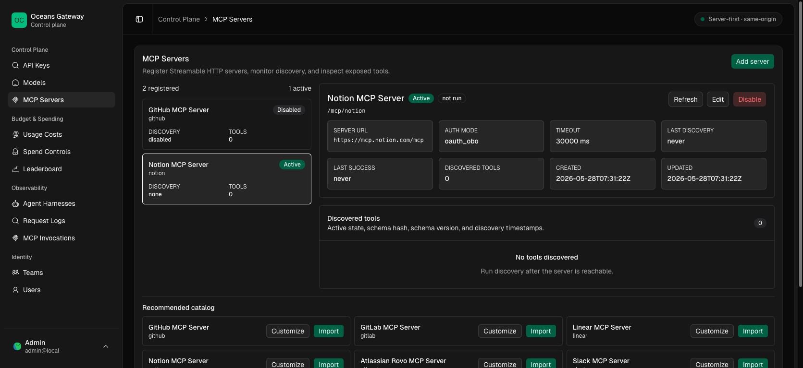

# MCP Servers

`See also`: [MCP Client Setup](../setup/mcp-client-setup.md), [MCP Tool Access](../access/mcp-tool-access.md), [Identity and Access](../access/identity-and-access.md), [Admin Control Plane](../access/admin-control-plane.md), [MCP Registry and Discovery](../operations/observability/mcp-registry-and-discovery.md)




Oceans can register external Streamable HTTP MCP servers and expose them to MCP clients through two gateway data-plane routes:

```text
/mcp
/mcp/{server_key}
```

`/mcp` is the aggregate discovery endpoint. It exposes `search_tools` and `describe_tool` over the caller's granted active tools across all registered servers.

`/mcp/{server_key}` is the direct proxy endpoint. The gateway authenticates the caller with an Oceans API key, looks up the active registered server, applies any gateway-managed upstream credential, and proxies the MCP Streamable HTTP request to the registered server URL.

Discovered tools are not automatically callable. Configure explicit MCP tool or toolset grants before clients can see tools in `tools/list` or call them with `tools/call`; see [MCP Tool Access](../access/mcp-tool-access.md).

## Add a Server

Platform admins manage servers in the admin UI:

```text
/admin/mcp/servers
```

The page supports:

- importing a recommended catalog entry
- adding a custom Streamable HTTP server
- editing display name, URL, auth mode, auth config, and timeout
- disabling a server
- refreshing discovery
- inspecting discovered tools, schema hashes, schema versions, active state, and timestamps

The corresponding admin API surface is documented for maintainers in [MCP Registry and Discovery](../operations/observability/mcp-registry-and-discovery.md).

## Server Keys

`server_key` is the public namespace used in direct `/mcp/{server_key}` URLs and aggregate tool addresses such as `mcp://github/tools/issues.create`.

Rules:

- 3 to 64 characters
- lowercase letters, digits, hyphen, and underscore
- stable once clients are configured
- unknown or disabled servers return not found

## Auth Modes

Supported stored auth modes are:

- `none`: no upstream credential is added.
- `gateway_static_header`: the gateway adds one configured upstream header.
- `gateway_bearer_token`: the gateway adds an upstream `Authorization: Bearer ...` header.
- `user_passthrough`: reserved for future user-scoped credentials.
- `oauth_obo`: reserved for future OAuth on-behalf-of grants.

Only `none`, `gateway_static_header`, and `gateway_bearer_token` are proxyable today. `user_passthrough` and `oauth_obo` return `403 mcp_upstream_auth_required` until user-scoped grants exist.

## Gateway-Managed Upstream Credentials

Gateway-managed credentials are for the upstream MCP server only. They are not caller credentials and are never returned to admin UI clients.

For `gateway_static_header`:

```json
{
  "header_name": "X-API-Key",
  "secret_ref": "env/OCEANS_MCP_DISCOVERY_EXAMPLE_KEY"
}
```

For `gateway_bearer_token`:

```json
{
  "secret_ref": "env/OCEANS_MCP_DISCOVERY_EXAMPLE_TOKEN"
}
```

Credentialed modes require an HTTPS `server_url`. Secret references must use `env/OCEANS_MCP_DISCOVERY_*`. The environment variable is resolved by the gateway process during discovery and proxying.

Inbound Oceans credentials are always stripped before forwarding upstream. The gateway forwards only MCP protocol/runtime headers plus configured gateway-managed upstream auth.

## Discovery

Discovery is the current server health signal.

Refresh discovery from the admin UI after adding or editing a server. Discovery:

- initializes Streamable HTTP
- lists upstream tools
- stores normalized tool schemas
- updates schema hashes and schema versions
- marks missing tools inactive
- records bounded failure summaries

No separate ping health check or discovery-run history UI exists in this slice.

## Access

On `/mcp`, `search_tools` and `describe_tool` resolve only active tools granted to the authenticated API key, owner user, owner service account, or team.

On `/mcp/{server_key}`, `tools/list` responses are filtered to granted active tools for that server. `tools/call` is rejected before upstream when the tool is not granted. Disabled servers, inactive tools, disabled toolsets, revoked grants, and inactive memberships do not resolve as callable access.
