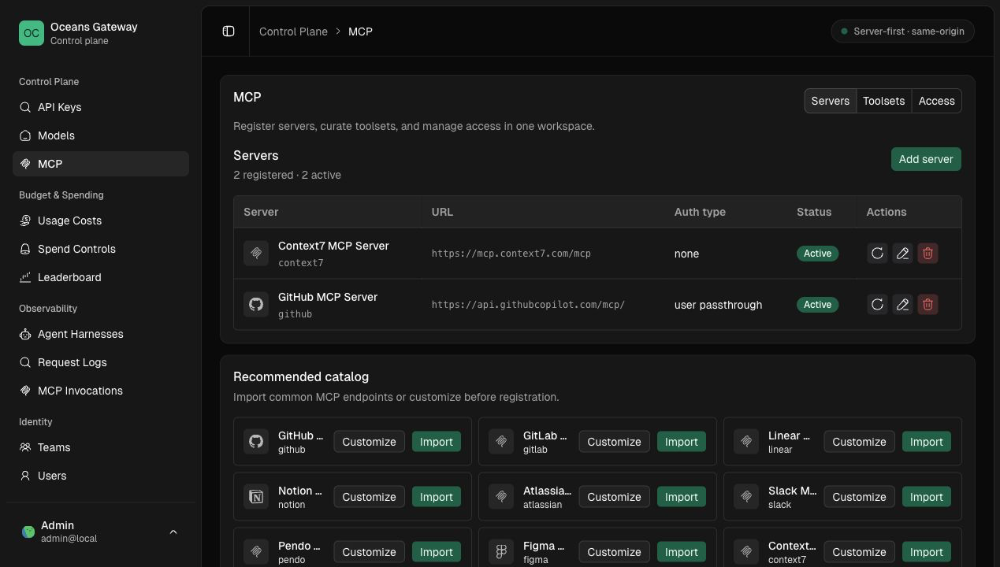
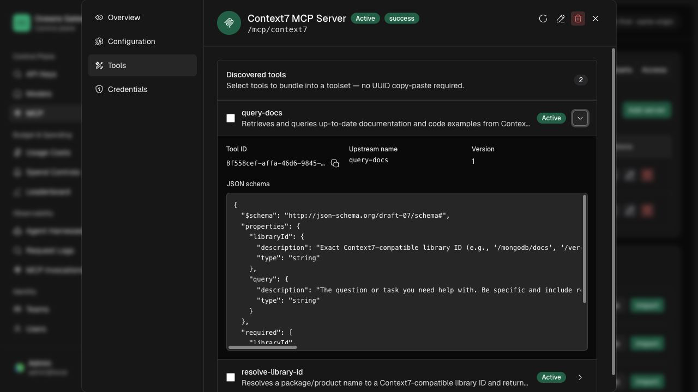

# MCP Servers

`See also`: [MCP Client Setup](../mcp/mcp-client-setup.md), [MCP Tool Access](../mcp/mcp-tool-access.md), [Identity and Access](../access/identity-and-access.md), [Admin Control Plane](../access/admin-control-plane.md), [MCP Registry and Discovery](../contributing/mcp/mcp-registry-and-discovery.md)




Oceans can register external Streamable HTTP MCP servers and expose them to MCP clients through two gateway data-plane routes:

```text
/mcp
/mcp/{server_key}
```

`/mcp` is the aggregate endpoint. It exposes `search_tools`, `describe_tool`, and `call_tool` over the caller's granted active tools across all registered servers.

`/mcp/{server_key}` is the direct proxy endpoint. The gateway authenticates the caller with an Oceans API key, looks up the active registered server, applies any gateway-managed upstream credential, and proxies the MCP Streamable HTTP request to the registered server URL.

Discovered tools are not automatically callable. Configure explicit MCP tool or toolset grants before clients can see tools in `tools/list` or call them with `tools/call`; see [MCP Tool Access](../mcp/mcp-tool-access.md).

## Add a Server

Platform admins manage servers in the admin UI:

```text
/admin/mcp/servers
```

The Servers tab is the registry workspace. It separates durable server records from
the recommended catalog so admins can see exactly which upstreams are registered
and which entries are only suggestions.

The page supports:

- importing a recommended catalog entry
- adding a custom Streamable HTTP server
- editing display name, URL, auth mode, auth config, and timeout
- disabling a server
- refreshing discovery
- opening a server detail dialog to inspect overview, configuration, discovered
  tools, and credential bindings

The corresponding admin API surface is documented for maintainers in [MCP Registry and Discovery](../contributing/mcp/mcp-registry-and-discovery.md).

## View Discovered Tools

Open a server from the Servers table, then use the **Tools** tab in the detail
dialog.



Each discovered tool row is collapsed by default. The collapsed row shows:

- selector checkbox
- tool name
- description, truncated when long
- active/inactive status

Expand a row to inspect:

- stable Oceans tool id
- upstream tool name
- schema version
- persisted JSON input schema

The JSON schema is the contract that `describe_tool` returns for aggregate MCP
clients and the schema that direct `tools/call` requests are checked against.
Schema hashes remain part of the backend drift contract, but the admin UI keeps
the row focused on the values humans need when selecting tools.

When one or more active tools are selected, use **Add to toolset** to move to the
Toolsets workflow with those tools preselected. Inactive tools remain visible for
audit and drift review, but they cannot be selected or called.

## Recommended Catalog

Recommended entries are curated shortcuts for common MCP servers. They are not
tenant records, do not imply access, and are never executed until an admin
imports or customizes them into a registered server.

Use **Import** when the catalog defaults are acceptable. Use **Customize** when
you need to review or change the key, URL, auth mode, timeout, or display name
before registration.

## Server Keys

`server_key` is the public namespace used in direct `/mcp/{server_key}` URLs and aggregate tool addresses such as `mcp://github/tools/issues.create`.

Rules:

- 3 to 64 characters
- lowercase letters, digits, hyphen, and underscore
- stable once clients are configured
- unknown or disabled servers return not found

## Auth Modes

Supported stored auth modes are:

- `none`: no upstream credential is added.
- `gateway_static_header`: the gateway adds one configured upstream header.
- `gateway_bearer_token`: the gateway adds an upstream `Authorization: Bearer ...` header.
- `user_passthrough`: resolve a caller-owned user/service-account/team credential binding at execution time.
- `oauth_obo`: resolve and refresh a user-owned OAuth credential at execution time.

Discovery normally uses `none`, `gateway_static_header`, or `gateway_bearer_token`. An `oauth_obo` server can set `auth_config.discovery_auth` to `none` when its upstream permits public `initialize` and `tools/list` requests. Execution still requires a user OAuth connection.

## Google Workspace OAuth

Google Drive and Google Docs are separate upstream MCP servers. Oceans can expose both through one aggregate `/mcp` endpoint. The client harness authenticates to Oceans with an Oceans API key. It does not receive a Google token, Google client secret, or Google callback URI.

Use Google's [Drive MCP guide](https://developers.google.com/workspace/drive/api/guides/configure-mcp-server) and [Workspace MCP guide](https://developers.google.com/workspace/guides/configure-mcp-servers) when you configure the Google Cloud project and consent screen.

Complete these Google Cloud steps before you enable the Oceans connection page:

1. Join the Google Workspace Developer Preview when Google requires it for the selected account or project.
2. Enable the Drive API, Docs API, Drive MCP API, and Docs MCP API in the same Cloud project.
3. Configure the OAuth consent screen, audience, test users, and the two read-only scopes used below.
4. Create a **Web application** OAuth client and register the exact Oceans callback URI.
5. Publish or verify the consent application as required for the audience and restricted scopes.

Configure one Google confidential OAuth client in gateway configuration:

```yaml
mcp:
  oauth:
    public_base_url: https://gateway.example.com
    providers:
      - key: google
        provider_type: google
        client_id: env.OCEANS_MCP_OAUTH_GOOGLE_CLIENT_ID
        client_secret: env.OCEANS_MCP_OAUTH_GOOGLE_CLIENT_SECRET
```

Register this exact callback URI in the Google OAuth client:

```text
https://gateway.example.com/api/v1/mcp/oauth/google/callback
```

The recommended Drive and Docs catalog entries set the provider key, OAuth resource, read-only scope, and public discovery mode. Drive requests `drive.readonly`. Docs requests only `documents.readonly` for `read_doc`. A harness can use the separate Drive tools to find a document, then pass its ID to Docs.

After an admin imports both entries and completes discovery, each user opens `/admin/account/connections` and grants access separately for Drive and Docs. Oceans uses authorization code flow with PKCE and the OAuth `resource` parameter. It stores the access and refresh tokens in the existing encrypted user credential binding. It refreshes the access token five minutes before expiry and requires a new connection after Google revokes the grant.

The harness must use an Oceans API key owned by that user to resolve the user's Google bindings. Service-account keys do not borrow user credentials. They require a separately managed service-account or team binding.

Disconnecting a server revokes its Oceans binding at once, but it does not call Google's token revocation endpoint. Google revocation removes the grant for the whole Cloud project and can invalidate both Drive and Docs tokens that use the same OAuth project. A user who wants to remove all project access can revoke the application from Google Account settings. Oceans then reports `credential_required` for each affected server.

Use read-only tools for the first toolset:

- Drive: `download_file_content`, `get_file_metadata`, `get_file_permissions`, `list_recent_files`, `read_file_content`, and `search_files`
- Docs: `read_doc`

Do not add Drive `copy_file` or `create_file`, or Docs `update_doc`, to a read-only toolset. OAuth scopes remain the main permission boundary, but a narrow toolset gives callers a clear contract.

Google classifies `drive.readonly` as a restricted scope. An external production application can require Google verification and a security assessment. Confirm the current Google requirements before production rollout.

Workspace content is untrusted model input. Keep the write tools disabled for the first toolset, review tool grants, and apply the prompt-injection controls in Google's [Workspace MCP security guidance](https://developers.google.com/workspace/guides/configure-mcp-security).

## Gateway-Managed Upstream Credentials

Gateway-managed credentials are for the upstream MCP server only. They are not caller credentials and are never returned to admin UI clients.

For `gateway_static_header`:

```json
{
  "header_name": "X-API-Key",
  "secret_ref": "env/OCEANS_MCP_DISCOVERY_EXAMPLE_KEY"
}
```

For `gateway_bearer_token`:

```json
{
  "secret_ref": "env/OCEANS_MCP_DISCOVERY_EXAMPLE_TOKEN"
}
```

Credentialed modes require an HTTPS `server_url`. Secret references must use `env/OCEANS_MCP_DISCOVERY_*`. The environment variable is resolved by the gateway process during discovery and proxying.

Inbound Oceans credentials are always stripped before forwarding upstream. The gateway forwards only MCP protocol/runtime headers plus configured gateway-managed upstream auth.

## Principal-Bound Upstream Credentials

For `user_passthrough`, admins can configure MCP credential bindings in the control plane. For a configured `oauth_obo` server, users should create and revoke their own binding from **Workspace connections**. Bindings are separate from server registry records and grants:

- owner scopes are `user`, `team`, or `service_account`
- material kinds are `static_header`, `bearer_token`, or `oauth_tokens`
- storage is either an encrypted blob or a `secret_ref`
- raw secrets are accepted only on submission and are never returned by admin APIs

Encrypted bindings require `OCEANS_MCP_CREDENTIAL_ENCRYPTION_KEY` to be set to a base64-encoded 32-byte key in the gateway process. Use a separate key from other gateway encryption keys. Credential `secret_ref` values must use `env/OCEANS_MCP_CREDENTIAL_*`.

The gateway does not start with a configured MCP OAuth provider unless this encryption key is present and valid.

Runtime resolution order:

- user-owned API key: user binding, then team binding
- service-account API key: service-account binding, then owning-team binding

Grant checks happen before credential lookup. A denied tool address does not reveal whether a credential exists.

## Discovery

Discovery is the current server health signal.

Refresh discovery from the admin UI after adding or editing a server. Discovery:

- initializes Streamable HTTP
- lists upstream tools
- stores normalized tool schemas
- updates schema hashes and schema versions
- marks missing tools inactive
- records bounded failure summaries

No separate ping health check or discovery-run history UI exists in this slice.

## Access

On `/mcp`, `search_tools`, `describe_tool`, and `call_tool` resolve only active tools granted to the authenticated API key, owner user, owner service account, or team.

On `/mcp/{server_key}`, `tools/list` responses are filtered to granted active tools for that server. `tools/call` is rejected before upstream when the tool is not granted. Disabled servers, inactive tools, disabled toolsets, revoked grants, inactive memberships, missing credentials, and expired credentials do not resolve as callable access.
