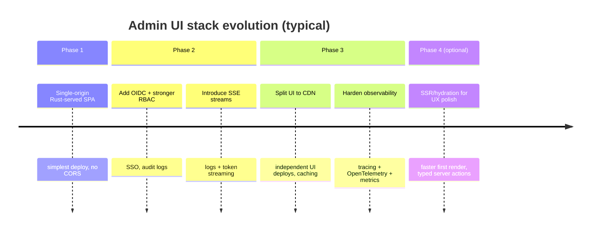

# Architectures and front-end stacks for Rust-hosted LLM gateway admin UIs

## Executive summary

An LLM gateway admin UI is a “control plane” product: its success depends less on public-facing SEO and more on correctness, observability, secure access control, fast iteration on forms/tables, and reliable real-time/streaming experiences (testing prompts, tailing logs, monitoring latency and token usage). Those constraints strongly favour architectures that minimise cross-origin complexity, keep authentication straightforward, and provide robust streaming semantics.

Across hosting architectures for Rust-backed admin UIs, three patterns dominate in practice:

- **Single-origin, Rust-served UI + API** is the simplest operationally (one deployable, no CORS), and is often the best choice for internal or low-traffic admin surfaces. It scales well for typical “admin workloads” (human-driven, not high-QPS) and improves security posture by reducing moving parts.
- **Split API + SPA (served from CDN/object storage) + Rust API** is the most common modern web pattern and scales extremely well, but introduces CORS, token/cookie strategy decisions, and more deployment orchestration.
- **SSR/hybrid (either JS meta-framework or Rust SSR such as Leptos) + Rust API** can provide the best perceived performance (fast first paint), and can simplify auth by keeping everything same-origin; however it increases build/runtime complexity and introduces server rendering concerns that purely-admin products may not “earn back” unless you need rapid initial load or strict zero-JS constraints.

For the front-end, **React (with shadcn/ui)** remains the most ecosystem-complete option for admin needs: mature table/grid tooling, form libraries, battle-tested streaming UI patterns, and a vast hiring pool. Its main downsides are bundle weight and the tendency for architectural sprawl without discipline. **Svelte** and **Solid** can deliver very fast, responsive UIs with smaller bundles and simpler mental models, but their admin-component ecosystems are thinner than React’s. **Vue** is competitive—especially if your organisation already uses it—thanks to a strong meta-framework story and established UI kits. **Qwik** is promising for performance but is still a smaller ecosystem. **WASM front-ends (Yew/Leptos CSR)** are viable when you strongly value Rust end-to-end and want to share types/validation logic, but they introduce WASM build tooling complexity and (in Yew’s case) maturity concerns.

Recommended stacks (summary):

- **Minimal (lowest cognitive + ops load):** Rust server serves static assets + same-origin JSON API; front-end React + shadcn/ui built with Vite into `/dist`, served by Rust.
- **Balanced (most common “production admin” posture):** Split deployment: CDN-hosted SPA + Rust API (Axum/Actix); OIDC; SSE for streaming; strong observability via tracing + OpenTelemetry; typed API via OpenAPI.
- **High-performance (fast first paint + typed full-stack):** Rust SSR/hydration with Leptos on Axum/Actix; server functions for “admin actions”; SSE/streams for model output; fewer client-side dependencies.

GitHub adoption signals (stars) support these practical recommendations: React (~243k) is materially larger than the other front-end options; shadcn/ui is also extremely popular (~107k). Among the alternatives, Svelte (~85.9k) and Vue core (~53.1k) are sizeable, while Solid (~35.2k) and Qwik (~21.9k) are smaller but non-trivial. For Rust/WASM, Yew (~32.4k) is visible, and Leptos (~20.2k) is rapidly adopted for full-stack Rust UI.  

Sources: citeturn4view0turn7view1turn4view1turn4view3turn5view0turn8view1turn21view0turn2view1

## Requirements and evaluation rubric

An LLM gateway admin UI typically needs:

- **Configuration surfaces:** providers, models, routing policies, tenant keys, quotas/token limits, timeouts, retries, fallbacks.
- **Operational views:** request logs, error traces, latency histograms, token accounting (prompt/completion totals), queue depth, and live health.
- **Interactive testing tools:** prompt sandbox with **streaming** responses, cancellation, and reproducible runs.
- **Security needs:** stronger-than-average authentication/authorisation (often SSO), granular RBAC, audit logs, and safe handling of secrets (API keys).
- **Latency-sensitive UX:** the UI should stay responsive while streaming tokens and while rendering large tables/logs.

### Scoring

For both architectures and front-end options, scores are **1–5 (higher is better)** across:

- **Simplicity:** conceptual and operational complexity (deployables, moving parts, failure modes).
- **Popularity:** ecosystem adoption (approximated by community maturity, GitHub stars, and breadth of integrations).
- **Performance:** end-user perceived speed (loading, responsiveness, streaming smoothness) and server efficiency.
- **Maintenance:** long-term cost (upgrades, debugging, hiring, CI/build complexity, security patching).

These scores are comparative and contextual (admin UI, no specific hosting provider constraint), not absolute guarantees.

## Hosting architectures for Rust servers with web UIs

This section compares deployment models that combine a Rust backend (gateway control plane + telemetry) with a web admin UI.

### Architecture comparison table

| Architecture | Simplicity | Popularity | Performance | Maintenance | Rationale (short) |
|---|---:|---:|---:|---:|---|
| Split API + SPA from CDN/static hosting | 3 | 5 | 4 | 3 | Scales and deploys independently; introduces CORS + auth strategy complexity. |
| Rust serves SPA static assets + JSON API (single origin) | 5 | 4 | 4 | 4 | One deployable, no CORS; great for internal/admin; CDN optional later. |
| JS SSR/hybrid (e.g., Next/Nuxt/SvelteKit) + Rust API | 2 | 4 | 4 | 2 | Great perceived performance + same-origin auth; more build/runtime moving parts. |
| Rust SSR/hydration “full-stack Rust UI” (Leptos SSR) | 3 | 3 | 5 | 3 | Excellent perf + typed server functions; Rust/WASM toolchain complexity. |
| WASM SPA (Yew/Leptos CSR) + Rust API (split or same-origin) | 2 | 2 | 4 | 2 | Rust end-to-end on client; heavier build pipeline + ecosystem gaps for admin UI. |

Popularity signals for the Rust gateway layer itself show Axum (~25.1k stars), Actix Web (~24.5k), and Rocket (~25.7k) are all widely used; for Rust-first UI, Leptos (~20.2k) and Yew (~32.4k) are significant but smaller than mainstream JS approaches.  

Sources: citeturn2view0turn1view2turn2view2turn2view1turn21view0

### Deployment model and static asset serving

**Split API + SPA**  
- UI is built to static assets (HTML/CSS/JS) and hosted on a CDN/object store.
- Rust API is deployed separately behind a reverse proxy/load balancer.
- Static asset caching is excellent; rollbacks can be clean if you version assets.

Operationally, this introduces at least two deployment pipelines and forces early decisions about **CORS**, auth tokens/cookies, and environment configuration.

**Single-origin Rust-served UI + API**  
- Rust serves the compiled SPA output under `/` (or `/admin`) and also exposes `/api/*` on the same host.
- In Rust, static files can be served with framework-specific helpers such as `tower-http`’s `ServeDir` (common with Axum), Actix’s `actix-files`, or Rocket’s `FileServer`.  

Sources: citeturn9search3turn13search7turn13search2

This pattern is operationally attractive: one container/service, one TLS termination point, and you can still put a CDN in front later if desired.

**SSR/hybrid** (JS meta-framework or Rust SSR)  
- A server component generates HTML and may hydrate on the client.
- You can keep the UI and API same-origin, avoiding CORS headaches.
- You pay for server rendering complexity and caching strategy decisions (per-route caching, auth-aware caching).

Leptos explicitly supports client-side rendering, server-side rendering, and SSR with hydration, and even notes support for HTTP streaming of data/HTML (e.g., suspense streaming).  

Sources: citeturn1view1

### Authentication/authorisation and session strategy

For admin surfaces, **OIDC over OAuth 2.0** is the most common SSO-friendly approach, with the OpenID Connect Core spec defining the authentication layer on top of OAuth 2.0.  

Sources: citeturn11search5turn11search1

How architecture affects auth:

- **Same-origin UI+API** (Rust-served SPA or SSR): easiest to implement with **secure, HttpOnly cookies** and server-side session state (or signed/encrypted cookies). This naturally avoids token leakage to JS and reduces CORS complications.
- **Split UI and API across origins:** you must choose:
  - **Cookie-based auth across origins:** requires careful SameSite/Secure settings and explicit CORS allowlists + `Access-Control-Allow-Credentials`. This is workable but fiddly.
  - **Bearer token auth (JWT or opaque tokens) stored in memory:** avoids cross-site cookies but requires robust refresh flows and careful XSS hardening.

Cookie/session best practices (rotation, secure flags, avoiding fixation) are emphasised in OWASP’s session guidance and modern browser cookie guidance (SameSite and Secure/HttpOnly).  

Sources: citeturn10search3turn11search11turn11search3turn11search7

For authorisation, admin UIs typically need:
- **RBAC** (roles: viewer/operator/admin) with route-level enforcement.
- **Audit logging** for actions that modify routing, keys, quotas, or provider credentials.
- Potentially **per-tenant scoping** if the gateway manages multiple tenants/environments.

Architecturally, the authorisation model is mostly backend-driven, but SSR and same-origin patterns often simplify enforcement because you can perform server-side checks before rendering sensitive pages.

### CORS and API design

CORS is an HTTP-header-based mechanism that controls which origins can read responses; browsers may issue a **preflight** request before the actual request.  

Sources: citeturn11search2turn11search6turn11search10

This has practical implications:

- **Same-origin** architectures: you can often avoid CORS entirely, reducing misconfiguration risk.
- **Split UI/API**: you must define:
  - Allowed origins (explicit, not `*` if using credentials),
  - Whether cookies/credentials are allowed,
  - Which headers/methods are permitted,
  - Preflight caching behaviour.

For an admin UI, API design patterns that minimise friction:
- Prefer a **versioned REST-ish JSON API** (`/api/v1/...`) for CRUD configuration.
- Use **separate streaming endpoints** for logs and token streaming (SSE or WebSocket), because mixing streaming with standard JSON responses tends to complicate client code and observability.
- Consider generating client types from an **OpenAPI** spec to reduce drift between UI and server.

### Real-time needs: WebSockets vs Server-Sent Events vs fetch streaming

Admin UIs for LLM gateways often need:
- Streaming model output (token-by-token),
- Live log tailing,
- Live metrics overlays (latency, error rates),
- “Cancel run” semantics during testing.

**WebSockets** provide a persistent, bidirectional session between browser and server.  

Sources: citeturn10search1turn10search5

**Server-Sent Events (SSE)** provide a server→client stream over HTTP, supported via `EventSource`, and require the `text/event-stream` content type.  

Sources: citeturn10search12turn10search4turn10search0

**Which to prefer for an admin UI?**
- Prefer **SSE** for:
  - log tailing (append-only),
  - streaming LLM output (often append-only with occasional “done/error” events),
  - simpler infra (works well with proxies and HTTP/2 in many setups).
- Prefer **WebSockets** if you genuinely need bidirectional low-latency messaging (e.g., collaborative editing, multiplexed channels with client-to-server commands beyond simple POSTs).

On the Rust side, Axum provides dedicated support for SSE responses (`axum::response::sse::Sse`) and WebSocket handling (`axum::extract::ws`).  

Sources: citeturn13search0turn13search1turn13search5turn13search13

### Build/tooling complexity

Toolchains diverge sharply by UI technology:

- **JS SPA or JS SSR:** typically use Vite or a meta-framework toolchain. Vite’s model is a fast dev server plus a bundling build step (Rollup-based) and is extremely widely used.  

  Sources: citeturn7view2turn8view0

- **Rust/WASM UI:** typically add:
  - `wasm-pack` (build Rust→WASM packages targeting the JS ecosystem) and/or
  - Trunk (a Rust-focused WASM bundler).  

  Sources: citeturn9search21turn9search13turn9search12turn9search20

For long-lived admin products, build complexity matters because it affects CI time, developer onboarding, and the risk of “works on my machine” toolchain pinning issues.

### Scalability, observability, and security

For admin UIs, scalability is rarely about raw throughput; it is more about:
- consistent behaviour under bursts (many log lines, many streamed tokens),
- avoiding head-of-line blocking for streaming endpoints,
- horizontally scaling stateless services.

Observability is non-negotiable in an LLM gateway context. In Rust, the `tracing` ecosystem is the standard approach for structured, event-based diagnostics, and OpenTelemetry provides vendor-neutral telemetry export, including OTLP as a protocol for exporting traces/metrics/logs.  

Sources: citeturn12search1turn12search5turn12search4turn12search20

If you publish Prometheus-style metrics, the OpenMetrics spec strongly associates metrics exposition with an HTTP GET endpoint (often `/metrics`).  

Sources: citeturn12search2

Security considerations that differ by architecture:
- **Split deployments** increase the chance of misconfigured CORS and cookie attributes.
- **Single-origin** reduces that surface but can increase the blast radius of a single service compromise (mitigated with strong secrets management and least privilege).
- SSR introduces additional SSR-specific security issues (template injection, cache poisoning, server-side data leakage) but can also improve security by reducing token exposure in the browser.

### Diagram: canonical split API/UI deployment

```mermaid
flowchart LR
  subgraph Browser
    UI[Admin UI (SPA)]
  end

  subgraph StaticHosting
    CDN[CDN / static file host]
  end

  subgraph Backend
    API[Rust API]
    DB[(Config DB)]
    LOGS[(Logs / Metrics Store)]
  end

  subgraph Identity
    IDP[OIDC Provider]
  end

  UI -->|GET /assets| CDN
  UI -->|HTTPS JSON + SSE| API
  API --> DB
  API --> LOGS
  UI -->|Login redirect| IDP
  API -->|Token introspection/JWKS| IDP
```

## Front-end frameworks and tooling for an LLM gateway admin UI

### Popularity and ecosystem signals

GitHub stars are an imperfect metric, but they are a useful proxy for ecosystem “surface area” (tutorials, issues answered, community components). As of 26 Feb 2026:

- React: ~243k stars  
- Svelte: ~85.9k  
- Vue core: ~53.1k  
- Solid: ~35.2k  
- Qwik: ~21.9k  
- Yew: ~32.4k  
- Leptos: ~20.2k  
- shadcn/ui: ~107k (React component approach commonly combined with Tailwind + Radix primitives)  

Sources: citeturn4view0turn4view1turn4view3turn5view0turn8view1turn21view0turn2view1turn7view1

For admin UIs specifically, an ecosystem’s **table/grid**, **form**, and **data-fetching** story matters more than raw framework features.

### Front-end framework comparison table

| Front-end option | Simplicity | Popularity | Performance | Maintenance | Rationale (short) |
|---|---:|---:|---:|---:|---|
| React (with shadcn/ui) | 4 | 5 | 4 | 4 | Best admin tooling ecosystem; easy to staff; can sprawl without conventions. |
| Solid | 4 | 3 | 5 | 3 | Fine-grained reactivity, very fast UI; smaller enterprise/admin ecosystem. |
| Svelte | 5 | 4 | 5 | 4 | Compiler model, minimal runtime; strong dev experience; fewer “enterprise grid” defaults. |
| Vue | 4 | 4 | 4 | 4 | Mature framework and strong UI kit options; great if organisation already uses it. |
| Qwik | 3 | 2 | 5 | 2 | Excellent performance model; ecosystem and patterns still forming. |
| WASM UI: Yew | 2 | 2 | 4 | 2 | Rust-to-WASM; interop possible; maturity/upgrade risk and admin UI libs thinner. |
| WASM UI: Leptos (CSR) | 3 | 2 | 5 | 3 | Very fast reactive model; can evolve to SSR; tooling complexity remains. |

Important nuance: **Leptos as SSR/hydration** often scores higher on overall system performance and same-origin simplicity than Leptos CSR-only, because SSR can improve first render and can reduce some client complexity. Leptos also highlights “server functions” (client-callable functions that run only on the server) as a way to avoid maintaining a separate REST API for some workflows—this is ergonomically attractive for admin “actions”.  

Sources: citeturn1view1

### Admin-specific needs: forms, tables, streaming, logs, and latency

#### Forms and validation

Admin forms tend to be:
- multi-step (provider credentials → routing rules → quotas),
- nested/conditional (different fields per provider/model),
- validation-heavy (timeouts, token limits, regex routing rules).

Practical patterns regardless of framework:
- Use a **schema validator** to keep client/server validation aligned.
- Prefer **server-side validation** as source of truth and treat client validation as UX optimisation.

In the React/shadcn/ui ecosystem, the general pattern is:
- headless components + Tailwind styling (shadcn/ui is positioned as a set of customizable components)  
  Sources: citeturn7view1
- pair with a strong data/schema stack for forms (exact library choices vary, but the pattern is stable).

#### Tables, logs, and large datasets

LLM gateway admin UIs often require:
- filtering by time window, tenant, model, provider,
- sorting by latency, token usage, status code,
- live appends (log tail),
- row expansion (request/response metadata).

Headless table tooling like TanStack Table positions itself specifically for powerful datagrids with full control, with features such as sorting/filtering/grouping and virtualisation friendliness.  

Sources: citeturn18view1

For “log tail” views, a key performance strategy is **virtualised rendering** (only render visible rows) and incremental ingestion so the UI doesn’t lock up.

#### Data fetching and cache coherency

Admin UIs have a mix of:
- “server state” (models, routes, logs),
- local UI state (selected rows, filter chips, modal open/close).

TanStack Query is an example of a widely used “server state” library, focusing on caching, refetching, pagination, and async state management across frameworks.  

Sources: citeturn19view0

In non-React frameworks:
- Solid/Svelte/Vue each have their own idiomatic state primitives (signals/stores/reactivity).
- Server-state libraries exist, but the maturity and “how-to” content may be thinner than in React.

#### Streaming responses and cancellation

For an LLM “test console”, the UI should:
- start rendering tokens immediately,
- keep the UI responsive while appending output,
- support cancellation.

SSE is often the most straightforward browser-native approach for “append-only streams”; it is explicitly designed for servers to push data to pages, and uses `EventSource`.  

Sources: citeturn10search12turn10search0turn10search4

If you need richer bi-directional interactive sessions, WebSockets provide a two-way interactive communication channel.  

Sources: citeturn10search1

The “best” choice depends on whether cancellation can simply be an HTTP POST (“cancel run”) while the stream is server→client (SSE), or whether you need to send cancellation and other control messages over the same session (WebSocket).

### Component libraries and design system considerations

An admin UI values:
- accessibility (keyboard navigation, tree views, dialogs),
- consistent form field behaviour,
- a cohesive design system.

In the React ecosystem, a common pairing is:
- Tailwind CSS (utility-first styling, very widely adopted)  
  Sources: citeturn17search2
- Radix Primitives for accessible, low-level components (the repo emphasises accessibility/customisation/DevEx)  
  Sources: citeturn18view0
- shadcn/ui as a distribution/customisation approach built around such primitives (extremely popular)  
  Sources: citeturn7view1

This combination is particularly effective for admin UIs because it provides accessible primitives while allowing consistent theming and fast iteration.

For Vue/Svelte/Solid/Qwik, the ecosystem story varies:
- Vue has multiple mature UI kits and a strong meta-framework story.
- Svelte and Solid are strong on performance and developer experience but the “enterprise admin kit” landscape is smaller.
- Qwik’s ecosystem is still comparatively young.

### WASM front-ends: when they do and don’t make sense

WASM UIs can be compelling if you want:
- single-language end-to-end (Rust),
- shared types/validation logic,
- tighter control over client performance characteristics.

However, they come with costs:
- build tooling (Trunk/wasm-pack) and toolchain pinning,  
  Sources: citeturn9search12turn9search13turn9search20
- JS interop friction for complex UI libraries,
- fewer off-the-shelf admin components compared with React ecosystems.

Yew explicitly warns it is not yet 1.0 and that breaking changes may require refactors, which is a material maintenance risk for long-lived admin products.  

Sources: citeturn21view0

## Three recommended full stacks

### Minimal stack

**Goal:** one deployable, strong security posture, fast iteration.

- **Backend:** Axum (or Actix) as JSON API + static file server for the built admin UI.
- **UI:** React + shadcn/ui, built with Vite; output served by Rust under `/admin` (or `/`).
- **Auth:** same-origin cookie sessions; optional OIDC later.
- **Real-time:** SSE endpoints for:
  - `/api/v1/logs/tail` (EventSource),
  - `/api/v1/test/stream` (stream model output).
- **Observability:** `tracing` with structured logs; add OpenTelemetry exporter once you need distributed tracing.  

Why: This avoids CORS entirely and keeps credentials out of JS by default (HttpOnly cookies), aligning well with OWASP session guidance and modern cookie best practices.  

Sources: citeturn12search1turn10search3turn11search11turn9search3turn19view0

Maintenance notes:
- Enforce conventions early (route structure, API versioning, component patterns) to avoid a “single repo sprawl” effect.
- Add a reverse proxy/CDN later without changing the fundamental app shape.

### Balanced stack

**Goal:** standard modern production posture with strong scalability and clean separation.

- **Deployment model:** split UI/API.
  - UI: SPA hosted on CDN/static hosting.
  - API: Rust service behind a load balancer.
- **Backend:** Axum or Actix, with:
  - OpenAPI-driven contract generation (server typed endpoints → generated TS client).
  - SSE for streaming and log tail.
  - Strict request validation and consistent error envelope.
- **UI:** React + shadcn/ui (or Vue/Svelte if your org has a strong preference).
  - Data: TanStack Query for server-state caching/invalidation.
  - Tables: TanStack Table + virtualisation for logs.
- **Auth:** OIDC (SSO), using authorisation code flow; session stored server-side or in encrypted cookie.
- **CORS:** explicitly allow UI origin(s); enable credentials only if using cookies; otherwise use token-based auth.
- **Observability:** `tracing` + OpenTelemetry (OTLP) + metrics endpoint consumable by Prometheus-style scrapers (`/metrics`).  

This stack matches common industry practice for “admin control planes”: independent UI rollout, robust telemetry, and explicit auth boundaries.  

Sources: citeturn11search5turn11search2turn11search10turn12search1turn12search4turn12search20turn12search2turn19view0turn18view1

Maintenance notes:
- Treat CORS as a first-class test surface (integration tests for preflight behaviour).
- Version the API and maintain backwards compatibility for at least one UI release window to avoid lockstep deploys.

### High-performance stack

**Goal:** fastest perceived UX, typed full-stack ergonomics, and first-class streaming.

- **Deployment model:** same-origin SSR/hydration.
- **Backend + UI:** Leptos SSR on Axum or Actix integration.
  - Use Leptos SSR/hydration for fast initial render and good interactivity.
  - Use Leptos “server functions” pattern for admin actions where it reduces boilerplate vs maintaining a separate REST surface.
  - Use HTTP streaming where appropriate (e.g., suspense/streaming patterns).
- **Auth:** same-origin cookies + OIDC integration server-side.
- **Streaming:** SSE for model output and log tail; use WebSockets only for genuinely bidirectional experiences.
- **Tooling:** cargo-leptos/Trunk-style workflows, pinned toolchains.

Leptos positions itself as full-stack and explicitly supports client-side rendering, server-side rendering, SSR with hydration, and HTTP streaming, which makes it well-suited to “fast, interactive control planes” if your team accepts the Rust/WASM tooling complexity.  

Sources: citeturn1view1turn9search12turn9search20turn10search12

Maintenance notes:
- Pin toolchains in CI and provide a “one command” dev bootstrap.
- Be deliberate about which interactions are server functions versus explicit API endpoints to keep boundaries comprehensible.

## Split API/UI example layout and API contract sketch

### Example folder layout (Rust API + JS UI)

```text
repo/
  contracts/
    openapi.yaml                # source-of-truth contract OR generated artifact
  server/
    Cargo.toml
    src/
      main.rs
      app.rs                    # router setup
      config.rs                 # env + typed config
      auth/
        mod.rs
        oidc.rs                 # OIDC/OAuth callback handling
        rbac.rs                 # role checks
      routes/
        mod.rs
        health.rs
        models.rs               # CRUD models/providers
        tenants.rs              # keys, quotas, limits
        logs.rs                 # query logs + stream tail
        test_console.rs         # start/cancel runs + stream output
      middleware/
        request_id.rs
        cors.rs
        rate_limit.rs
      telemetry/
        mod.rs
        tracing.rs
        otel.rs
        metrics.rs              # /metrics exporter
  ui/
    package.json
    pnpm-lock.yaml
    vite.config.ts
    src/
      main.tsx
      app.tsx
      api/
        client.ts               # generated from OpenAPI
      components/
        forms/
        tables/
        layout/
      pages/
        dashboard.tsx
        models.tsx
        tenants.tsx
        logs.tsx
        test-console.tsx
      state/
        query.ts                # query client setup
      styles/
        globals.css
```

### API contract sketch (selected endpoints)

A pragmatic admin API tends to split into:
- **CRUD configuration**
- **read-only analytics/log queries**
- **streaming channels**
- **auth + session**

```yaml
openapi: 3.0.3
info:
  title: LLM Gateway Admin API
  version: 1.0.0
paths:
  /api/v1/health:
    get: { ... }

  /api/v1/auth/oidc/start:
    get: { ... }         # redirect to IdP

  /api/v1/auth/oidc/callback:
    get: { ... }         # set session cookie, redirect to UI

  /api/v1/me:
    get: { ... }         # current user + roles

  /api/v1/providers:
    get: { ... }         # list provider configs (redacted)
    post: { ... }        # create provider config
  /api/v1/providers/{id}:
    patch: { ... }
    delete: { ... }

  /api/v1/models:
    get: { ... }         # list models, capabilities, defaults
    post: { ... }
  /api/v1/routes:
    get: { ... }         # routing rules/policies
    put: { ... }         # replace rules (audit logged)

  /api/v1/tenants:
    get: { ... }         # tenants / API keys
    post: { ... }
  /api/v1/tenants/{id}/limits:
    put: { ... }         # token + rate limits, timeouts

  /api/v1/logs/query:
    post: { ... }        # filtered search (time window, tenant, model)
  /api/v1/logs/tail:
    get:
      description: SSE stream of log events
      responses:
        "200":
          content:
            text/event-stream: {}

  /api/v1/test-runs:
    post: { ... }        # start test run, returns run_id
  /api/v1/test-runs/{run_id}/cancel:
    post: { ... }
  /api/v1/test-runs/{run_id}/stream:
    get:
      description: SSE stream of token deltas + final summary
      responses:
        "200":
          content:
            text/event-stream: {}
```

Design notes for streaming endpoints:
- Use SSE `event:` types like `token`, `meta`, `error`, `done`.
- Add heartbeat/keep-alive to keep intermediaries from closing idle connections.
- Use a separate POST endpoint for cancellation if you want to keep SSE one-way.

SSE requires `text/event-stream`, and common browser usage patterns are documented around `EventSource`.  

Sources: citeturn10search4turn10search0turn13search0

## Migration and integration notes

### Migration paths

A realistic migration plan (minimising rewrites) often looks like:



Key principle: **don’t introduce CORS until you get a clear benefit** (independent deploy cadence, CDN caching, multi-frontend strategy). For many admin UIs, Phase 1–3 is the “sweet spot.”

### Integration with Rust web frameworks

Even though developer ergonomics vary, three integration needs are consistent: static assets, streaming, and middleware.

- **Static assets**
  - Axum commonly uses `tower-http`’s file services such as `ServeDir`.  
    Sources: citeturn9search3turn9search11
  - Actix Web uses `actix-files` (non-blocking static file serving).  
    Sources: citeturn13search7turn13search3
  - Rocket provides `rocket::fs::FileServer` for serving static files from a directory.  
    Sources: citeturn13search2

- **Real-time**
  - Axum has first-class SSE and WebSocket support in its API surface.  
    Sources: citeturn13search0turn13search5turn13search13
  - Actix Web highlights WebSocket support and streaming among its features and positions itself as extremely fast.  
    Sources: citeturn1view2
  - Rocket focuses on usability, security, extensibility, and speed; static serving is straightforward via FileServer.  
    Sources: citeturn1view3turn13search2

### Integration with build tools: Trunk, wasm-pack, Vite

- **Vite** is a de facto standard dev/build tool for JS SPAs and is extremely widely adopted; it combines a dev server and a production bundling step, and is commonly used across React/Vue/Svelte/Solid ecosystems.  
  Sources: citeturn7view2turn8view0

- **Trunk** is a Rust-focused WASM web bundler that uses a source HTML file to bundle WASM, JS snippets, and other assets; it is commonly used in Rust/WASM UI workflows.  
  Sources: citeturn9search12turn9search20

- **wasm-pack** targets building Rust-generated WebAssembly packages for use alongside JavaScript and in npm-based workflows.  
  Sources: citeturn9search21turn9search13

Practical guidance:
- Prefer **Vite** for JS-first admin UIs (React/Svelte/Vue/Solid/Qwik).
- Prefer **Trunk** (and/or cargo-leptos) for Rust/WASM UIs unless you have a strong reason to integrate into a JS monorepo pipeline.
- Use `wasm-pack` when you explicitly want to distribute a Rust/WASM package into the JS ecosystem or share logic as a package.

### Observability integration in Rust services

For gateway control planes, production readiness typically implies:
- structured logs and spans at request boundaries (including request IDs),
- distributed tracing export (OTLP),
- metrics endpoint for time-series.

`tracing` is a standard Rust approach for structured diagnostics, and OpenTelemetry’s Rust documentation describes generating and collecting telemetry (metrics/logs/traces) with Rust.  

Sources: citeturn12search1turn12search4turn12search20

Prometheus/OpenMetrics conventions for exposing metrics over HTTP (often `/metrics`) are documented in the OpenMetrics spec.  

Sources: citeturn12search2
