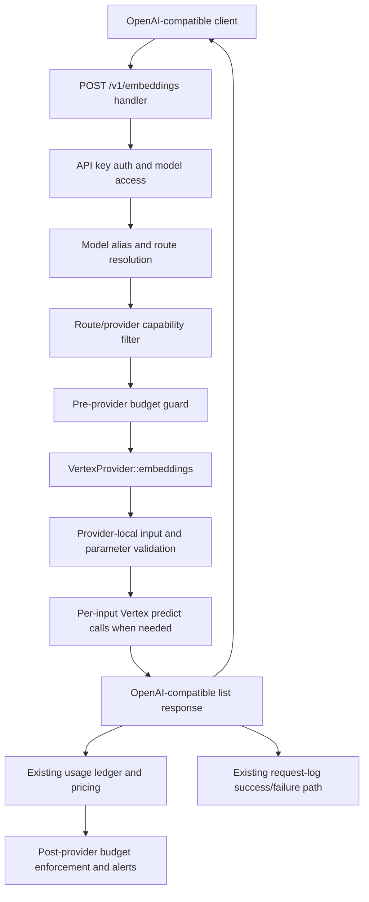

# Vertex Gemini Embeddings Implementation Plan

`See also`: [Google Vertex AI](../providers/gcp-vertex.md), [Provider API Compatibility](../reference/provider-api-compatibility.md), [Model Routing and API Behavior](../configuration/model-routing-and-api-behavior.md), [Budgets](../access/budgets.md), [Budgets and Spending](../contributing/operations/budgets-and-spending.md), [Pricing Catalog and Accounting](../configuration/pricing-catalog-and-accounting.md)

- Date: 2026-07-05
- Status: Draft plan
- GitHub issues: [#218](https://github.com/ahstn/oceans-llm/issues/218), [#103](https://github.com/ahstn/oceans-llm/issues/103)
- Primary target: native Vertex AI text embeddings through Oceans' existing OpenAI-compatible `POST /v1/embeddings` endpoint

## Summary

Implement native `gcp_vertex` embeddings for Google publisher text-embedding models, starting with `google/gemini-embedding-001` and including `google/text-embedding-005` and `google/text-multilingual-embedding-002` when they use the same verified Vertex `:predict` text-embedding contract.

The public Oceans contract remains OpenAI-compatible:

- request: `model`, `input`, optional `dimensions`, optional `encoding_format`, plus documented provider-specific extras
- input support: `string` and `string[]`
- response: `object: "list"`, ordered `data[]`, `data[].object: "embedding"`, `data[].index`, float vectors, `model`, and normalized `usage` when real token counts are available
- accounting: existing request logging, usage ledger, pricing catalog, and budget enforcement paths stay shared with chat and responses

The implementation should be conservative. Do not infer token usage from character counts, do not silently ignore unsupported OpenAI fields, and do not mark broad Vertex chat routes as embedding-capable just because the provider type can support a different embedding route.

## Decisions Already Made

1. First supported scope is broader than Gemini-only: support `gemini-embedding-001` plus verified legacy Vertex text embedding models (`text-embedding-005`, `text-multilingual-embedding-002`) when covered by the same `:predict` request/response shape. A follow-up review request expanded the text-only scope to `gemini-embedding-2` through Vertex `:embedContent`.
2. Keep the synchronous OpenAI-compatible endpoint. Async batch embeddings, vector database storage, and multimodal Gemini Embedding 2 inputs remain out of scope.
3. Reject unsupported OpenAI features locally for this provider path instead of forwarding malformed requests to Vertex.
4. Preserve the existing generic handler/accounting flow. Vertex-specific work belongs in provider mapping, response normalization, and capability derivation.
5. Keep user-facing budget setup in `docs/access/budgets.md`; keep ledger/pricing/budget internals in `docs/contributing/operations/budgets-and-spending.md` and `docs/configuration/pricing-catalog-and-accounting.md`.

## Goals

- A configured `gcp_vertex` route for a supported Google text embedding model can set `capabilities.embeddings: true` and successfully execute `POST /v1/embeddings`.
- `input: "text"` returns one embedding with `index: 0`.
- `input: ["a", "b"]` returns two embeddings in original order with indexes `0` and `1`.
- `dimensions` maps to Vertex `outputDimensionality` where the selected model supports it.
- `task_type`, `input_type`, `title`, and `auto_truncate` handling is explicit, documented, and tested.
- `encoding_format: "float"` is accepted; `encoding_format: "base64"` is rejected locally unless a later implementation adds tested float32/base64 encoding.
- OpenAI token-array inputs, nested arrays, non-string values, empty strings, and multimodal/base64 payloads fail locally with clear `invalid_request` errors for native Vertex text embeddings.
- Usage normalization uses real provider token counts only. Character or byte counts must not be relabeled as tokens.
- Successful priced usage charges the existing usage ledger and budgets. `usage_missing` and `unpriced` remain visible but do not consume budgets.
- Admin/model capability views match executable runtime support.
- Existing OpenAI-compatible embedding routes keep working unchanged.

## Non-Goals

- Multimodal embeddings for image/audio/video/PDF inputs.
- `gemini-embedding-2` multimodal support.
- Gemini Developer API key provider support.
- Async batch embedding jobs.
- Vector storage, retrieval APIs, or RAG-specific persistence.
- New native providers such as Cohere, Mistral, Hugging Face, NVIDIA NIM, or Bedrock embeddings.
- Pre-provider cost estimation for the current request.
- Replacing the existing ledger, pricing catalog, budget scopes, or request-log lifecycle.

## Current Local State

Observed from the codebase:

- `crates/gateway/src/http/mod.rs` registers `POST /v1/embeddings`.
- `crates/gateway/src/http/handlers.rs::v1_embeddings` already performs auth, model resolution, capability filtering, request logging, pre-provider budget guard, provider execution, usage accounting, and non-stream request logging.
- `crates/gateway-core/src/protocol/openai.rs`, `crates/gateway-core/src/protocol/core.rs`, and `crates/gateway-core/src/protocol/translate.rs` preserve embeddings requests as `model`, raw JSON `input`, and flattened `extra` fields.
- `crates/gateway-providers/src/openai_compat.rs` already forwards embeddings to OpenAI-compatible `/embeddings` upstreams.
- Initial planning found `crates/gateway-providers/src/vertex.rs::embeddings` returning `ProviderError::InvalidRequest("vertex embeddings are not supported in this v1 runtime")`; the implementation now supports the listed text-embedding routes.
- Initial planning found `crates/gateway-providers/src/vertex.rs::capabilities` advertising `embeddings: false` for Vertex; route-aware capability derivation now lives in shared gateway-core metadata.
- Initial planning found `crates/gateway-service/src/admin_models.rs::provider_capabilities` treating non-Anthropic `gcp_vertex` as `chat_only_streaming()`; admin/model views now use the shared Vertex route capability metadata.
- `crates/gateway-service/src/pricing_catalog.rs` maps `gcp_vertex` `google/<model_id>` routes to pricing provider `google-vertex` and model id `<model_id>`.
- `crates/gateway-service/data/pricing_catalog_fallback.json` contains input pricing for `google-vertex/gemini-embedding-001` and `google-vertex/gemini-embedding-2`.
- `docs/providers/gcp-vertex.md`, `docs/reference/provider-api-compatibility.md`, and `docs/configuration/model-routing-and-api-behavior.md` document current Vertex embedding support and capability gating.

## External API Facts Used For Planning

Source-backed facts from external documentation and implementation references:

- OpenAI embeddings create reference: `POST /v1/embeddings`; accepts `input`, `model`, optional `dimensions`, optional `encoding_format`; response shape is `object: "list"`, `data[]`, `model`, `usage.prompt_tokens`, `usage.total_tokens`.
- Vertex text embeddings `:predict` endpoint: `POST https://{host}/v1/projects/{project}/locations/{location}/publishers/google/models/{model}:predict`.
- Vertex `:predict` request body for text embeddings uses `instances: [{ content, task_type?, title? }]` and optional `parameters: { autoTruncate?, outputDimensionality? }`.
- Vertex `:predict` response shape includes `predictions[].embeddings.values` and `predictions[].embeddings.statistics.token_count`/`truncated` in the documented text-embedding response.
- Vertex `:embedContent` response shape for `gemini-embedding-2` includes `embedding.values` and `usageMetadata.promptTokenCount`/`totalTokenCount`; use `promptTokenCount` as the real input token count when present.
- `gemini-embedding-001` defaults to 3072 dimensions, has a 2048-token max sequence length in public docs, and supports lower output dimensions.
- `text-embedding-005` and `text-multilingual-embedding-002` are older Vertex text embedding models with up to 768 dimensions.
- Google task types include `RETRIEVAL_QUERY`, `RETRIEVAL_DOCUMENT`, `SEMANTIC_SIMILARITY`, `CLASSIFICATION`, `CLUSTERING`, `QUESTION_ANSWERING`, `FACT_VERIFICATION`, and `CODE_RETRIEVAL_QUERY`.
- `title` is documented as useful/valid for retrieval-document embeddings.
- `autoTruncate` defaults to provider truncation behavior when omitted; `auto_truncate: false` should make overlong inputs fail upstream instead of truncating when supported.
- Google docs are inconsistent on batching for `gemini-embedding-001`: generic text embedding docs mention multiple inputs, but model-specific REST notes say `gemini-embedding-001` supports only one input text per request on `:predict`. Plan for safe fan-out unless fixtures prove multi-instance support.
- LiteLLM design context maps OpenAI `dimensions` to Vertex `outputDimensionality`, maps `input_type` to Vertex `task_type`, transforms `instances`/`parameters`, and sums `statistics.token_count` into OpenAI-compatible usage.

Reference URLs:

- OpenAI embeddings API: https://developers.openai.com/api/reference/resources/embeddings/methods/create/
- Vertex text embeddings API: https://docs.cloud.google.com/gemini-enterprise-agent-platform/reference/models/text-embeddings-api
- Vertex get text embeddings guide: https://docs.cloud.google.com/gemini-enterprise-agent-platform/models/embeddings/get-text-embeddings
- Vertex `models.embedContent` reference: https://docs.cloud.google.com/gemini-enterprise-agent-platform/reference/rest/v1/projects.locations.publishers.models/embedContent
- Gemini embeddings API: https://ai.google.dev/api/embeddings
- Gemini embeddings guide: https://ai.google.dev/gemini-api/docs/embeddings
- Gemini embedding pricing reference: https://ai.google.dev/gemini-api/docs/pricing#gemini-embedding
- Gemini embedding GA note: https://developers.googleblog.com/gemini-embedding-available-gemini-api/
- LiteLLM Vertex embeddings transform: https://github.com/BerriAI/litellm/blob/main/litellm/llms/vertex_ai/vertex_embeddings/transformation.py
- LiteLLM Gemini batch embedding transform: https://github.com/BerriAI/litellm/blob/main/litellm/llms/vertex_ai/gemini_embeddings/batch_embed_content_transformation.py

## Architecture



### Boundary Placement

- Keep OpenAI/core DTOs loose. Do not add provider-specific fields to `gateway-core` unless every provider needs typed access.
- Add native Vertex embedding mapping helpers in `crates/gateway-providers/src/vertex.rs` near existing Google request/response mapping helpers.
- Keep generic handler behavior in `crates/gateway/src/http/handlers.rs` unchanged unless route-aware capability derivation requires a small helper update.
- Keep ledger and budget code generic. Do not add an embeddings-specific usage table or budget path.
- Update admin capability derivation in `crates/gateway-service/src/admin_models.rs` using the same support predicate as runtime route filtering.

## Route Capability Strategy

This is the highest-risk design point because route capability defaults are permissive.

Current route selection computes:

```text
provider.capabilities() ∩ route.capabilities
```

If `VertexProvider::capabilities()` simply flips `embeddings` to `true`, then existing `google/*` chat routes with default or loose route capabilities may become embedding-eligible and fail only after provider validation. That would be confusing and would violate the capability model's goal of edge failure.

Plan:

1. Introduce one shared support predicate for Vertex embedding routes, for example:
   - provider type is `gcp_vertex`
   - `upstream_model` publisher is `google`
   - model id is in the supported text-embedding set:
     - `gemini-embedding-001`
     - `gemini-embedding-2`
     - `text-embedding-005`
     - `text-multilingual-embedding-002`
   - route capability explicitly enables `embeddings`
2. Use that predicate in runtime effective capabilities so supported embedding routes can pass the `embeddings` gate.
3. Use the same predicate in admin model capability derivation so the UI/API reports executable support accurately.
4. Keep existing Google chat route examples with `embeddings: false`.
5. Prefer explicit embedding-only routes in examples:

```yaml
models:
  - id: gemini-embedding
    description: Gemini embeddings on Vertex AI
    routes:
      - provider: vertex-global
        upstream_model: google/gemini-embedding-001
        capabilities:
          chat_completions: false
          responses: false
          embeddings: true
          stream: false
          tools: false
          vision: false
          json_schema: false
```

If route compatibility metadata is needed to support multiple Vertex embedding endpoint styles, add an explicit `gcp_vertex` compatibility profile instead of encoding behavior only by model name. A new ADR is warranted only if that metadata becomes a durable config contract.

## Provider Implementation Plan

### 1. Add Vertex Embedding Model Classification

Add helpers in `crates/gateway-providers/src/vertex.rs`:

- parse and require `PublisherFamily::Google`
- classify supported text embedding models:
  - `gemini-embedding-001`
  - `gemini-embedding-2`
  - `text-embedding-005`
  - `text-multilingual-embedding-002`
- return `ProviderError::InvalidRequest` for:
  - malformed upstream model
  - unsupported publisher such as `anthropic/*`
  - unsupported Google model id when a route tries embeddings

Keep classification small and explicit. This avoids accidentally accepting Gemini chat or multimodal models under an embeddings route.

### 2. Parse OpenAI-Compatible Inputs

Add a helper such as `vertex_embedding_inputs(&CoreEmbeddingsRequest) -> Result<Vec<String>, ProviderError>`.

Accept:

- `input: "hello"`
- `input: ["hello", "world"]`

Reject locally:

- `input: []`
- empty string values
- `input: [1, 2, 3]`
- `input: [[1, 2], [3, 4]]`
- arrays containing non-string elements
- objects, null, booleans, or nested arrays
- anything that implies multimodal payloads for this text-only route

Reason: OpenAI token arrays depend on OpenAI tokenization. Vertex text embeddings expect text content. There is no provider-safe translation from OpenAI token IDs to Vertex text.

### 3. Parse and Validate Parameters

Consume request `extra` deliberately. Do not pass arbitrary OpenAI embedding extras to Vertex.

Supported public fields:

| Public field | Vertex field | Plan |
| --- | --- | --- |
| `dimensions` | `parameters.outputDimensionality` for `:predict`; `embedContentConfig.outputDimensionality` for `gemini-embedding-2` | Primary OpenAI-compatible field. Require positive integer. Validate known max per model where practical: 3072 for `gemini-embedding-001` and `gemini-embedding-2`, 768 for `text-embedding-005` and `text-multilingual-embedding-002`. |
| `output_dimensionality` | `parameters.outputDimensionality` | Provider-specific alias. Reject if it conflicts with `dimensions`. |
| `outputDimensionality` | `parameters.outputDimensionality` | Provider-native alias. Accept only if consistent with other aliases. |
| `encoding_format` absent or `float` | n/a | Accept. |
| `encoding_format: "base64"` | n/a | Reject locally for the first implementation. |
| `task_type` | `instances[].task_type` | Accept only known Google task enum values. |
| `input_type` | `instances[].task_type` | OpenAI-compat-friendly alias. Normalize common values to Google task types when documented; reject conflicts with `task_type`. |
| `title` | `instances[].title` | Accept only for `RETRIEVAL_DOCUMENT` behavior, or reject with a clear local error. Preferred: reject unless task type resolves to `RETRIEVAL_DOCUMENT`. |
| `auto_truncate` | `parameters.autoTruncate` | Accept bool. |
| `autoTruncate` | `parameters.autoTruncate` | Provider-native alias. Reject conflict with `auto_truncate`. |
| `user` | n/a | Do not forward to Vertex. It is OpenAI metadata; preserve request logging behavior only if already captured elsewhere. |

Task type enum to allow:

- `RETRIEVAL_QUERY`
- `RETRIEVAL_DOCUMENT`
- `SEMANTIC_SIMILARITY`
- `CLASSIFICATION`
- `CLUSTERING`
- `QUESTION_ANSWERING`
- `FACT_VERIFICATION`
- `CODE_RETRIEVAL_QUERY`

If the selected legacy model rejects one of these values in empirical fixtures, narrow the model-specific set and document it.

### 4. Build Vertex `:predict` Requests

For each input text, build:

```json
{
  "instances": [
    {
      "content": "text to embed",
      "task_type": "SEMANTIC_SIMILARITY"
    }
  ],
  "parameters": {
    "outputDimensionality": 768,
    "autoTruncate": true
  }
}
```

Omit optional fields when absent.

Endpoint:

```text
{base}/v1/projects/{project_id}/locations/{location}/publishers/google/models/{model_id}:predict
```

Reuse existing `VertexProvider::model_endpoint("google", model_id, "predict")` and `build_request` so auth, default headers, route extra headers, timeout, and `x-request-id` stay consistent with chat paths.

Route `extra_body` policy:

- Prefer not to rely on `extra_body` for ordinary embedding parameters; request fields should be documented and validated.
- If `extra_body` is applied, merge it after generated body only for admin-controlled experiments, then re-run validation so route config cannot bypass local safeguards.
- Document any final override behavior in `docs/providers/gcp-vertex.md` and `docs/reference/provider-api-compatibility.md`.

### 5. Preserve OpenAI Array Semantics

OpenAI array input means independent embeddings, not one fused prompt.

For `input: ["a", "b"]`:

- produce two upstream embedding operations if the chosen Vertex API style only supports one input per request
- keep result index `0` for `"a"` and `1` for `"b"`
- aggregate usage across all upstream calls
- fail the whole request if any upstream call fails
- do not collapse all strings into one newline-joined content

Concurrency:

- Add a small bounded fan-out inside `VertexProvider`, not in the generic handler.
- Use a boring constant initially, for example `VERTEX_EMBEDDING_FANOUT_LIMIT: usize = 4`, unless the repo has an existing config pattern for provider concurrency.
- Preserve output ordering by storing each result with its original input index.
- Keep single-input requests as one upstream call.

Future optimization:

- If empirical tests prove multi-instance `:predict` works for a model, add model/API-style capability and tests before switching from fan-out.
- Keep Gemini `batchEmbedContents` and async batch as separate future API styles; do not mix them into this first synchronous `gcp_vertex` provider path.

### 6. Normalize Vertex Responses

Support the documented `:predict` response shape:

```json
{
  "predictions": [
    {
      "embeddings": {
        "values": [0.1, 0.2],
        "statistics": {
          "token_count": 5,
          "truncated": false
        }
      }
    }
  ]
}
```

Normalize to:

```json
{
  "object": "list",
  "data": [
    {
      "object": "embedding",
      "index": 0,
      "embedding": [0.1, 0.2]
    }
  ],
  "model": "gemini-embedding",
  "usage": {
    "prompt_tokens": 5,
    "total_tokens": 5
  }
}
```

Rules:

- `model` should use `context.model_key`; the handler also normalizes top-level `model` to the requested gateway model key.
- Validate that vectors are numeric arrays.
- Treat missing/invalid vectors as provider response errors (`ProviderError::Transport` with a specific message), not as local request errors.
- Sum per-input `statistics.token_count` when present.
- Include `usage.prompt_tokens` and `usage.total_tokens` only when token counts are real.
- Do not convert `billable_character_count` to token usage.
- Consider preserving `truncated` and raw provider statistics in `usage.provider_usage` only if existing logging/accounting parsers tolerate extra fields and user-facing response compatibility remains acceptable. Otherwise keep public response minimal and rely on request-log payloads for raw response capture.

### 7. Error Handling

Follow existing Vertex conventions:

- local validation: `ProviderError::InvalidRequest(message)`
- upstream non-2xx: `ProviderError::UpstreamHttp { status, body }`
- invalid provider JSON or invalid provider response shape: `ProviderError::Transport(message)`
- reqwest timeout/transport: existing `map_reqwest_error`

Error messages should name the unsupported field and the supported contract. Examples:

- `vertex embeddings input must be a string or array of strings; token arrays are not supported`
- `vertex embeddings encoding_format "base64" is not supported; use "float"`
- `vertex embeddings title is only supported with task_type RETRIEVAL_DOCUMENT`
- `vertex embeddings route google/gemini-2.0-flash is not a supported embedding model`

## Accounting, Pricing, And Budgets

### Preserve Existing Flow

`v1_embeddings` already calls:

- `enforce_pre_provider_budget` before provider execution
- `provider.embeddings`
- `finalize_successful_usage_accounting` after provider success
- `usage_value_from_response(&value)` to read top-level `usage`
- `best_effort_log_non_stream_success` / failure helpers

Do not fork this flow. Provider normalization should feed it.

### Usage Normalization

For Vertex text embeddings:

- `usage.prompt_tokens`: sum `statistics.token_count` across inputs when present
- `usage.total_tokens`: same as prompt tokens for text embeddings
- `usage.completion_tokens`: omit, or set `0` only if tests confirm downstream summaries/pricing remain correct
- no token counts: omit `usage` or omit token fields so the ledger records `usage_missing`

Current `GatewayService::record_chat_usage` accepts `prompt_tokens`/`input_tokens`, `completion_tokens`/`output_tokens`, and `total_tokens`.

### Pricing

`gcp_vertex` pricing target logic already maps:

- `google/gemini-embedding-001` -> `google-vertex/gemini-embedding-001`
- `google/text-embedding-005` -> `google-vertex/text-embedding-005`
- `google/text-multilingual-embedding-002` -> `google-vertex/text-multilingual-embedding-002`

Add tests for exact target behavior and missing-row behavior.

Budget correctness depends on pricing rows and normalized token counts:

- real token usage + exact pricing row -> `priced`, counts toward spend and hard-limit windows
- real token usage + no exact pricing row -> `unpriced`, visible but does not count toward spend
- no token usage -> `usage_missing`, visible but does not count toward spend

Do not estimate request spend from input character length or output dimensions.

### Budget Documentation Split

User-facing `docs/access/budgets.md` should explain:

- budget taxonomy: user budgets, service-account budgets, user model budgets
- embedding requests are chargeable gateway traffic when usage/pricing are available
- user model budgets can target an embedding gateway model such as `gemini-embedding`
- service-account budgets apply to automation embedding calls exactly like chat calls
- `unpriced` and `usage_missing` rows are visible accounting-quality signals but do not consume budgets
- Vertex provider service-account credentials are not gateway service accounts and are not budget principals

Developer docs should explain:

- one ledger row per `(request_id, ownership_scope_key)`
- input-token-only accounting for embeddings
- how `usage_missing` and `unpriced` are produced
- post-provider budget behavior and alert implications
- pricing source and model id resolution for `google-vertex/*`

## Admin And Capability Updates

Update runtime and admin surfaces together.

Runtime targets:

- `crates/gateway-providers/src/vertex.rs`
  - implement `ProviderClient::embeddings`
  - expose provider capability in a way that does not make unsupported chat routes embedding-eligible
- `crates/gateway/src/http/handlers.rs`
  - if needed, make `route_effective_provider_capabilities` route-aware for Vertex embeddings using the shared predicate
  - keep generic handler flow unchanged

Admin targets:

- `crates/gateway-service/src/admin_models.rs`
  - update `provider_capabilities` or route capability computation to identify supported Vertex embedding routes
  - add tests showing:
    - `google/gemini-embedding-001` can display `embeddings: true`
    - `google/gemini-2.0-flash` chat route remains `embeddings: false` unless explicitly supported by a tested embedding API style
    - `anthropic/*` remains embeddings not applicable

Config/admin docs should recommend explicit route capabilities. Do not rely on permissive defaults for partial providers.

## Documentation Plan

### User-Facing Docs

Update these pages after implementation:

1. `docs/providers/gcp-vertex.md`
   - Replace blanket unsupported statement for `/v1/embeddings`.
   - Add Vertex embeddings route example.
   - Add curl and OpenAI SDK examples.
   - Document supported models, request parameters, limits, fan-out behavior, usage/pricing/budget notes, and troubleshooting.
   - Keep chat Gemini examples with `embeddings: false`.

2. `docs/reference/provider-api-compatibility.md`
   - Update provider endpoint matrix for `gcp_vertex` `google/*` embeddings.
   - Keep `anthropic/*` embeddings as not applicable.
   - Add Vertex embeddings compatibility section for input support, local rejections, parameter mapping, response normalization, usage/pricing caveats.
   - Remove or reclassify #103 as completed after implementation lands.

3. `docs/configuration/model-routing-and-api-behavior.md`
   - Replace current limitation saying Vertex embeddings are out of scope.
   - Explain embedding route capability filtering and embedding-only Vertex routes.
   - Add failure examples for capability mismatch and unsupported input.

4. `docs/configuration/configuration-reference.md`
   - Add a Vertex embedding-only route example.
   - Add `gcp_vertex` caveat that pricing is inferred from `google/*` and embedding routes should declare explicit capabilities.

5. `docs/access/budgets.md`
   - Add user-facing section for embedding spend and budgets per model.
   - Include steps for a user model budget targeting an embedding gateway model.
   - Keep taxonomy, setup, and principal model here.

6. `docs/access/admin-control-plane.md`
   - Broaden current capability visibility wording from Responses-only to Responses and embeddings.

### Developer/Maintainer Docs

Update these pages after implementation:

1. `docs/contributing/operations/budgets-and-spending.md`
   - Add embeddings-specific ledger lifecycle details.
   - Keep setup/taxonomy out of this page; link to `docs/access/budgets.md`.

2. `docs/configuration/pricing-catalog-and-accounting.md`
   - Document Vertex embedding pricing behavior, `usage_missing`, `unpriced`, and input-token-only charging.
   - State whether dimensions/task/truncation affects pricing status.

3. `docs/reference/request-lifecycle-and-failure-modes.md`
   - Add Vertex embeddings lifecycle/failure examples.

4. `docs/operations/observability-and-request-logs.md`
   - Add a note that native Vertex embeddings log `operation: embeddings`, provider attempts, and sanitized payloads through existing policy.

5. Historical ADRs
   - Do not rewrite accepted ADRs.
   - Optionally append status notes to ADRs that currently say Vertex embeddings are deferred if the capability model or provider support changes materially.

## Test Plan

Delegate test authoring to the Tester agent during implementation. Tests should assert behavior, not implementation plumbing.

### Provider Tests: `crates/gateway-providers/src/vertex.rs`

Add focused unit/integration-style tests for:

- supported upstream model classification
- unsupported upstream model rejection:
  - `google/gemini-2.0-flash`
  - `anthropic/claude-sonnet-4-6`
  - malformed model id
- input parsing:
  - string input
  - string array input
  - empty string rejection
  - empty array rejection
  - token-array rejection
  - nested-array rejection
  - non-string element rejection
- parameter mapping:
  - `dimensions` -> `outputDimensionality`
  - `output_dimensionality` alias
  - alias conflict rejection
  - `encoding_format: float` accepted
  - `encoding_format: base64` rejected
  - `task_type` allowed enum
  - `input_type` alias mapping
  - `task_type`/`input_type` conflict rejection
  - `title` accepted only for `RETRIEVAL_DOCUMENT`
  - `auto_truncate`/`autoTruncate` mapping and conflict rejection
- request body construction for `:predict`
- response normalization from `predictions[].embeddings.values`
- token usage aggregation from `statistics.token_count`
- usage-missing behavior when token stats are absent
- fan-out ordering for array inputs
- upstream non-2xx propagation
- invalid provider JSON/shape errors
- local HTTP test verifying:
  - endpoint path ends in `publishers/google/models/gemini-embedding-001:predict`
  - bearer auth is present
  - `x-request-id` is present
  - fan-out sends one request per input if using per-input calls

### Core Tests

Existing core DTOs can remain loose. Add or preserve tests for:

- embeddings requirements require only `embeddings`
- OpenAI/core embeddings round-trip preserves `input` and `extra`
- no narrowing that breaks OpenAI-compatible providers

### Handler/Capability Tests

Add focused tests around route selection/capability behavior:

- supported Vertex embedding route is eligible for `/v1/embeddings`
- Vertex chat route with `google/gemini-2.0-flash` is not embedding-eligible
- `anthropic/*` Vertex route is not embedding-eligible
- OpenAI-compatible embedding route remains eligible
- no-compatible-route error remains deterministic when only chat routes exist

### Accounting/Budget Tests

Add tests for:

- normalized embedding `usage.prompt_tokens` creates a priced ledger row when pricing exists
- priced embedding row counts toward user budget and user-model budget windows
- service-account embedding spend uses service-account budget
- `usage_missing` embedding row is visible but does not count toward budget
- `unpriced:model_not_found` embedding row is visible but does not count toward budget
- duplicate request id still fails before another ledger write

### Admin Model Tests

Add tests in `crates/gateway-service/src/admin_models.rs` for:

- supported Vertex embedding route displays `embeddings: true`
- unsupported Vertex Google chat route displays `embeddings: false`
- Anthropic-on-Vertex route keeps tool behavior unchanged and embeddings false
- generated client config/model data aligns with effective runtime support

### Docs Tests

After docs updates:

- run docs link/ownership checks via repo tooling
- verify new user-facing budget text does not duplicate maintainer ledger internals
- verify plan remains in `docs/plans/` and is either intentionally excluded from public docs or intentionally linked in contributor navigation

## Verification Commands For Implementation

Use `mise` per repo convention. Focused commands first:

```bash
/Users/ahstn/.local/bin/mise exec -- cargo test -p gateway-providers vertex
/Users/ahstn/.local/bin/mise exec -- cargo test -p gateway-core embeddings
/Users/ahstn/.local/bin/mise exec -- cargo test -p gateway-service pricing_catalog admin_models request_logging budget_guard
/Users/ahstn/.local/bin/mise exec -- cargo test -p gateway -- embeddings
/Users/ahstn/.local/bin/mise run //docs:build
```

Before handoff after implementation:

```bash
/Users/ahstn/.local/bin/mise exec -- cargo clippy --workspace --all-targets -- -D warnings
```

If UI/admin contract types change:

```bash
/Users/ahstn/.local/bin/mise run admin-contract-generate
/Users/ahstn/.local/bin/mise run admin-contract-check
```

## Implementation Phases

### Phase 1: Provider Mapping And Normalization

- Add supported Vertex embedding model classifier.
- Add input parser and parameter parser.
- Implement single-input `:predict` request mapping.
- Implement response vector extraction and OpenAI-compatible response normalization.
- Add provider unit tests for parsing, mapping, normalization, and local errors.

Exit criteria:

- Provider tests show string input works for `gemini-embedding-001`.
- Unsupported input forms fail locally.
- Existing OpenAI-compatible provider embedding tests remain unchanged.

### Phase 2: Batch Fan-Out And Usage Aggregation

- Add bounded fan-out for `input: string[]`.
- Preserve input order and indexes.
- Aggregate token counts across upstream calls.
- Add local HTTP tests for multiple inputs.

Exit criteria:

- Array input returns one embedding per input in order.
- Any upstream failure fails the whole request deterministically.
- Usage totals sum real token counts only.

### Phase 3: Runtime/Admin Capability Truthfulness

- Add shared route support predicate or compatibility metadata.
- Update runtime effective capability derivation.
- Update admin model capability derivation.
- Add tests for supported embedding route and unsupported chat routes.

Exit criteria:

- `google/gemini-embedding-001` embedding route can pass `/v1/embeddings` capability filtering.
- `google/gemini-2.0-flash` chat route does not become embedding-capable by accident.
- Admin/model views align with runtime behavior.

### Phase 4: Accounting And Budget Coverage

- Add pricing target test for `google/gemini-embedding-001` and legacy text embedding models when present.
- Add usage ledger tests for prompt-token-only embedding usage.
- Add budget tests for user, service-account, and user-model embedding spend.
- Add `usage_missing` and `unpriced` coverage.

Exit criteria:

- Priced embedding usage counts toward budgets.
- `usage_missing`/`unpriced` rows are visible and do not consume budget.
- Duplicate request id behavior is unchanged.

### Phase 5: Documentation Updates

- Update provider, compatibility, routing, config, budget, pricing/accounting, lifecycle, and observability docs listed above.
- Keep user-facing and developer-facing docs split.
- Add examples for route config, curl/OpenAI SDK request, budget per model, and troubleshooting.

Exit criteria:

- No docs still claim Vertex embeddings are unsupported for the implemented model family.
- User docs explain budget taxonomy and setup without leaking implementation internals.
- Developer docs explain ledger/pricing behavior without duplicating user setup guidance.

### Phase 6: Final Verification And Cleanup

- Run focused tests.
- Run docs check.
- Run lint/clippy per changed scope.
- Remove stale comments, unused imports, dead helpers, and obsolete unsupported-doc text.

Exit criteria:

- Acceptance criteria from issues #218 and #103 are satisfied.
- Existing OpenAI-compatible embeddings behavior is protected by regression coverage.
- Plan/docs/tests all describe the same capability boundary.

## Risk Register

| Risk | Impact | Mitigation |
| --- | --- | --- |
| Provider-wide `embeddings: true` makes chat routes eligible | Confusing runtime failures and stale admin capability display | Use shared route/model support predicate or explicit compatibility metadata; keep examples explicit. |
| Vertex docs conflict on multi-input support | Broken array semantics or upstream 400s | Implement safe per-input fan-out for `gemini-embedding-001`; add fixture tests before optimizing. |
| Character counts mistaken for token counts | Incorrect budgets and spend reports | Only use provider token counts for `usage`; otherwise record `usage_missing`. |
| `encoding_format: base64` silently ignored | Client receives wrong response format | Reject locally until implemented and tested. |
| `task_type`, `input_type`, and `title` drift across docs/models | Opaque upstream errors | Validate local enum/constraints and document supported subset. |
| Legacy text models differ from `gemini-embedding-001` | Incorrect dimensions/task behavior | Gate support by model classification and tests; narrow docs to verified behavior. |
| Docs overpromise budget enforcement when pricing/usage is absent | Operator confusion | User docs must state only priced rows count; `unpriced` and `usage_missing` are visible but not budget-consuming. |
| Admin UI says supported while runtime rejects, or vice versa | Loss of operator trust | Share support predicate between runtime and admin capability derivation. |
| Fan-out multiplies latency and partial failure surface | Slower large array requests | Bound concurrency, preserve order, fail whole request on any upstream error, document behavior. |
| Route `extra_body` bypasses validation | Hard-to-debug provider 400s or unsupported behavior | Re-validate after merge or do not allow route overrides for protected fields. |

## Open Questions For Implementation

These should be answered with fixture tests or explicit product decisions before coding beyond the initial narrow path:

1. Does Vertex `:predict` for `gemini-embedding-001` accept multiple `instances` in one request in the target environment, or only one?
2. Does the raw REST `:predict` response always include `statistics.token_count` for all supported models?
3. Should the public native Vertex route accept both `auto_truncate` and `autoTruncate`, or only the snake_case alias documented by Oceans?
4. Should `outputDimensionality` be accepted as a provider-native request field, or should Oceans document only `dimensions` and `output_dimensionality`?
5. Should `title` without `RETRIEVAL_DOCUMENT` be rejected locally or passed through to Vertex for provider validation?
6. Should `completion_tokens: 0` be included in the OpenAI-compatible `usage`, or omitted for embeddings?
7. Does the admin/client model response need a new explicit embedding dimension/capability metadata field, or are existing boolean capabilities enough for this issue?

## Acceptance Checklist

- [ ] `gcp_vertex` route for `google/gemini-embedding-001` executes `POST /v1/embeddings` successfully.
- [ ] Verified same-contract support for `google/text-embedding-005` and `google/text-multilingual-embedding-002`, or docs explicitly narrow support if fixtures differ.
- [ ] OpenAI-compatible string input tested.
- [ ] OpenAI-compatible array-of-strings input tested with order/index preservation.
- [ ] `dimensions`/`outputDimensionality` behavior tested.
- [ ] `task_type`/`input_type`, `title`, and `auto_truncate` accepted/rejected as documented.
- [ ] `encoding_format: base64` rejected locally unless fully implemented.
- [ ] Token arrays and nested arrays rejected locally.
- [ ] Vertex response normalized to OpenAI-compatible list shape.
- [ ] Usage normalization uses real token counts; missing token counts become `usage_missing`.
- [ ] Pricing target and ledger behavior verified for `google-vertex/gemini-embedding-001`.
- [ ] Budget behavior verified for user, service-account, and user-model budgets.
- [ ] Request logging success and provider-error paths covered.
- [ ] Admin/model capabilities align with runtime support.
- [ ] Existing OpenAI-compatible embedding routes remain unchanged.
- [ ] User-facing docs explain Vertex embedding setup, request examples, supported parameters, limitations, troubleshooting, and budgets per model.
- [ ] Developer docs explain ledger/pricing/budget internals for embeddings.
- [ ] Stale docs saying Vertex embeddings are unsupported are removed or scoped to unsupported model families.
