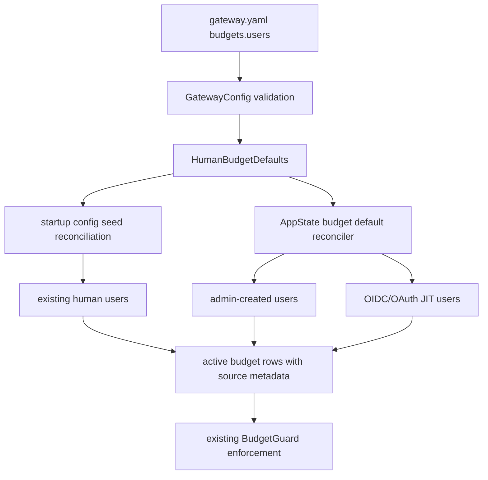

# Issue 227: Declarative Default User And User-Model Budget Policies

`See also`: [Budgets](../access/budgets.md), [Configuration Reference](../configuration/configuration-reference.md), [Budgets and Spending](../contributing/operations/budgets-and-spending.md), [Identity and Access](../access/identity-and-access.md), [Request Lifecycle and Failure Modes](../reference/request-lifecycle-and-failure-modes.md), [Data Relationships](../contributing/reference/data-relationships.md), [ADR: Declarative Config-Seeded Identity and Budget Reconciliation](../adr/2026-03-31-declarative-config-seeded-identity-and-budget-reconciliation.md)

- Date: 2026-07-06
- Status: Draft plan
- GitHub issue: [#227](https://github.com/ahstn/oceans-llm/issues/227)
- Primary target: declarative budget defaults for all human users, plus selected per-user model defaults for expensive gateway models

## Summary

Add a top-level `budgets` config object that lets admins express the common platform spend posture once:

```yaml
budgets:
  users:
    default:
      cadence: daily
      amount_usd: "70.0000"
      hard_limit: true
      timezone: UTC
    model_defaults:
      - model: fable-5
        budget:
          cadence: daily
          amount_usd: "40.0000"
          hard_limit: true
          timezone: UTC
```

The defaults must apply to every human user represented in the gateway, including config-seeded users, admin-created users, bootstrap-created admins, and OIDC/OAuth/JIT-created users. Existing `users[*].budget` stays as an explicit per-user override. Service-account budget semantics do not change.

Implementation should materialize defaults into the existing `BudgetScope::User` and `BudgetScope::UserModel` rows so request-path enforcement remains unchanged. The main new work is policy parsing, source-aware budget reconciliation, and user-creation hooks that keep future users covered.

## Terms

- Default user budget: a per-user budget created from `budgets.users.default`. It is not a single shared pool.
- Default user-model budget: a per-user, per-model budget created from `budgets.users.model_defaults[*]`.
- Explicit user budget: a `users[*].budget` block for a config-seeded user.
- Manual budget: a budget created or edited through the admin UI/API.
- Aggregate global user budget: one shared cap across all human users. This is out of scope for issue #227.

## Goals

- Add declarative config for one default user budget.
- Add declarative config for a concise list of selected model-specific user budget defaults.
- Apply defaults to all human users regardless of creation path.
- Preserve explicit per-user overrides.
- Preserve manual admin-created exceptions unless config explicitly owns that scope.
- Reconcile default updates and removals predictably.
- Keep enforcement, ledger writes, alerts, and spend reports on the existing budget scopes.
- Update user-facing budget docs, config syntax docs, and maintainer-facing budget internals.

## Non-Goals

- A single aggregate budget shared by all users.
- Team budgets or team budget principals.
- Service-account budget defaults.
- Adding budget fields under every `models[*]` entry.
- Adding upstream-model declarative defaults in v1.
- Changing request-path enforcement order.
- Changing budget windows or introducing timezone-based enforcement.

## Decisions

1. Use a top-level `budgets` object.
   - Budget policy is spend governance. It should not be scattered through mostly empty `models[*]` entries.
   - Model-specific defaults are expected to be rare and expensive-model focused, so a short list under `budgets.users.model_defaults` is easier to audit.

2. `model_defaults[*].model` references `models[*].id`.
   - Config already uses model keys for declarative references such as service-account `allowed_models`.
   - Stored budget scopes should use the deterministic gateway model UUID resolved from that key.
   - Do not require admins to duplicate provider upstream model strings.

3. Defaults materialize into ordinary active budget rows.
   - `BudgetGuard` and `applicable_budget_scopes` already enforce user-model then user budgets.
   - Request handling should not learn a second policy system.

4. Budget rows need ownership metadata.
   - The current `budgets` table cannot distinguish a default-derived row from an admin-created row.
   - Source metadata is required to update/remove config-owned rows without clobbering manual exceptions.
   - Source metadata should be exposed in v1 admin API responses.

5. Defaults apply to all human users.
   - Do not filter by role, auth mode, status, or creation source.
   - Disabled users may receive reconciled default rows; they cannot spend while disabled.

6. Admin edits convert inherited rows to manual.
   - If an admin edits a config-default-owned budget through the UI/API, the active row becomes a manual exception.
   - Future config-default reconciliation must not overwrite that scope unless the manual row is removed or deactivated.

7. Absence always inherits.
   - A listed user without `users[*].budget` inherits the platform default when one exists.
   - Manual/API deactivation is the escape hatch for users that should not have an active budget.
   - Do not add an opt-out YAML syntax in v1.

## External Context

Exa search found two useful industry patterns:

- Cloudflare AI Gateway spend limits can scope cost caps by model and custom metadata such as user/team, and distinguish per-value partitions from shared buckets: https://developers.cloudflare.com/ai-gateway/features/spend-limits/
- LangSmith LLM Gateway spend policies distinguish defaults from materialized child policies and retain parent/source ownership metadata for safe updates and deletes: https://docs.langchain.com/langsmith/llm-gateway-spend-policies

The relevant lesson is not to copy either API shape. The useful pattern is source-owned default materialization: defaults create per-user children, and future reconciliation knows which rows it may manage.

## Current Local State

- `crates/gateway-core/src/budgets.rs` defines `BudgetScope::{User, ServiceAccount, UserModel}` and `BudgetModelSelector::{Model, UpstreamModel}`.
- `crates/gateway-service/src/budget_scopes.rs` evaluates human user scopes as user-model first, then user.
- `crates/gateway-service/src/budget_guard.rs` enforces active budget rows before provider execution and again before recording priced usage.
- `crates/gateway-store/migrations/V28__generic_budget_scopes.sql` created the generic `budgets` table with one active row per `scope_key`.
- `crates/gateway-store/src/libsql_store/budgets.rs` and `crates/gateway-store/src/postgres_store/budgets.rs` implement `upsert_active_budget` as a blind active-scope upsert.
- `crates/gateway/src/config.rs` supports `users[*].budget` and required `service_accounts[*].budget`, but no top-level `budgets` object.
- `crates/gateway-store/src/seed.rs::reconcile_seed_user` currently treats `users[*].budget: None` as deactivation of that user's active user budget.
- Admin-created users are created in `crates/gateway/src/http/identity.rs::create_identity_user`.
- OIDC/OAuth JIT users are created in `create_jit_oidc_user` and `create_jit_oauth_user`.
- `AppState` does not currently carry a compact budget-default policy.

## Target Architecture



Boundary placement:

- YAML parsing and model-key validation stay in `crates/gateway/src/config.rs`.
- Durable policy DTOs belong near the budget domain in `crates/gateway-core/src/budgets.rs` or a sibling module.
- Store-specific budget source columns and source-aware upserts belong in `gateway-store`.
- A small budget-default reconciliation service should live outside `http/spend.rs`; spend APIs remain direct budget mutation endpoints.
- Request-path enforcement remains unchanged.

## Config Contract

Add:

```rust
#[derive(Debug, Clone, Deserialize, Default)]
#[serde(deny_unknown_fields)]
pub struct BudgetsConfig {
    #[serde(default)]
    pub users: UserBudgetDefaultsConfig,
}

#[derive(Debug, Clone, Deserialize, Default)]
#[serde(deny_unknown_fields)]
pub struct UserBudgetDefaultsConfig {
    #[serde(default)]
    pub default: Option<BudgetConfig>,
    #[serde(default)]
    pub model_defaults: Vec<UserModelBudgetDefaultConfig>,
}

#[derive(Debug, Clone, Deserialize)]
#[serde(deny_unknown_fields)]
pub struct UserModelBudgetDefaultConfig {
    pub model: String,
    pub budget: BudgetConfig,
}
```

Validation rules:

- `budgets.users.default`, when present, uses existing `BudgetConfig::validate`.
- `model_defaults[*].model` trims and normalizes as a config model key.
- `model_defaults[*].model` must reference a configured `models[*].id`.
- duplicate model defaults are rejected after normalization.
- `model_defaults[*].budget` uses existing budget validation.
- unknown fields are rejected.
- negative amounts remain rejected.

Seed/domain shape:

```rust
pub struct SeedHumanBudgetDefaults {
    pub default_user_budget: Option<SeedBudget>,
    pub model_defaults: Vec<SeedUserModelBudgetDefault>,
}

pub struct SeedUserModelBudgetDefault {
    pub model_key: String,
    pub model_id: Uuid,
    pub budget: SeedBudget,
}
```

Use deterministic model UUID resolution from config model key so the stored `UserModel` scope uses `BudgetModelSelector::Model`.

## Budget Source Metadata

Add source metadata to active and historical budget rows.

Recommended columns:

```sql
source_kind TEXT NOT NULL DEFAULT 'manual'
source_key TEXT
```

Recommended `source_kind` values:

- `manual`: admin UI/API-created or pre-migration rows
- `config_user_override`: row is owned by a `users[*].budget` block
- `config_user_default`: row is owned by `budgets.users.default`
- `config_user_model_default`: row is owned by `budgets.users.model_defaults[*]`

Recommended `source_key` values:

- `NULL` for `manual`
- normalized user email for `config_user_override`
- `budgets.users.default` for the default user policy
- `budgets.users.model_defaults:<model_key>` for model defaults

Store invariants:

- Existing rows migrate as `manual`.
- Admin UI/API upserts write `manual`.
- Explicit `users[*].budget` upserts may replace a config-default-owned row for that same user scope.
- Default reconciliation may update only rows whose active scope is absent or whose source matches the same default source.
- Default reconciliation must skip active `manual` and `config_user_override` rows.
- Removing a default deactivates only active rows with the matching config-default source.

This metadata should be returned on internal `BudgetRecord` and exposed in v1 admin API budget responses. Label it as source/ownership state rather than a user-editable field.

## Reconciliation Semantics

### Startup Seed

The seed entrypoint should pass `SeedHumanBudgetDefaults` into store reconciliation.

Reconciliation order:

1. Seed providers and models.
2. Seed teams and service accounts.
3. Seed configured users and explicit `users[*].budget` overrides.
4. Apply default user budget to all human users without an active manual or explicit override.
5. Apply model defaults to all human users without an active manual or explicit per-user model budget for that model.
6. Deactivate stale config-default rows whose source keys are no longer present.

Important change: `users[*].budget: None` should no longer mean "deactivate any active user budget" when a platform default exists. It should mean "this listed user has no explicit override; use the default unless a manual exception exists."

If backwards compatibility requires an explicit way to clear a listed user's inherited default, add that as a follow-up design rather than overloading omission.

### Runtime User Creation

All user creation paths must apply the same default policy after the user row exists:

- admin-created users in `create_identity_user`
- OIDC JIT users in `create_jit_oidc_user`
- OAuth JIT users in `create_jit_oauth_user`
- bootstrap-created admin users if the bootstrap path creates or ensures a human user row

Invited OIDC/OAuth users created by admins should already receive defaults at admin creation time. Activation should not duplicate work, though an idempotent reconciliation call after activation is acceptable if simpler.

Runtime paths need access to the parsed policy. Recommended option:

- derive a compact `HumanBudgetDefaults` value from `GatewayConfig`
- store it in `AppState` as `Arc<HumanBudgetDefaults>`
- call a shared `apply_budget_defaults_for_user(store, policy, user_id, now)` helper

Do not keep the full `GatewayConfig` in `AppState`.

### Updates And Removal

When `budgets.users.default` changes:

- update all active `config_user_default` rows
- leave `manual` and `config_user_override` rows unchanged
- create missing default rows for users without an active override

When `budgets.users.default` is removed:

- deactivate only active `config_user_default` rows
- leave manual and explicit override rows unchanged

When a model default changes:

- update all active `config_user_model_default` rows for that model source key
- create missing rows for users without an active override for that model scope

When a model default is removed:

- deactivate only active `config_user_model_default` rows for that source key

When a `users[*].budget` override is added:

- replace a default-owned active user budget for that user with a `config_user_override` row/settings
- do not overwrite an active manual user budget unless this is explicitly decided and documented

## Store And Trait Work

Core/domain:

- Extend `BudgetRecord` with source metadata.
- Add a `BudgetSource` enum or stringly-safe domain type.
- Add seed structs for human budget defaults.

Traits:

- Keep `BudgetRepository::upsert_active_budget` as the manual/admin mutation surface, or add an explicit source parameter with a manual default at call sites.
- Add source-aware methods for reconciliation, for example:
  - `upsert_config_owned_budget`
  - `deactivate_config_owned_budgets_by_source`
  - `list_budget_sources_for_active_scopes`
- Add a user listing method if existing `list_identity_users` is too admin-shaped for store-level reconciliation.

Migrations:

- Add a new migration after the current active migration.
- Update libsql and Postgres variants.
- Update `migration_registry.rs`.
- Update app-table/schema detection where needed.
- Backfill existing rows to `source_kind = 'manual'`.

Store implementations:

- Update budget SELECT/decode helpers to read source metadata.
- Ensure admin upsert writes `manual`.
- Implement source-aware reconciliation in both libsql and Postgres.
- Keep source checks inside SQL transactions where a race could otherwise overwrite a manual exception.

## Admin API And UI

Minimum v1:

- Existing admin spend APIs continue to create manual budget rows.
- Existing UI continues to edit budgets as manual exceptions.
- Listing budgets exposes source metadata.
- Editing source directly is not exposed.

Recommended UI enhancement:

- Show a small read-only label for inherited/config-default budgets versus manual/explicit budgets on `/admin/spend-controls`.
- Explain through labels, not long instructional text, that editing an inherited budget creates or preserves a manual exception.

Admin editing an inherited default row converts it to `manual`.

## Documentation Plan

User-facing docs:

- Update `docs/access/budgets.md`.
  - Explain taxonomy: user, service-account, user-model, default user, default user-model.
  - Show the `$70/day` user default plus `$40/day` selected model default example.
  - Explain precedence: manual or explicit per-user budget wins over default; user-model and user budgets both enforce.
  - Explain that model defaults apply per user and do not create one shared model pool.
  - Keep service accounts separate.

Config docs:

- Update `docs/configuration/configuration-reference.md`.
  - Add `budgets` to top-level sections.
  - Document YAML syntax and validation.
  - Document seed/reconciliation behavior and source ownership.
  - Clarify `users[*].budget` as an override rather than the only declarative user budget.

Maintainer docs:

- Update `docs/contributing/operations/budgets-and-spending.md`.
  - Document source metadata, reconciliation semantics, and request-path non-changes.
  - Link back to user-facing budget docs for setup.

ADRs:

- Consider a short ADR if implementation chooses a durable ownership model beyond simple `source_kind/source_key`, or if it changes previous seed deletion semantics in a way maintainers must remember.

Do not put this implementation plan in primary user-facing navigation.

## Test Plan

Config tests in `crates/gateway/src/config.rs`:

- parses `budgets.users.default`
- parses `budgets.users.model_defaults`
- rejects unknown model key
- rejects duplicate model default key
- rejects invalid/negative amount
- `users[*].budget` still parses as explicit override

Budget domain tests:

- source enum serializes/deserializes expected DB values
- invalid source values fail cleanly

Migration/store tests:

- existing budget rows migrate to `manual`
- admin/API upsert writes `manual`
- config default creates missing user budgets
- config default skips active manual user budget
- explicit config user budget overrides a config-default-owned row
- default update changes only config-default-owned rows
- default removal deactivates only config-default-owned rows
- model default creates one user-model row per user per model
- model default uses gateway model UUID, not upstream string
- model default skips manual user-model exceptions
- disabled users are reconciled consistently with active users
- libsql and Postgres behavior match

Identity tests:

- admin-created user receives default user and model budgets
- OIDC JIT user receives defaults
- OAuth JIT user receives defaults
- invited OIDC/OAuth activation does not duplicate or overwrite manual budgets
- bootstrap admin receives defaults when represented as a normal human user row

Enforcement regression tests:

- request-path user-model then user order remains unchanged
- manual exception is enforced instead of default settings
- priced rows count toward default-materialized scopes
- unpriced and usage-missing rows remain non-consuming

Docs checks:

```bash
mise run docs:check
mise run admin-contract-generate
mise run admin-contract-check
mise run lint
```

Run `cargo clippy --workspace --all-targets -- -D warnings` instead of full lint only if the final implementation is Rust-only and no admin UI/generated contract changes are introduced.

## Implementation Phases

### Phase 1: Source Metadata

Add budget source metadata to core, migrations, libsql, and Postgres.

Done when:

- all active budget reads include source metadata
- admin budget mutations continue to work as manual rows
- migration tests pass for both backends

### Phase 2: Config Parsing

Add the top-level `budgets` config object and seed/domain policy DTOs.

Done when:

- YAML parses and validates the new shape
- model defaults resolve only configured model keys
- config tests cover valid and invalid cases

### Phase 3: Source-Aware Reconciliation

Implement default budget materialization for all existing users during seed.

Done when:

- defaults apply to all existing users
- explicit and manual overrides are preserved
- updates/removals affect only config-owned rows
- seed tests cover libsql and Postgres

### Phase 4: Runtime User-Creation Hooks

Make parsed defaults available to HTTP/JIT creation paths and apply them after user creation.

Done when:

- admin-created users receive defaults
- OIDC/OAuth JIT users receive defaults
- bootstrap-created human admins are covered
- repeated reconciliation is idempotent

### Phase 5: Admin API/UI Polish

Expose source state where useful and keep manual edits understandable.

Done when:

- admin spend control surfaces do not misrepresent inherited defaults as ordinary one-off rows
- contract artifacts are regenerated if API shapes change
- UI tests cover any visible source labels or edit behavior

### Phase 6: Documentation

Update user-facing, config, and maintainer docs.

Done when:

- admins can configure default user budgets and selected model defaults from docs alone
- docs clearly separate default-per-user policy from aggregate global budget
- maintainer docs explain ownership metadata and reconciliation
- `mise run docs:check` passes

## Risks And Mitigations

- Risk: default reconciliation overwrites manual exceptions.
  - Mitigation: source metadata plus source-aware SQL predicates.

- Risk: removing a default leaves stale active rows.
  - Mitigation: stable source keys and explicit deactivate-by-source behavior.

- Risk: applying defaults only at startup misses future users.
  - Mitigation: shared helper used by admin-created and JIT-created user paths.

- Risk: changing `users[*].budget: None` surprises existing deployments.
  - Mitigation: document the new inheritance semantics and keep explicit override behavior clear.

- Risk: admin UI edits accidentally remain config-owned and are later overwritten.
  - Mitigation: admin/API upsert converts the active scope to `manual`.

- Risk: aliases create ambiguous model-default expectations.
  - Mitigation: document that `model_defaults[*].model` targets exactly that gateway model key; aliases do not inherit unless separately listed.

## Open Questions

- Should a follow-up issue add aggregate global user budgets as a distinct `BudgetScope`?
