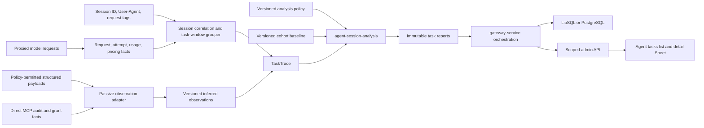

# Agent Task Analysis and Efficiency

`See also`: [Agent Session Analysis](../operations/agent-session-analysis.md), [Agent Session Analysis Architecture](../contributing/reference/agent-session-analysis.md), [Passive, Versioned Agent Task Analysis](../adr/2026-07-21-passive-agent-task-analysis.md), [Agent Harness Usage](../operations/agent-harness-usage.md), [Request Logs](../operations/observability/request-logs.md), [MCP Invocations](../mcp/mcp-invocations.md), [MCP Tool Access](../mcp/mcp-tool-access.md), [Pricing Catalog and Accounting](../configuration/pricing-catalog-and-accounting.md), [Data Relationships](../contributing/reference/data-relationships.md)

- Date: 2026-07-20
- Status: Implemented
- Tracking issue: [#255: Add outcome-aware agent session efficiency analytics](https://github.com/ahstn/oceans-llm/issues/255)
- Primary product resource: `Agent task`
- Headline: `Task Efficiency Score`
- Pure Rust crate: `crates/agent-session-analysis`
- Initial evidence source: passively observed gateway requests only

## Summary

Add a passive, privacy-bounded analysis subsystem that groups proxied model requests into inferred agent task windows, correlates them with request, usage, pricing, MCP, and payload-derived observations, and calculates a versioned experimental `Task Efficiency Score` from gateway-observed outcome, cost, and active time.

The first release does not require users to configure their harnesses, emit custom events, upload transcripts, or run an offline importer. Oceans uses facts already available while proxying requests:

- authenticated caller and ownership scope;
- request and request-log identifiers;
- optional self-reported session-correlation fields recognized by versioned harness adapters;
- User-Agent-derived harness labels;
- request tags;
- provider request timing and outcome;
- provider usage and pricing facts;
- direct MCP gateway invocations;
- structured request and response payloads only when the existing payload-capture policy permits inspection.

The passive model has hard limits. It cannot prove semantic task correctness, reliably observe every harness-local tool or file operation, or treat inferred boundaries as authoritative. The API, UI, reports, and docs must use `gateway-observed`, `inferred`, `experimental`, `coverage`, and `confidence` language consistently. They must not relabel successful HTTP/model delivery as semantic verification.

Issue #255 remains the umbrella epic. Delivery is split into small, gated pull requests. The numeric score remains hidden from normal admin UI until shadow calibration succeeds. Platform admins may inspect shadow diagnostics behind a runtime capability. Team Owners/Admins receive the calibrated feature through a route-level authorization matrix after the list/detail experience is proven.

## Resolved Product Decisions

1. Score tasks, not whole sessions.
   - The canonical headline is `Task Efficiency Score`.
   - The canonical admin resource is `Agent tasks`.
   - `agent-session-analysis` remains the crate name because session correlation is still an input and future direct adapters remain in its domain.

2. Use passive gateway evidence only in v1.
   - No required correlation headers.
   - No event-ingestion API.
   - No Pi JSONL or transcript import path.
   - No admin transcript upload.
   - No watched-directory importer.

3. Use observed session identifiers opportunistically.
   - Accept only fields recognized by a versioned harness adapter; do not treat every session-looking header as equivalent.
   - Store the bounded raw value, adapter namespace/version, exact source field, harness evidence, and evidence classification.
   - Scope uniqueness by authenticated ownership/caller context and adapter namespace; never use correlation input as identity or authorization.
   - Preserve optional thread/agent/parent execution evidence separately from the canonical session candidate.
   - If aliases conflict, adapter selection is ambiguous, or lineage is incomplete, record a limitation and fall back to task-window grouping rather than guessing.

4. Infer task windows.
   - Group using authenticated caller/API-key ownership, available session correlation, self-reported harness key, and explicit request tags.
   - Split after a versioned default 30-minute inactivity gap.
   - Treat the boundary as inferred and expose grouping limitations.
   - For traffic without a usable session identifier, do not invent a second session grouping above the task window.

5. Use gateway-observed outcome.
   - Each determinate terminal model request receives equal weight.
   - Successful terminal delivery counts as passed gateway outcome evidence.
   - Terminal gateway/provider failure counts as failed gateway outcome evidence.
   - Cancellation, disconnect, usage-only partial completion, or otherwise indeterminate termination is `unknown`, excluded from the outcome fraction, reported separately, and lowers coverage/confidence.
   - Provider routing attempts are not task attempts and do not enter the outcome denominator.

6. Preserve the v1 formula as experimental policy.
   - Keep weights `O^0.50 × C^0.30 × T^0.20` during shadow calibration.
   - Do not present those weights as an empirical law.
   - Do not expose the numeric headline to normal admins until sensitivity and cohort review passes.

7. Separate state dimensions.
   - Lifecycle, gateway-observed outcome, score maturity, and confidence are independent.
   - Reserve `verified` for a future direct semantic-outcome evidence path.
   - Never overload a single `ScoreState` with in-progress, failure, verification, and maturity.

8. Normalize all current provider paths.
   - Cover OpenAI-compatible Chat and Responses, Anthropic-shaped Messages, Bedrock, Vertex, embeddings, and streaming results.
   - Missing cache-write or reasoning data remains unavailable, not zero.

9. Cut cache-aware pricing over in two stages.
   - First compute and persist normalized shadow cost beside existing authoritative cost.
   - Reconcile discrepancies and provider semantics.
   - Then switch new usage and budget enforcement through an explicit dated pricing-policy cutover.
   - Do not create a permanent analytics-only cost truth.

10. Keep immutable facts and reports.
    - Append parser-versioned inferred observations.
    - Append reports keyed by input watermark and all analysis versions.
    - Late facts stale the prior report and enqueue a replacement; they never mutate historical report content.

11. Align fact retention with request logs and retain reports longer.
    - Normalized task facts and inferred observations expire with request-log retention.
    - Privacy-safe analysis reports default to 90-day retention and remain configurable/purgeable.
    - Correlation links are optional because request logs, usage rows, and MCP rows have different retention behavior.
    - Deleting a user or service account deletes identifiable task facts and reports; authoritative billing records retain their existing policy.

12. Support platform and team admins deliberately.
    - Shadow UI: platform admins only, behind a runtime gateway capability.
    - Calibrated UI: platform admins plus active team Owners/Admins.
    - The existing identity model remains single-team-per-user; `team_memberships.user_id` stays unique.
    - A team Owner/Admin sees user-owned tasks for current members of that one team and team-owned service-account tasks.
    - Membership changes affect current authorization to historical retained reports.
    - The admin shell must use a route capability matrix; team admins must not gain platform-only pages.

13. Use ReUI narrowly.
    - Add the free ReUI `data-grid` and `filters` components to the existing `radix-nova` app.
    - Keep existing shadcn Chart, Card, Badge, Sheet, Skeleton, Empty, and Alert primitives.
    - Render detail in a right-side Sheet with URL-backed `task_id` state.

## Product Outcome

After calibrated rollout, an admin can open `Observability > Agent tasks` and see task windows with:

- inferred task and optional observed session identifiers;
- lifecycle and gateway-observed outcome;
- Task Efficiency Score and score maturity;
- confidence and telemetry coverage;
- harness, requested model, caller, owner, and time range;
- actual and shadow/cutover cost provenance;
- active time and raw wall duration;
- largest explanatory findings;
- optional links to all correlated request logs, usage ledger events, and MCP invocations.

The task detail Sheet progressively discloses:

```text
Task Efficiency                                      84 / 100
Outcome       Gateway-observed success               Medium confidence
Maturity      Calibrated policy                      91% coverage
Cost          More efficient than 81% of cohort      $11.53
Active time   More efficient than 72% of cohort      8m 42s

Cache savings          $8.42 net / 71% versus uncached
Cached-context spend   $3.11 / 28% of total spend
Context peak           118k tokens / suspected compaction
Supplied tools          20 / 8 inferred invoked
Edit preparedness       Inferred from 9 / 10 classifiable files
Validation              Inferred pass after final classified mutation
Rework                  $0.84 / 7% of task spend, medium evidence
Telemetry coverage      91%, payload capture permitted
```

Every inferred metric must say what was observed, what was classified, and what was unavailable. A large number without evidence, maturity, coverage, cohort, and policy version is invalid UI and invalid API.

## Goals

- Normalize provider usage and cache pricing without provider-semantic conflation.
- Consolidate divergent usage parsing into one canonical path.
- Preserve request-level billing and request-log compatibility during shadow rollout.
- Correlate proxied requests into inferred task windows without harness setup.
- Recognize self-reported session IDs without treating them as authenticated identity.
- Add bounded, parser-versioned payload observations under the existing privacy policy.
- Implement a pure deterministic analysis crate with inspectable evidence.
- Publish one experimental then calibrated 0–100 Task Efficiency Score.
- Keep outcome, cost, active-time, cohort, confidence, coverage, and versions adjacent to the score.
- Keep cache, context, MCP, file-operation, verification, and rework metrics explanatory rather than double-counting them in the score.
- Persist append-only facts and immutable, recomputable reports for LibSQL and PostgreSQL.
- Provide platform-wide and team-scoped admin APIs with list/detail/session/aggregate views.
- Add an accessible, responsive ReUI-backed admin list and evidence Sheet.
- Preserve canonical user-facing and maintainer-facing documentation ownership.

## Non-Goals

- Requiring users to install a harness plugin or configure custom correlation headers.
- Accepting a harness event stream in v1.
- Importing local Pi, Codex, Claude, or other transcript files in v1.
- Claiming semantic task correctness from successful model delivery.
- Treating User-Agent or `session_id` as authenticated identity.
- Reusing MCP transport session IDs as agent session IDs.
- Guaranteeing complete visibility into harness-local tools, file operations, verification, compaction, subagents, approvals, or idle state.
- Storing raw prompts, source code, file contents, tool outputs, secrets, network infrastructure headers, or sensitive arguments in analytics facts.
- Ranking employees by raw activity or a context-free score.
- Rewarding cache hit rate, read volume, MCP utilization, or tool count directly.
- Assigning a universal positive read/edit ratio.
- Treating provider routing attempts as agent retries.
- Treating repeated edits or validation-driven iteration as rework without failure-linked evidence.
- Backfilling ambiguous historical cache usage or inferred task windows.
- Comparing scores across incompatible policy versions without explicit recomputation.
- Expanding users from one team to multiple teams.
- Adding aggregate dashboards before list/detail grouping and calibration are proven.

## Terms

- **Agent session**: an Oceans-generated correlation resource created only when a bounded self-reported session identifier is observed. It remains self-reported evidence.
- **Inferred task window**: a versioned grouping of proxied requests split by session/caller context and inactivity policy. It is the scored grain.
- **Model turn**: one proxied model inference request and terminal response state.
- **User turn**: a payload-derived conversation observation when capture policy and parser coverage permit it; otherwise unavailable.
- **Gateway-observed outcome**: delivery attainment derived from determinate terminal request results, not semantic task correctness.
- **Active time**: the union of observed provider/tool intervals and bounded orchestration gaps. It excludes unobserved long gaps but cannot perfectly classify user/approval waits.
- **Score maturity**: whether the formula/cohort policy is experimental or calibrated.
- **Confidence**: low, medium, or high assessment based on boundaries, outcomes, cost, timing, payload coverage, and cohort support.
- **Telemetry coverage**: versioned dimension-level coverage plus an overall 0–100 summary; missing values never receive hidden neutral scores.
- **Supplied tool inventory**: tools actually present in a proxied model request when payload policy permits inspection.
- **Potential tool inventory**: effective gateway grants that may have been available but are not proof of model-supplied schemas.
- **Inferred observation**: a bounded classification derived from structured payload/timing facts with source, confidence, parser version, and limitations.
- **Comparable cohort**: prior gateway-observed successful task windows matched only on facts known before execution.

## Current Local State

Oceans currently has request-scoped observability and billing, not task analysis.

### Request And Usage Flow

- `crates/gateway/src/http/handlers.rs` creates a canonical `request_id`, authenticates the caller, resolves one provider route, invokes the provider, then independently records usage and request logs.
- Provider attempts are modeled in `RequestAttemptRecord`, but current paths emit exactly one attempt numbered `1`; there is no retry/fallback execution loop.
- Streaming collectors retain the latest observed usage and tool-call identifiers, but failed streams can contain usage that is not currently accounted consistently.
- Embeddings uniquely records `ProviderError::PartialUsage` to the usage ledger while the failed request log omits that usage summary.

### Divergent Usage Parsing

- `crates/gateway-service/src/service.rs::usage_summary_from_value` parses top-level prompt/input, completion/output, and total tokens and errors on inferred-total overflow.
- `crates/gateway-service/src/request_logging.rs::usage_summary_from_value` duplicates that parsing but silently leaves total unavailable on overflow.
- The two paths can disagree for the same provider response.
- `record_chat_usage` is also used for embeddings, so its name no longer describes its responsibility.

### Cache And Pricing

- `UsageLedgerRecord` stores raw provider usage and snapshots input, output, cache-read, and cache-write rates.
- `service.rs::apply_token_rates` currently accepts only input and output rates and calls `compute_usage_cost` with prompt and completion tokens. It does not receive cache quantities or apply the stored cache rates.
- OpenAI-compatible responses may retain `prompt_tokens_details.cached_tokens`; current normalization does not promote it.
- OpenAI GPT-5.6 and later also report billable `cache_write_tokens`; earlier OpenAI model families do not charge an additional cache-write fee.
- Anthropic uses separate `cache_read_input_tokens` and `cache_creation_input_tokens` semantics.
- Bedrock may preserve cache counters in provider usage, while Vertex mappings can drop original cache/provenance fields.
- Missing provider cache-write telemetry cannot be interpreted as zero.

### Correlation

- `UsageLedgerRecord` has `usage_event_id` and `request_id`, but no `request_log_id`.
- MCP invocation rows have `request_id` and optional `request_log_id`.
- Correlation is therefore optional and one-to-many through `request_id`; APIs must not promise a single request-log-to-ledger/tool link.
- Existing request logs carry request tags, caller identity, User-Agent-derived harness data, timing, and optional sanitized payloads.
- Arbitrary inbound headers are not normalized into task/session facts.
- `mcp_aggregate_sessions` are MCP transport/authentication state and must never be reused as agent sessions.

### MCP Cardinality

- Request logging initially records shallow request tool counts.
- `best_effort_record_mcp_request_telemetry` can overwrite exposed-tool cardinality with the complete effective grant set.
- That set is potential inventory, not proof that schemas reached the model.
- `mcp_token_overhead` labels estimates as context telemetry, not billed spend.
- Actual response tool-call cardinality is distinct from direct MCP invocation audit rows.

### Storage And Migrations

- `V17` is the reset baseline, not the current migration head.
- The active registry is incremental from `V17` through `V40`; new schema begins at `V41` or later.
- Every migration needs paired LibSQL and PostgreSQL SQL, registry checksums, transactional application, rollback/retry tests, and behavioral parity.
- `ACTIVE_APPLICATION_TABLES` omits tables introduced in V29, V34, and V35, weakening empty-history reset detection. Fix the list before adding analytics tables.
- Request-log purge removes request-log children but does not automatically remove usage ledger or MCP invocation rows.
- No persisted, immutable analytical-report model exists today.
- No public asynchronous job resource exists; maintenance uses CLI commands, internal loops, or synchronous refresh endpoints.

### Admin API And UI

- Existing observability handlers require platform-admin access.
- Team Owners/Admins are currently rejected by the admin UI root before route loading.
- Team membership is single-team-per-user.
- Request-log HTTP pagination accepts up to 500 while both stores clamp to 200; fix this mismatch before copying the pattern.
- Rust DTOs and `utoipa` annotations are the source of truth; checked-in OpenAPI and generated TypeScript are mandatory artifacts.
- `request-logs.tsx` already approaches the repository file-size review threshold and should not absorb agent-task UI.
- The UI is `radix-nova`, Hugeicons, TanStack Start, and shadcn-based. It has no ReUI registry configuration or ReUI components today.

## External Evidence And Standards

- OpenTelemetry moved GenAI conventions into the dedicated [`semantic-conventions-genai`](https://github.com/open-telemetry/semantic-conventions-genai) repository. Current development attributes include conversation IDs, compaction indication, tool definitions/calls, evaluation evidence, cache-read/cache-creation input tokens, and reasoning output tokens.
- OpenTelemetry warns that prompts, tool definitions, arguments, results, and messages can be large and sensitive. Content capture should be opt-in and bounded.
- [OpenAI prompt caching](https://developers.openai.com/api/docs/guides/prompt-caching) reports cached reads and, for GPT-5.6 and later families, billable cache writes. Model/version semantics must be explicit.
- [Anthropic prompt caching](https://platform.claude.com/docs/en/build-with-claude/prompt-caching) distinguishes fresh input, cache reads, and cache creation with TTL-dependent write premiums.
- [Pi PR #3018](https://github.com/badlogic/pi-mono/pull/3018) documents session-derived alignment of `prompt_cache_key`, `session_id`, and `x-client-request-id` and UUIDv7 session IDs. Oceans still treats these as self-reported correlation.
- [Claude Code's gateway protocol](https://code.claude.com/docs/en/llm-gateway-protocol#request-headers) defines `x-claude-code-session-id` as the current-session aggregation key and optional agent/parent-agent headers as execution lineage. A [redacted proxy reproduction](https://github.com/anthropics/claude-code/issues/66761) confirms the same session value on parent and subagent requests, but resume continuity has not been verified from an outbound-header capture.
- [OpenCode v1.18.4 request preparation](https://github.com/anomalyco/opencode/blob/dev/packages/opencode/src/session/llm/request.ts) emits `x-session-affinity`, `X-Session-Id`, and optional `x-parent-session-id` for non-OpenCode providers, or `x-opencode-session` for OpenCode-managed providers. [PR #31511](https://github.com/anomalyco/opencode/pull/31511) reports HTTP-inspection confirmation. The newer V2 runner only source-verifies a session-derived OpenAI `prompt_cache_key`, which is overloaded and not canonical session identity.
- [Current Codex request construction](https://github.com/openai/codex/blob/main/codex-rs/codex-api/src/requests/headers.rs) emits `session-id` and `thread-id`; [wire-capture tests](https://github.com/openai/codex/blob/main/codex-rs/core/tests/suite/client.rs) verify the header/body mapping and shared session ID across a session tree. [Commit #22193](https://github.com/openai/codex/commit/7c7b4861d88960f7e3bd5b7f30f8351be666dd84) removed the historical underscored Codex header aliases.
- Oh My Pi 17.0.6 requires its own adapter rather than blindly inheriting Pi: [Anthropic requests](https://github.com/can1357/oh-my-pi/blob/main/packages/ai/src/providers/anthropic.ts) emit `X-Claude-Code-Session-Id` and a JSON-stringified `metadata.user_id.session_id`, while [official OpenAI requests](https://github.com/can1357/oh-my-pi/blob/main/packages/ai/src/providers/openai-shared.ts) emit `session_id`; OpenRouter uses a body `session_id`. [Deterministic request tests](https://github.com/can1357/oh-my-pi/blob/main/packages/ai/test/openai-responses-cache-affinity.test.ts) verify these provider-specific paths. New, forked, child, and advisor sessions may intentionally use distinct provider IDs even when a prompt-cache key is inherited.
- The harness follow-up used five distinct web-search/source-trace rounds for each harness: canonical source/version, request construction, lifecycle, history/issues/PRs, and traces/tests. Primary implementation plus request capture or deterministic request-fixture evidence exists for all four harnesses; absence and resume caveats remain explicit.
- [SWE-bench](https://www.swebench.com/original.html) uses test-passing patches as outcome evidence. Passive Oceans telemetry cannot claim equivalent semantic verification.
- [SWE-Effi](https://arxiv.org/html/2509.09853v1) evaluates resolved work under token, dollar, CPU-time, and inference-time budgets and highlights expensive failure tails.
- [Failure as a Process](https://arxiv.org/html/2607.09510v1) supports trajectory-aware failure and recovery diagnostics rather than final pass/fail alone.
- [OECD/JRC composite-indicator guidance](https://www.oecd.org/en/publications/handbook-on-constructing-composite-indicators-methodology-and-user-guide_9789264043466-en.html) treats normalization, weighting, missing data, geometric aggregation, and sensitivity analysis as explicit design decisions.
- The [SPACE framework](https://doi.org/10.1145/3453928) cautions against reducing human productivity to one activity metric.

## Target Architecture



### Dependency Direction

- `agent-session-analysis` depends only on narrow foundational crates such as `serde`, `time`, and `uuid`.
- `gateway-core` may depend one-way on `agent-session-analysis` for opaque IDs and stable persistence/report contracts.
- `agent-session-analysis` must never depend on `gateway-core`, storage, HTTP, providers, or harness formats.
- `gateway-service` owns passive adapters, grouping, provider normalization coordination, policy selection, cohort lookup, and recomputation orchestration.
- `gateway-store` owns persistence and queue implementations.
- `gateway` owns HTTP DTO mapping, authorization, runtime loops, CLI commands, and OpenAPI.
- `admin-ui` owns presentation only and consumes generated API types.

### Pure Crate API

```rust
pub fn analyze_task(
    trace: &TaskTrace,
    policy: &AnalysisPolicy,
    cohort: &CohortBaseline,
) -> Result<TaskAnalysis, AnalysisError>;
```

Recommended internal modules:

- `ids`: transparent, distinct `AgentSessionId`, `AgentTaskId`, `ModelTurnId`, `ObservationSetId`, and `AnalysisId` wrappers;
- `trace`: task facts, ordering, source, evidence, schema validation, and coverage;
- `usage`: provider-neutral token buckets, priced cost facts, and availability semantics;
- `timing`: interval union, wall time, bounded gaps, and overlap diagnostics;
- `outcome`: terminal request evidence and outcome factor;
- `cohort`: descriptors, sample size, fallback level, and baselines;
- `score`: formula, midrank normalization, clamps, rounding, and maturity;
- `diagnostics`: cache, context, MCP, payload observations, preparedness, verification, rework, and reliability;
- `report`: evidence, findings, limitations, and version envelope.

Do not expose independent analyzer functions that let callers combine incompatible policy versions.

## Passive Correlation Model

### Session Correlation

Use a versioned allowlisted adapter registry in `gateway-service`, not a generic header-name scan. An adapter returns one bounded opaque session candidate, optional execution and parent candidates, exact source provenance, confidence, coverage, and limitations. The pure analysis crate receives only normalized evidence and never imports harness formats.

#### Verified Adapter Matrix

| Harness and path | Canonical session candidate | Optional execution or parent evidence | Verified behavior and limitation |
| --- | --- | --- | --- |
| Claude Code 2.1.86+ | Case-insensitive `x-claude-code-session-id` header | `x-claude-code-agent-id`, `x-claude-code-parent-agent-id` | Present at Claude Code API/gateway ingress and shared by observed parent/subagent requests. Agent fields can be absent. Join resumed work only when the same outbound value is observed; do not substitute `system.init.session_id` or OTel `session.id`. |
| OpenCode v1.18.4 V1 path, non-OpenCode provider | Equal case-insensitive `x-session-id` and `x-session-affinity` aliases | `x-parent-session-id` | Both aliases are built from the durable OpenCode session ID. Later model/plugin headers can override them. If aliases differ, reject the correlation candidate. |
| OpenCode-managed provider | `x-opencode-session` | `x-opencode-request` is request-level, not session lineage | This is a provider-specific branch, not an alias automatically interchangeable with the generic V1 fields. |
| OpenCode V2 native OpenAI Responses | No canonical session field accepted in v1 | Body `prompt_cache_key` may be recorded as low-confidence session-derived cache affinity | The key is derived from the durable V2 session ID but is an overloaded cache field. Do not create an agent session from it alone. |
| Current Codex Responses HTTP/WebSocket and compaction | Case-insensitive `session-id` header; payload-policy-permitted fallback `client_metadata.session_id` | `thread-id`, `x-codex-turn-metadata` lineage; `x-client-request-id` equals the thread ID | Session ID is UUIDv7-backed, persisted, and shared by root and descendant threads. Current Codex deliberately removed `session_id`/`thread_id` header aliases. Memory summarization is a known route without these IDs. |
| Pi OpenAI Responses | Case-insensitive `session_id` header | `x-client-request-id` is corroborating only when equal | Session-derived UUIDv7 is stable for the Pi session. `cacheRetention: none`, compatibility configuration, or explicit override can suppress/change fields. |
| Oh My Pi Anthropic | Case-insensitive `x-claude-code-session-id`; payload-policy-permitted fallback to JSON-stringified body `metadata.user_id.session_id` | Per-request `x-client-request-id` is not stable | The persisted provider session ID is stable on resume. OMP intentionally implements the Claude-compatible wire contract; the field alone does not prove the executable was Claude Code rather than OMP. |
| Oh My Pi official OpenAI/OpenRouter | Official OpenAI `session_id` header; OpenRouter Responses body `session_id` only when structured payload inspection is permitted | Cache and compatibility fields remain diagnostics | New/fork/child/advisor sessions may rotate provider identity; inherited or independently configured `prompt_cache_key` must not be promoted to session identity. |

Rules:

- Treat HTTP header names as case-insensitive and JSON field names as case-sensitive.
- Remove only HTTP optional whitespace, then enforce a versioned maximum length and a conservative opaque-value character policy that supports UUIDs and OpenCode `ses_` identifiers.
- Store the accepted raw value after HTTP parsing because raw correlation was the approved debugging contract.
- Scope uniqueness by authenticated owner/caller plus adapter namespace. Store every observed alias as provenance, but collapse aliases only when that adapter declares them equivalent and their values match.
- Keep harness identity separate from wire-protocol evidence. OMP can emit Claude-compatible fields, and user-configured headers can imitate any harness.
- Prefer a canonical session header over an exact session body field. Inspect body fallbacks only when the existing payload policy permits structured inspection.
- Never promote `prompt_cache_key`, `x-client-request-id`, `thread-id`, request IDs, response IDs, OTel attributes, transcript IDs, Cloudflare/AWS traces, forwarding/IP/CDN fields, or MCP transport sessions to canonical session identity on their own.
- Keep verified execution/thread/agent and parent evidence for concurrency and lineage diagnostics. Missing lineage is unknown; do not synthesize it from timing.
- Join a resume only from the same observed canonical value. Respect observed rotation on branch, fork, fresh session, child session, or route change instead of assuming each harness has Pi semantics.
- Do not use correlation evidence to authorize, identify, rate-limit, or bill a caller.
- Unknown, stripped, unsupported, conflicted, and payload-policy-blocked fields produce explicit absence/limitation states, never heuristic replacement IDs.

### Task Window Key

Use available pre-execution facts in this order:

1. authenticated ownership/caller scope;
2. canonical observed session correlation and adapter namespace when present;
3. API key or service-account caller identity;
4. User-Agent-derived harness evidence;
5. explicit request tags;
6. versioned 30-minute inactivity split.

Optional execution/thread/agent identifiers enrich a task window but do not split it by themselves. A verified parent-session edge may associate an active child execution with the parent's task window only when owner/caller scope and time overlap; absent or conflicting lineage leaves separate inferred windows.

Requested model is a cohort dimension, not a grouping boundary; one task may switch models.

### Ordering And Late Data

- Primary order: source `occurred_at`.
- Tie-break: stable request/event identifier.
- Persist source watermark and highest included ordering key.
- Identical source facts are idempotent.
- Conflicting duplicates are rejected and counted; they are never last-write-wins.
- A late fact whose occurred time belongs in an existing window invalidates its latest report and enqueues a new immutable report.
- A fact after the policy boundary creates a new task window even when the raw session ID is unchanged.

## Payload-Derived Observations

Payload inference is permitted only when the existing request-log payload policy allows payload inspection. `Disabled` and `SummaryOnly` produce unavailable payload-derived dimensions.

The adapter may inspect structured payloads in memory, but it persists only bounded classifications and quantities:

- prompt and message counts/sizes;
- initial/effective context sizes where provider usage supports them;
- supplied tool names, stable schema hashes, schema byte/token estimates, and counts;
- inferred tool-call identity/status when structured messages expose it;
- classified read/search/create/edit/overwrite candidates;
- opaque or bounded file identity, file kind, generated/unknown status, and evidence source;
- verification command/result candidates;
- suspected compaction, context reset, or truncation observations;
- failure-linked correction spans when target and result evidence are sufficient;
- result sizes and error signatures without raw output.

Persist these as separate inferred observations, not direct canonical harness events:

```rust
pub struct InferredObservation {
    pub observation_id: ObservationId,
    pub kind: InferredObservationKind,
    pub source_request_id: String,
    pub parser_version: String,
    pub evidence: EvidenceQuality,
    pub occurred_at: OffsetDateTime,
    pub facts: BoundedObservationFacts,
    pub limitations: Vec<LimitationCode>,
}
```

Use names such as `file_edit_suspected`, `verification_result_classified`, and `compaction_suspected`. Do not emit direct `FileEdited`, `VerificationFinished`, or `Compaction` claims from passive heuristics.

Reparsing appends a new parser-versioned observation set. Reports record exactly which set they consumed.

## Provider Usage Normalization

### Canonical Contract

```rust
pub struct NormalizedTokenUsage {
    pub fresh_input_tokens: Option<i64>,
    pub cache_read_tokens: Option<i64>,
    pub cache_creation_tokens: Option<i64>,
    pub output_tokens: Option<i64>,
    pub reasoning_tokens: Option<i64>,
    pub provider_total_tokens: Option<i64>,
    pub semantics: TokenUsageSemantics,
    pub coverage: UsageCoverage,
}
```

`TokenUsageSemantics` must describe:

- whether provider input includes or excludes cache reads;
- whether cache creation overlaps input;
- whether reasoning is included in output;
- whether totals can be reconciled by addition;
- source provider/API/model family and parser version;
- missing, malformed, negative, overflow, and unsupported-field behavior.

### Provider Matrix

Implement fixtures and adapters for:

- OpenAI Chat Completions: `prompt_tokens`, `prompt_tokens_details.cached_tokens`, GPT-5.6+ `cache_write_tokens`, completion details reasoning;
- OpenAI Responses: `input_tokens`, `input_tokens_details.cached_tokens`, model-family cache-write fields, output/reasoning details;
- Anthropic Messages: `input_tokens`, `cache_read_input_tokens`, `cache_creation_input_tokens`, output tokens;
- Bedrock: normalized and raw cache read/write counters;
- Vertex Google usage metadata, including cached-content quantities when present;
- Vertex Anthropic-shaped usage;
- embeddings, including synthesized versus provider-reported counts;
- streams, including latest/final usage and usage observed before failure.

Preserve raw provider usage under the existing privacy/retention policy for audit. Never drop cache/provenance data during provider adaptation without recording unavailability.

### Canonical Parser Cleanup

Replace the duplicate service/request-log parsers with one typed normalizer and one shared error policy. Rename chat-specific accounting entry points used by embeddings.

Acceptance:

- request logs and usage ledger derive identical normalized totals;
- overflow, negatives, absent fields, and inconsistent totals behave identically;
- old summary fields remain compatible;
- normalized buckets are additive only when provider semantics permit it.

## Cache-Aware Pricing And Cutover

### Shadow Stage

Persist:

- authoritative legacy computed cost;
- normalized shadow cost by fresh input, cache read, cache creation/write, output, reasoning, and tool/provider compute;
- pricing row/override and dated pricing-policy version;
- discrepancy amount/reason;
- partial/unpriced state.

The experimental score uses the normalized shadow cost and says so. Budgets and existing spend reports continue using the authoritative legacy value during shadow.

### Cutover Stage

After provider fixture parity, shadow discrepancy review, and docs approval:

- switch new usage ledger cost and budget enforcement to cache-aware cost;
- retain legacy/shadow provenance for audit;
- do not reprice ambiguous history;
- backfill only rows whose raw usage and model-version semantics are unambiguous, as a separately reviewed operation;
- publish a dated pricing-policy boundary in spend and task-analysis charts.

### Cache Diagnostics

```text
uncached counterfactual input cost =
    fresh input at normal rate
  + cache-read tokens at normal rate
  + cache-creation tokens at normal rate

actual input cost =
    fresh input cost
  + cache-read cost
  + cache-creation/write cost

net cache savings = uncached counterfactual - actual input cost
cache savings rate = net cache savings / uncached counterfactual
```

Also report absolute cached-context spend, write premium, read/write ratio, churn, cold/warm request cost, and provider coverage. Cache hit rate remains diagnostic only.

## Task Efficiency Score

### Independent State Axes

```rust
pub enum TaskLifecycleState {
    Open,
    Finalized,
}

pub enum GatewayOutcomeState {
    Succeeded,
    Partial,
    Failed,
    Unknown,
}

pub enum ScoreMaturity {
    Experimental,
    Calibrated,
}

pub enum Confidence {
    Low,
    Medium,
    High,
}
```

A report also includes evidence class, coverage, limitations, and an optional numeric score while the task is open.

### Outcome Factor

For determinate terminal requests:

```text
O = successful terminal requests / determinate terminal requests
```

Each model request counts once. Provider attempts do not count.

Rules:

- all determinate requests successful: `O = 1` and `GatewayOutcomeState::Succeeded`;
- mix of success and failure: weighted fraction and `Partial`;
- all determinate requests failed: `O = 0`, `Failed`, and score `0`;
- no determinate terminal request: use experimental unknown prior `O = 0.5`, `Unknown`, and low confidence;
- incomplete requests do not enter numerator/denominator but reduce outcome coverage;
- normal stop, commit, push, or PR is never labeled semantic verification.

### Cost And Active-Time Efficiency

For lower-is-better value `x` in cohort size `n`, use midrank survival percentile:

```text
E(x) = clamp((count(peer > x) + 0.5 × count(peer = x)) / n, 0.01, 1.0)
```

Apply this independently to logarithmic actual cost and active time.

- `C = E(actual_task_cost)`
- `T = E(active_task_time)`

This defines ties, avoids the draft's ambiguous literal `1 - ECDF`, and prevents finite samples from accidentally reaching exact zero/one before policy clamps.

### Cohorts

Exact matching may use only observable pre-execution facts:

- gateway operation;
- requested model family/generation;
- self-reported harness key/version;
- caller class;
- explicit request tags when present.

Do not match on turns, requests consumed, provider route selected, tokens, tools, files, cost, time, or any other result of execution.

Minimum exact cohort size: `10` successful finalized task windows.

Fallback order:

1. drop explicit request tags;
2. drop caller class;
3. relax harness version to harness family;
4. relax harness family;
5. relax requested model generation to model family;
6. use versioned configured operation/model baseline;
7. lower confidence and disclose fallback level/sample.

### Active Time

Headline active time uses interval union, not sum:

- provider request intervals;
- correlated direct MCP execution intervals;
- bounded orchestration gaps up to the versioned default two minutes;
- overlapping parent/subtask-like activity only once when correlation is observable.

Also expose:

- summed provider/tool work time;
- wall duration;
- excluded long gaps;
- unknown wait time;
- overlap savings.

### Formula

```text
Task Efficiency Score = round(100 × O^0.50 × C^0.30 × T^0.20)
```

Only `O`, `C`, and `T` enter the headline. Cache, context, MCP, payload/tool/file, verification, and rework observations explain the result without independently changing it.

## Granular Diagnostics

### Outcome And Delivery

- determinate success/failure numerator and denominator;
- incomplete/unknown request count;
- gateway outcome evidence source;
- finalization reason and boundary confidence;
- terminal failure cost/time;
- semantic verification explicitly unavailable in v1.

### Resource Economics

- fresh input, cache read, cache creation, output, and reasoning tokens;
- priced/unpriced cost per bucket;
- legacy versus shadow/cutover cost;
- provider/tool compute cost where available;
- active interval union, summed work, wall duration, and excluded gaps;
- cost/time per gateway-observed successful window;
- p50/p90 failed-window cost.

### Context

- initial, median, p90, and maximum effective prompt tokens;
- context growth per model turn and active minute;
- repeated versus new context where provider evidence permits;
- tool schema contribution;
- oversized observations;
- suspected compaction/reset events and confidence;
- context-window occupancy where model limits are known.

### MCP And Tool Schema

Keep categories separate:

1. potential effective grants;
2. request-supplied definitions;
3. model-emitted tool calls;
4. direct MCP gateway invocations;
5. supplied-but-not-observed-invoked definitions;
6. deferred or filtered inventory where known.

Claim paid-unused schema burden only when supplied definitions, task-window model calls, schema sizes, and invocation evidence are all observable. Otherwise label potential or inferred burden.

### Exploration And Change

When payload policy and structured tool messages permit classification, report:

- read/search/create/edit/overwrite candidates;
- classified versus unclassified tool calls;
- explicit denominator variants;
- unique opaque file identities;
- inferred work phases;
- parser and coverage limitations.

No universal ratio target.

### Inferred Edit Preparedness

```text
inferred preparedness =
  classified eligible existing-file edits preceded by a qualifying observation
  / classified eligible existing-file edits
```

- Exclude confidently classified new-file creation.
- Keep unknown create-versus-overwrite operations out of the denominator and lower coverage.
- Treat direct reads, exposed search regions, prompt-supplied provenance, and diagnostic output as different evidence classes.
- Never present passive preparedness as complete file-system truth.

### Rework And Reliability

Only classify rework when the passive trace contains:

```text
classified failure or rejection
  -> attributable corrective work on the same bounded target
  -> classified successful replacement or verification
```

Report ambiguous iteration separately. Provider routing attempts remain reliability telemetry, not agent rework.

## Persistence Design

Finalize exact SQL in the ADR, using these ownership boundaries:

### Existing Tables To Extend

- `usage_cost_events`: normalized token buckets, usage-semantics version, shadow/cutover cost components, pricing-policy version, discrepancy state;
- `request_logs`: optional Oceans agent-session/task-window correlation IDs and analysis source/coverage metadata, without embedding traces or reports.

### New Tables

- `agent_sessions`: Oceans ID, owner/caller scope, raw external session value, adapter namespace/version, observed source provenance, harness evidence, first/last seen;
- `agent_task_windows`: task ID, optional agent session ID, owner/caller scope, boundary policy/version, lifecycle, start/end/watermark;
- `agent_task_window_requests`: ordered many-to-many-safe request correlation using request IDs and optional request-log/usage references, plus normalized session, execution, parent, confidence, and limitation evidence;
- `agent_inferred_observation_sets`: parser/version/source watermark and coverage;
- `agent_inferred_observations`: bounded typed facts and limitations;
- `agent_task_analyses`: immutable report envelope, components, evidence, limitations, versions, stale/superseded marker, expiry;
- `agent_analysis_recompute_queue`: task ID, reason, desired versions, lease, attempts, status, timestamps.

### Keys And Versions

Every report stores:

- report schema version;
- task boundary policy version;
- input watermark;
- observation parser version/set;
- analyzer version;
- score policy version;
- pricing-policy version;
- cohort version/fallback/sample size;
- analysis timestamp.

Use a uniqueness key across task ID plus all input/version dimensions. Never upsert over historical report content.

### Repository Boundary

Add a narrow `AgentSessionAnalysisRepository` in `gateway-core::traits` rather than extending request-log or budget repositories. Implement:

- idempotent task/session/request correlation append;
- immutable observation-set append;
- ordered task trace load;
- immutable analysis append;
- latest report and historical version lookup;
- scoped list/detail/aggregate queries;
- stale marking;
- recompute queue claim/complete/fail;
- fact/report purge and owner deletion.

Wire:

- LibSQL implementation;
- PostgreSQL implementation;
- `AnyStore` forwarding in a dedicated module;
- only the service generic bounds that need analysis;
- shared cross-backend behavioral tests.

### Migration Safety

Prerequisite migration work must:

- repair `ACTIVE_APPLICATION_TABLES` omissions for V29, V34, and V35 tables;
- document V17 as reset baseline and V40 as current head before analytics;
- standardize request-log page-size behavior;
- add the next paired migration at V41 or the actual next free version;
- add analytics tables to `ACTIVE_APPLICATION_TABLES`;
- test fresh apply, repeat apply, rollback/retry, checksum/name validation, JSON round trip, indexes/checks/FKs, and backend parity;
- decide and document migration-runner concurrency rather than assuming a global lock exists.

### Queue Execution

- Use a durable internal queue and service-owned periodic loop.
- PostgreSQL claims with row locking/skip-locked or an equivalent lease.
- LibSQL claims with a guarded transactional update.
- Both backends expose the same observable lease, retry, and terminal-failure behavior.
- Provide a maintainer CLI for bounded backfill/recompute.
- Do not add a public recomputation job endpoint in v1.

### Retention And Deletion

- Task windows, request links, and inferred observations: same cutoff as request logs.
- Reports: 90 days by default, configurable and purgeable.
- Queue terminal rows: bounded operational retention defined in config.
- User/service-account deletion removes identifiable analytics and enqueues aggregate recomputation.
- Request-log purge may leave usage/MCP rows under existing policy; detail correlation arrays become partial rather than invalid.

## Admin API

### Authorization

Create an `AgentTaskAdminScope` or equivalent:

- platform admin: global list/detail/session/aggregate access;
- active team Owner/Admin: current team members' user-owned tasks and team service-account tasks;
- team Member: no admin analytics access;
- inactive user: denied;
- list filters never substitute for detail authorization.

The UI root and navigation move from a platform-only boolean to a route capability matrix. Existing platform-only routes remain platform-only.

### Runtime Capability

Add gateway runtime capability fields for:

- passive analysis enabled;
- shadow diagnostics visible;
- calibrated score visible;
- team-admin analytics enabled;
- aggregate monitoring enabled.

Surface these through authenticated admin session/bootstrap data so the nav and route guards use the gateway's runtime truth rather than a UI-only environment variable.

### Endpoints

1. `GET /api/v1/admin/observability/agent-tasks`
   - page/page size with one core/store/HTTP cap;
   - owner, harness, model, operation, outcome, maturity, confidence, coverage, time, session, and tag filters;
   - latest non-stale report per task;
   - platform or scoped team results.

2. `GET /api/v1/admin/observability/agent-tasks/{task_id}`
   - summary and component values;
   - raw numerators/denominators;
   - coverage by dimension;
   - cohort/fallback;
   - inferred observations and limitations;
   - optional arrays of request-log IDs, usage-event IDs, MCP invocation IDs, and request IDs;
   - report version history metadata.

3. `GET /api/v1/admin/observability/agent-sessions/{agent_session_id}`
   - only for observed session correlation;
   - session evidence/source and task summaries;
   - no reuse of MCP transport session resources.

4. `GET /api/v1/admin/observability/agent-task-report`
   - added only after list/detail calibration;
   - explicit UTC range and dimension (`user`, `team`, `model`, `provider`, `harness`);
   - median and p10/p90;
   - gateway outcome, maturity, confidence, and coverage distributions;
   - formula/pricing-version boundaries;
   - failure-cost tail and cost/time overlays.

No endpoint returns a bare score. Every score includes maturity, gateway outcome, confidence, coverage, cohort, and policy version.

### Contract Workflow

For every endpoint:

- define Rust DTOs and `utoipa` annotations in the gateway;
- document 200, 400, 401, 403, and 404 responses through the common OpenAI error envelope;
- update `crates/gateway/openapi/admin-api.json`;
- regenerate `crates/admin-ui/web/src/generated/admin-api.ts`;
- export aliases from `src/types/live-api.ts` rather than duplicating wire types;
- use `createGatewayApiClient` and `unwrapGatewayResponse` in server adapters;
- add admin contract drift checks and E2E auth/envelope tests.

## Admin UI

### Information Architecture

- Nav label: `Agent tasks` under Observability.
- Route: `/observability/agent-tasks`.
- Selected detail: `task_id` URL search parameter.
- Desktop: server-side ReUI Data Grid plus right-side Sheet.
- Mobile: task summary rows/cards plus full-width Sheet.
- Back/forward, refresh, and shared URLs preserve the selected task.

### ReUI And shadcn Composition

Project facts:

- shadcn style/base: `radix-nova` / Radix;
- Tailwind v4;
- icon library: Hugeicons;
- package manager: Bun;
- current chart: shadcn Chart/Recharts.

Implementation workflow:

1. Add the `@reui` registry to `components.json` using the project style.
2. Install free components with the shadcn CLI:
   - `@reui/data-grid`
   - `@reui/filters`
3. Read the real component APIs before wiring props.
4. Install/read one dense grid and one filter/grid example, then adapt their composition rather than hand-rolling:
   - [Data Grid](https://reui.io/components/data-grid)
   - [Dense Data Grid preview](https://reui.io/preview/base/components/c-data-grid-3)
   - [Filters with Data Grid preview](https://reui.io/preview/base/components/c-filters-7)
   - [Async Filters with Data Grid preview](https://reui.io/preview/base/components/c-filters-8)
5. Build a TanStack `useReactTable` instance and pass documented `table`, `recordCount`, `isLoading`, `emptyMessage`, `onRowClick`, and `tableLayout` props.
6. Use ReUI Filters' documented `filters`, `fields`, `onChange`, `size`, and `allowMultiple` props with URL-backed server filters.
7. Keep installed component source intact; adapt real data, copy, tokens, and icons.
8. Use existing shadcn Sheet, Card, Badge, Alert, Skeleton, Empty, Collapsible, and Chart components.

### List Columns

- task start/end;
- caller/owner;
- raw external session indicator, not identity;
- harness;
- requested model/operation;
- lifecycle;
- gateway outcome;
- score maturity;
- numeric score only when capability allows it;
- confidence;
- coverage;
- cost and active time.

Use dense layout, stable row IDs, server pagination, skeleton loading, explicit empty/error states, and responsive overflow.

### Detail Sheet

Use a required accessible `SheetTitle`. Structure:

1. compact summary card;
2. gateway-observed outcome evidence;
3. cost and active-time components;
4. top findings and limitations;
5. collapsible cache/context/MCP/tool/file/verification/rework diagnostics;
6. telemetry coverage matrix;
7. cohort and version metadata;
8. optional correlation links.

Do not create a wall of nested cards or a giant hero metric. The calibrated number is prominent but subordinate to evidence.

### Shadow And Calibrated States

Shadow:

- platform admins only;
- runtime capability required;
- diagnostics, grouping, coverage, and components visible;
- headline number withheld from normal presentation;
- experimental limitations always visible.

Calibrated:

- platform and authorized team Owners/Admins;
- compact score summary enabled;
- team route capabilities enabled;
- aggregate route remains separately gated until list/detail validation finishes.

### Accessibility And QA

- keyboard-accessible filters, rows, Sheet close, and correlation links;
- visible focus and semantic status text, not color alone;
- `aria-label` on icon/numeric buttons;
- Skeleton, Empty, and Alert components for loading/empty/error;
- screen-reader-accessible chart summaries and tabular aggregate fallback;
- stable `n/a` versus numeric zero semantics;
- no raw content or secrets in DOM, URLs, telemetry, or fixtures;
- route tests for URL selection, role capabilities, partial evidence, stale reports, and error states;
- Playwright coverage for platform and team-admin route access, mobile/desktop Sheet behavior, and deep links.

## Documentation Ownership

Follow `docs/AGENTS.md` terminology and audience boundaries. Use `admins`, not `operators`, for people using the control plane.

### Primary Admin-Facing Docs

Implemented as [Agent Session Analysis](../operations/agent-session-analysis.md), covering:

- what Agent tasks are;
- gateway-observed versus semantic outcome;
- score, maturity, confidence, coverage, cohort, and limitations;
- shadow/calibrated feature behavior;
- privacy and retention summary;
- admin list/detail workflow.

Update canonical owners:

- `docs/operations/observability-and-request-logs.md` for passive correlation, payload policy, retention, and optional links;
- `docs/operations/observability/request-logs.md` for task correlation and one-to-many request/usage/MCP links;
- `docs/operations/agent-harness-usage.md` for self-reported User-Agent/session evidence;
- `docs/configuration/pricing-catalog-and-accounting.md` for bucket semantics and shadow/cutover behavior;
- `docs/access/budgets.md` for the dated authoritative cost cutover;
- `docs/access/admin-control-plane.md` for platform/team capabilities and Agent tasks.

### Maintainer-Facing Docs

Implemented as:

- [ADR: Passive Agent Task Analysis](../adr/2026-07-21-passive-agent-task-analysis.md);
- [Agent Session Analysis Reference](../contributing/reference/agent-session-analysis.md), which owns metrics, provider normalization, passive correlation, privacy, retention, and score-version policy.

Update:

- `docs/contributing/reference/data-relationships.md`;
- `docs/contributing/reference/admin-api-contract-workflow.md`;
- `docs/contributing/reference/e2e-contract-tests.md`;
- `docs/contributing/operations/budgets-and-spending.md`;
- `docs/mcp/mcp-invocations.md`;
- `docs/mcp/mcp-tool-access.md`;
- `crates/gateway-store/README.md` to distinguish the V17 reset baseline from current migration head;
- VitePress primary and contributor sidebars plus matching `See also` links.

Do not copy formulas, provider matrices, privacy policy, or adapter capability tables across pages. The admin guide links to canonical maintainer references.

## Delivery Plan

### Prerequisite PR A: Canonical Usage Normalization

Changes:

- Introduce one typed usage normalizer shared by accounting and request logging.
- Define provider/model semantics and availability.
- Resolve overflow/negative/malformed behavior.
- Rename chat-specific accounting entry points used by embeddings.
- Preserve existing DTO fields while adding normalized buckets.

Tests:

- all provider/operation/stream fixtures;
- service/request-log parity;
- missing/zero/nested/inclusive cache fields;
- partial stream and embedding usage;
- no raw/provenance loss.

Exit:

- one response cannot produce divergent ledger and request-log usage summaries.

### Prerequisite PR B: Observability Contract Cleanup

Changes:

- Preserve shallow actual request tool cardinality separately from potential granted inventory.
- Standardize request-log page-size cap across HTTP, core, LibSQL, PostgreSQL, docs, and tests.
- Make request-log/usage/MCP correlation explicitly one-to-many and optional.

Exit:

- no current observability field changes meaning silently when analytics begins consuming it.

### Prerequisite PR C: Migration Safety Cleanup

Changes:

- Repair `ACTIVE_APPLICATION_TABLES` omissions.
- Clarify V17 baseline versus current head in docs.
- Add migration history tests covering omitted application tables.
- Document accepted migration-runner concurrency behavior or add locking as a separate decision.

Exit:

- an untracked database containing any current application table cannot be silently treated as fresh.

### Phase 0 PR: ADR, Policy, And Synthetic Contracts

Changes:

- Write the ADR.
- Freeze IDs, source/evidence enums, task boundary ordering, duplicate conflict behavior, score state axes, formula, cohort fallback, privacy, retention, team authorization, and immutable-report semantics.
- Add handcrafted synthetic provider/payload fixtures only.
- Do not copy or commit the supplied real Pi captures.

Exit:

- every term and state has one definition;
- serialized examples reject unknown versions;
- privacy review approves bounded facts;
- direct-event/offline designs are explicitly deferred.

### Phase 1 PR: Cache-Aware Usage Shadow Accounting

Changes:

- Extend core usage records and paired migrations.
- Normalize all current providers.
- Compute legacy and normalized shadow costs.
- Record discrepancy and pricing-policy versions.
- Keep budgets authoritative on legacy cost.
- Update pricing/accounting docs.

Exit:

- supported usage buckets are independently priced in shadow;
- missing buckets remain unavailable;
- existing request/budget behavior remains unchanged;
- provider fixtures reconcile expected cost.

### Phase 2 PR: Passive Session And Task-Window Facts

Changes:

- Add `agent_sessions`, `agent_task_windows`, request links, observation sets, and observations.
- Add a versioned harness-adapter registry and deterministic request fixtures for Claude Code, OpenCode, Codex, Pi, and Oh My Pi.
- Capture bounded raw canonical session candidates, exact source provenance, optional execution/parent evidence, conflicts, and explicit absence within owner scope.
- Implement 30-minute window grouping and late-fact invalidation.
- Add payload-policy-aware classifiers.
- Add fact retention and owner deletion.

Exit:

- repeated ingestion is idempotent;
- conflicting duplicates fail explicitly;
- same owner, adapter namespace, and canonical session candidate group deterministically while verified lineage remains inspectable;
- sessionless traffic produces task windows without fake sessions;
- disabled/summary payload policy yields unavailable inferred metrics;
- no raw prompts/tool outputs/source content are stored.

### Phase 3 PR: Pure Analysis Crate

Changes:

- Add `crates/agent-session-analysis` to the workspace.
- Implement validation, outcome, timing, midrank cohort normalization, formula, coverage/confidence, cache/context/MCP/inferred diagnostics, findings, and limitations.
- Use fixed IDs/timestamps and table-driven deterministic tests.
- Do not add a property-test dependency unless a concrete invariant justifies it.

Exit:

- crate builds/tests without gateway, store, provider, network, or DB dependencies;
- fixed trace/policy/cohort produces identical report bytes/values;
- failed gateway outcome scores zero;
- unknown outcome uses disclosed prior;
- every component has evidence and raw numerator/denominator;
- missing optional data never becomes a neutral value.

### Phase 4 PR: Immutable Reports And Recompute Queue

Changes:

- Freeze report persistence after the pure API stabilizes.
- Implement new repository trait, LibSQL/PostgreSQL/AnyStore, immutable reports, stale marking, queue, internal loop, CLI, retention, and owner deletion.
- Use backend-safe claim/lease patterns.

Exit:

- equivalent facts produce equivalent reports on both backends;
- late data produces a new version and preserves history;
- concurrent workers claim one job;
- analysis failure never blocks model requests, task delivery, or authoritative billing.

### Phase 5 PR: Scoped Admin API And Runtime Capabilities

Changes:

- Add runtime capabilities to admin session/bootstrap.
- Add route access matrix for active team Owners/Admins without exposing platform-only pages.
- Add list/detail/session endpoints.
- Keep shadow capability platform-only.
- Generate OpenAPI/TypeScript contracts.

Exit:

- platform admins can inspect all retained tasks;
- team Owners/Admins are denied while shadow-only;
- calibrated scope permits only current-team member/service-account tasks;
- team Members remain denied;
- list and detail authorization agree;
- score never appears without maturity, outcome, confidence, coverage, cohort, and policy.

### Phase 6 PR: ReUI Agent Tasks List And Detail Sheet

Changes:

- Configure ReUI for `radix-nova`.
- Install/adapt Data Grid and Filters.
- Add `/observability/agent-tasks` with URL-backed filters and `task_id` Sheet state.
- Render shadow diagnostics without normal headline score.
- Add compact calibrated score treatment behind capability.
- Add correlation links and responsive/a11y states.

Exit:

- deep-linked Sheet survives refresh/back/forward;
- platform shadow and calibrated role states render correctly;
- missing evidence is visibly unavailable;
- mobile/desktop/keyboard behavior passes focused tests;
- no demo data, invented ReUI props, raw colors, or duplicated generated API types.

### Phase 7 PR: Calibration And Authoritative Cost Cutover

Changes:

- Run shadow grouping review and score sensitivity analysis.
- Validate midrank/fallback behavior at minimum cohort size 10.
- Review provider cost discrepancies.
- Approve dated pricing cutover.
- Switch new budget/spend accounting to normalized cache-aware cost.
- Enable calibrated score and team-admin capability after review.
- Publish score and pricing version boundaries.

Exit:

- grouping error rates and coverage are documented;
- score ordering is stable under plausible weights;
- expensive gateway failures cannot score well;
- no metric claims semantic verification;
- budget/spend/task analysis share one authoritative post-cutover cost.

### Phase 8 PR: Aggregate Monitoring

Changes:

- Add aggregate report endpoint.
- Add user/team/model/provider/harness distributions and trends.
- Split maturity/outcome/confidence/coverage distributions.
- Add score/pricing-version boundaries, failure-cost tails, and accessible table fallback.

Exit:

- each completed task counts once;
- experimental and calibrated values are never silently mixed;
- current team authorization applies to aggregates;
- charts remain interpretable without color and have tabular equivalents.

## Testing Strategy

### Pure Analysis

- succeeded, partial, failed, and unknown gateway outcome;
- equal request weighting and incomplete-request coverage;
- failure score zero;
- unknown prior and rounding;
- midrank ties and clamps;
- cohort sizes 1, 9, 10, fallback levels, and configured baseline;
- zero/near-zero cost/time;
- active interval union and two-minute gap cap;
- cache savings, write premium, high hit with high spend;
- missing cache buckets and semantics mismatch;
- supplied versus potential tools;
- inferred create/edit/overwrite unknown handling;
- failure-linked rework versus ambiguous iteration;
- deterministic serialization/version rejection.

### Provider And Service

- OpenAI Chat/Responses pre-5.6 and 5.6+ cache semantics;
- Anthropic cache read/creation;
- Bedrock and Vertex usage preservation;
- embeddings synthetic/partial usage;
- stream final usage and failure after usage;
- canonical request-log/ledger parser parity;
- shadow discrepancy and cutover behavior;
- billing remains authoritative and analysis errors are best effort.

### Grouping And Privacy

- same raw session value under different owners or adapter namespaces never joins;
- Claude Code, OpenCode, Codex, Pi, and Oh My Pi request fixtures cover canonical fields, aliases, execution/parent evidence, route exceptions, and absence;
- valid/invalid/oversized/overridden/conflicting aliases, historical header spellings, and payload-policy-blocked body fallbacks;
- `x-client-request-id`, `thread-id`, `prompt_cache_key`, OTel IDs, request IDs, and MCP transport IDs never become canonical sessions alone;
- sessionless and unsupported-harness fallback grouping;
- 30-minute boundary and ordering ties;
- late fact invalidates/reports again;
- payload Disabled/SummaryOnly/Redacted behavior;
- no raw prompts, paths, code, arguments, outputs, hosts, IPs, network headers, or encrypted content in facts;
- parser-versioned reparse preserves old observations.

### Store And Migration

- paired migration apply/reapply/rollback;
- active-table history detection;
- append/idempotency/conflict behavior;
- LibSQL/PostgreSQL schema and behavior parity;
- AnyStore dispatch;
- immutable reports and unique version key;
- queue claim/lease/retry/dead-letter parity;
- request-log-aligned fact purge;
- 90-day report purge;
- owner deletion and aggregate stale marking.

### API And Authorization

- runtime capability states;
- platform global access;
- active team Owner/Admin current-team access;
- team Member/inactive user denial;
- membership transfer changes historical access;
- list/detail scope agreement;
- page cap/order/filter validation;
- 400/401/403/404 error envelope;
- optional one-to-many correlation arrays;
- no bare score;
- OpenAPI and generated-TypeScript drift.

### UI

- ReUI server pagination/filter mapping;
- URL-backed Apply/Clear and `task_id` selection;
- right-side Sheet loading/error/empty/partial evidence;
- platform shadow versus calibrated team state;
- compact score metadata adjacency;
- stable zero versus unavailable formatting;
- mobile/desktop/keyboard behavior;
- chart table fallback and version boundaries;
- no unauthorized nav routes.

## Operational Telemetry

Record:

- task-window grouping count, lag, split reason, and conflict rate;
- observed session-header coverage and invalid/conflicting values;
- payload-policy coverage;
- usage-normalization success/failure by provider/API/model;
- legacy-versus-shadow cost discrepancy;
- stale report count and recompute queue age;
- analysis duration/failure;
- cohort size/fallback distribution;
- score maturity/confidence/coverage distribution;
- fact/report storage growth and purge counts;
- authorization denials by platform/team capability without sensitive identifiers.

Analysis remains best effort. It must not block data-plane requests, authoritative usage recording, budget enforcement, or task delivery.

## Risks And Mitigations

### Proxy Outcome Misread As Correctness

Risk: a 2xx model response is presented as a correct completed task.

Mitigation:

- canonical term `gateway-observed outcome`;
- reserve `verified` for future direct evidence;
- display limitations beside score;
- keep score experimental until reviewed;
- docs explicitly distinguish SWE-bench-style verification from passive delivery.

### Task-Window Misgrouping

Risk: concurrent tasks merge or slow tasks split.

Mitigation:

- visible inferred boundary/source;
- versioned 30-minute policy;
- use session IDs opportunistically;
- report grouping coverage/conflicts;
- preserve recomputation versions;
- never use grouping for authorization or billing.

### Caller-Controlled Session IDs

Risk: spoofing, collision, sensitive text, or cross-tenant correlation.

Mitigation:

- bounded validation;
- owner-scoped uniqueness;
- raw value limited to authorized detail;
- no identity/security semantics;
- deletion and retention enforcement;
- conflict limitations.

### Payload Privacy

Risk: inference expands processing of prompts, code, arguments, or outputs.

Mitigation:

- honor existing payload policy;
- bounded structured classifications only;
- no raw analytics content;
- sanitized synthetic tests;
- explicit privacy/retention docs;
- feature capability disabled by default.

### Provider Accounting Drift

Risk: providers use incompatible cache/input semantics and pricing changes by model generation.

Mitigation:

- provider/model semantics version;
- raw usage provenance;
- independent optional buckets;
- shadow discrepancy phase;
- dated cutover;
- no ambiguous historical repricing.

### False Precision And Goodhart Effects

Risk: admins optimize a 0–100 score or use it as employee ranking.

Mitigation:

- score maturity/confidence/coverage/cohort always adjacent;
- no activity metric bonus;
- no universal read/edit target;
- compact score, evidence-first Sheet;
- maturity/version separation in aggregates;
- explicit prohibition on employee performance use.

### Dynamic Team Access

Risk: moving a user into a team exposes retained historical task analytics to the new team's Owner/Admin.

Mitigation:

- document current-membership semantics;
- single-team model remains explicit;
- route and detail authorization use current membership;
- no raw payload content in reports;
- bounded retention and owner deletion;
- audit access denials and capability state.

### Immutable Report Growth

Risk: reparsing, late facts, and policy changes multiply report rows.

Mitigation:

- 90-day report retention;
- stale/superseded metadata;
- bounded observation versions;
- queue deduplication;
- storage-growth telemetry;
- purge tests on both backends.

## Acceptance Criteria

- [ ] `Task Efficiency Score` and `Agent tasks` are canonical across code, API, UI, and docs.
- [ ] The pure crate remains `agent-session-analysis` and has no gateway/store/provider/network dependency.
- [ ] Proxied requests are grouped deterministically into inferred task windows using owner/caller, versioned session-adapter evidence, harness/tags, optional verified lineage, and the versioned 30-minute gap.
- [ ] Every accepted session candidate records raw value, adapter namespace/version, exact source, confidence, and owner scope and is never used as identity/authorization.
- [ ] Claude Code, OpenCode, Codex, Pi, and Oh My Pi fixtures prove current field names, precedence, conflicts, route gaps, and lineage behavior without treating cache/request/telemetry IDs as sessions.
- [ ] Sessionless, unsupported, stripped, and payload-policy-blocked traffic remains analyzable without inventing an agent session.
- [ ] Gateway-observed outcome is an equal-weight fraction of determinate terminal request results.
- [ ] Incomplete requests are reported as unknown and reduce coverage.
- [ ] Failed gateway outcome scores zero; unknown outcome uses a disclosed experimental prior.
- [ ] The experimental formula is `round(100 × O^0.50 × C^0.30 × T^0.20)`.
- [ ] Cost/time efficiency uses midrank survival percentile and a minimum exact cohort of 10.
- [ ] Cohort matching uses only observable pre-execution facts.
- [ ] Lifecycle, gateway outcome, score maturity, and confidence are separate axes.
- [ ] Every score includes maturity, outcome, confidence, coverage, cohort, and policy version.
- [ ] OpenAI, Anthropic, Bedrock, Vertex, embeddings, and streaming usage paths normalize supported token buckets.
- [ ] Missing cache creation/write telemetry remains unavailable, not zero.
- [ ] Legacy and normalized shadow costs coexist until an explicit dated authoritative cutover.
- [ ] Post-cutover budgets, spend, and task analysis use one authoritative cache-aware cost.
- [ ] Actual request-supplied tool definitions remain distinct from effective grants and direct MCP invocations.
- [ ] Payload-derived file/tool/verification/compaction/rework facts are stored only as inferred observations with source, confidence, parser version, coverage, and limitations.
- [ ] Payload-derived inference honors Disabled/SummaryOnly/Redacted policy.
- [ ] No raw prompt, code, path, file content, tool output, sensitive argument, infrastructure header, IP, or secret is stored in default analytics facts.
- [ ] Facts are append-only/idempotent; reports are immutable and versioned by input and policy.
- [ ] Late facts stale and re-report rather than mutate history.
- [ ] Facts follow request-log retention; reports default to 90 days.
- [ ] User/service-account deletion removes identifiable analytics.
- [ ] LibSQL, PostgreSQL, and AnyStore implement and test equivalent behavior.
- [ ] Analysis/recompute failure never blocks data-plane requests, billing, budgets, or delivery.
- [ ] Shadow diagnostics are platform-admin-only behind a runtime gateway capability.
- [ ] Calibrated team Owners/Admins see only current-team member and service-account analytics through route-level authorization.
- [ ] Existing platform-only admin routes remain unavailable to team admins.
- [ ] Admin list/detail/session API never returns a bare score and models correlations as optional arrays.
- [ ] ReUI Data Grid and Filters power the Agent tasks list using documented APIs and real generated contract types.
- [ ] The right-side detail Sheet is accessible and deep-linkable through `task_id` route search.
- [ ] Aggregate dashboards ship only after list/detail calibration and keep experimental/calibrated distributions separate.
- [ ] User-facing and maintainer-facing docs have distinct canonical owners and updated nav/`See also` links.

## Saved Follow-Up Design

The following capabilities are intentionally saved but skipped from v1 implementation because Oceans cannot require every caller to configure its harness:

- trusted session/task/user-turn/model-turn correlation headers;
- authenticated append-only harness event ingestion;
- direct file observed/created/edited/overwritten events;
- direct verification and semantic outcome evidence;
- approval/user-wait/pause events;
- direct compaction and subagent parentage;
- streaming Pi or other transcript import;
- offline/online equivalence tests;
- semantic verified-success cohorts;
- calibrated outcome probability replacing the fixed unknown prior;
- multi-team membership;
- learned task archetype classification;
- organization-configurable score weights;
- cross-session cache-entry lifecycle attribution.

When revisited, direct evidence must coexist with passive observations through explicit source precedence. It must not silently reinterpret historical passive facts.
