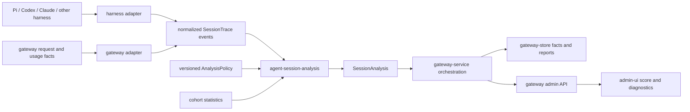

# Agent Session Analysis and Efficiency

`See also`: [Agent Harness Usage](../operations/agent-harness-usage.md), [Request Logs](../operations/observability/request-logs.md), [MCP Invocations](../mcp/mcp-invocations.md), [MCP Tool Access](../mcp/mcp-tool-access.md), [Pricing Catalog and Accounting](../configuration/pricing-catalog-and-accounting.md), [Data Relationships](../contributing/reference/data-relationships.md), [ADR: MCP Tool Grants and Token Overhead](../adr/2026-06-09-mcp-tool-grants-and-token-overhead.md)

- Date: 2026-07-20
- Status: Draft plan
- Primary target: session-level agent analytics with a single 0–100 efficiency score and inspectable outcome, resource, cache, context, MCP, read/edit, verification, and rework metrics

## Summary

Add a harness-neutral agent-session analysis subsystem to Oceans. It will correlate the model requests and tool activity that belong to one agent task, normalize provider-specific usage and harness events, calculate granular diagnostics, and publish a single `Session Efficiency Score` for quick-glance monitoring.

The headline score is a product requirement, but it must not conceal its evidence. Every score is accompanied by:

- outcome state and whether the score is verified or provisional;
- cost and active-time efficiency components;
- telemetry coverage and confidence;
- the comparable-session cohort;
- analyzer, policy, and pricing versions;
- granular diagnostics explaining cache economics, context growth, MCP burden, file-operation behavior, verification, and rework.

The score intentionally does not reward cache hit rate, a high read/edit ratio, or low tool usage directly. These are diagnostic mechanisms, not outcomes. Their economic effects are already reflected in actual cost and active time, while their quality effects belong in outcome evidence. Adding them independently would double-count costs and create incentives to perform unnecessary reads or cache irrelevant context.

Implement the analysis policy in a dedicated pure `agent-session-analysis` crate. Provider and harness adapters stay at the edges; persistence remains in `gateway-store`; orchestration remains in `gateway-service`; HTTP and UI remain in `gateway` and `admin-ui`.

## Product Outcome

For an individual task, an operator should be able to see:

```text
Session Efficiency                                      84 / 100
Outcome       Verified success                          High confidence
Cost          More efficient than 81% of comparable successful sessions
Active time   More efficient than 72% of comparable successful sessions

Cache savings          $8.42 net / 71% versus uncached
Cached-context spend   $3.11 / 28% of total spend
Context peak           118k tokens / 2 compactions
Edit preparedness      9 / 10 eligible files
Validation             Passed after final edit
Rework                 $0.84 / 7% of task spend
Unused MCP schemas     18 tools / estimated 11k repeated context tokens
Telemetry coverage     93%
```

For a user, team, model, or harness over a time range, operators should additionally see:

- median and p10/p90 Session Efficiency Score;
- verified, partial, failed, unknown, and in-progress outcome counts;
- cost and active time per verified success;
- success-within-dollar-budget and success-within-time-budget curves;
- p50/p90 failed-session cost;
- score distribution and telemetry-coverage distribution;
- top explanatory findings, without presenting activity metrics as employee productivity measures.

## Terms

- Agent session: a durable harness conversation that may span multiple user turns, model requests, compactions, and idle periods.
- Task: one requested unit of work within an agent session. Efficiency is scored at the task level first and aggregated later.
- User turn: one user-to-agent interaction within a task. It is not necessarily a complete task.
- Model turn: one provider inference request and response.
- Active time: execution time attributable to model inference, tool execution, and bounded orchestration gaps. It excludes user, approval, and long idle waits.
- Outcome evidence: acceptance checks, regression checks, explicit harness results, or weaker delivery proxies used to determine task attainment.
- Comparable cohort: prior sessions matched using facts known before execution, such as task archetype, repository, model, harness, language, and requested scope.
- Provisional score: a numeric score produced when outcome evidence or telemetry is incomplete. It must be visibly distinguished from a verified score.
- Edit preparedness: evidence that an existing file was observed before its first edit in the task.
- Exploration/change mix: descriptive reads and searches relative to creates, edits, and overwrites. It has no universal target.
- Cache economics: actual cache-read and cache-creation costs compared with an uncached counterfactual.
- Potential MCP burden: granted tool inventory that might have been exposed to a harness.
- Paid-unused MCP burden: tool definitions demonstrably supplied to the model but never invoked during the task.

## Goals

- Introduce canonical agent session, task, turn, and event semantics.
- Add a pure analysis crate with versioned input, policy, metric, finding, and report types.
- Deliver one 0–100 Session Efficiency Score suitable for compact dashboards.
- Keep outcome state, confidence, components, cohort, and formula version available wherever the score is shown.
- Normalize fresh input, cache read, cache creation/write, output, and reasoning token buckets.
- Calculate cache net savings without treating hit rate as utility.
- Measure absolute and repeated context burden, compaction, context growth, and large fixed prefixes.
- Distinguish actual model-supplied MCP schemas from potential granted inventory.
- Split read/edit analytics into exploration/change mix and edit preparedness.
- Distinguish new-file creation from editing or overwriting existing files.
- Attribute rework only when failure and corrective work are observable.
- Compare tasks against cohorts using pre-execution features.
- Support session, user, team, model, provider, and harness aggregation.
- Preserve privacy by default and make missing evidence explicit.
- Version algorithms so historical results remain interpretable and can be recomputed.

## Non-Goals

- Ranking individual engineers by raw tool activity, read count, token count, or a context-free score.
- Treating User-Agent classification as authenticated agent identity.
- Inferring semantic correctness from a normal model stop, commit, push, or final message alone.
- Treating provider routing attempts as agent retries.
- Treating repeated edits or test-driven iterations as wasted work without failure evidence.
- Treating a cache hit as proof that cached content was relevant.
- Claiming that granted MCP inventory was paid model context without evidence that schemas were supplied.
- Storing raw prompts, source code, file contents, tool outputs, or sensitive arguments by default.
- Replacing request logs, usage ledgers, MCP invocation logs, tracing, or billing records.
- Comparing score values across policy versions without an explicit recalculation or compatibility statement.

## Decisions

1. Score tasks before sessions.
   - A long-running agent session can contain unrelated user requests, resumed work, experiments, and idle gaps.
   - Session and user summaries aggregate task analyses instead of treating the entire transcript as one atomic outcome.

2. Keep a single headline score.
   - `Session Efficiency Score` is a 0–100 task-level value optimized for quick-glance monitoring.
   - The UI must show verified/provisional state and confidence adjacent to the number.
   - A number without its state, version, or coverage must not be returned by the public admin contract.

3. Base the headline on outcome, cost, and active time.
   - Outcome prevents cheap failures from appearing efficient.
   - Cost captures provider tokens, cache behavior, and priced compute without double-counting their causes.
   - Active time captures user-facing execution efficiency separately from dollars.
   - Cache, MCP, read/edit, tool reliability, context, and rework remain explanatory diagnostics in v1.

4. Use a multiplicative score.
   - A geometric form limits compensation: excellent cost cannot completely hide poor outcome or severe latency.
   - Verified failure and abandoned work score zero, regardless of how cheaply they stopped.

5. Make provisional scoring explicit rather than omitting the headline.
   - Quick-glance monitoring still receives a number when outcome evidence is incomplete.
   - Provisional outcome uses a conservative, versioned prior and is capped by its outcome factor.
   - Provisional and verified scores must never be silently mixed in rankings or aggregates.

6. Compare against successful peers.
   - Cost and time efficiency use comparable verified-successful tasks as the reference population.
   - Cohort matching uses pre-execution properties. Turns, tool calls, files changed, and other agent-created activity cannot be used to explain away inefficiency.

7. Preserve independent resource dimensions.
   - Cost and active time remain visible even when combined into the headline score.
   - Harness-level comparisons additionally publish separate budget-effectiveness curves.

8. Do not set a universal read/edit target.
   - The ratio describes work shape and varies materially for analysis, feature development, generated artifacts, and experimental search.
   - Edit preparedness is the actionable safety metric.

9. Require evidence for paid MCP overhead.
   - Effective grants are potential inventory.
   - Only tools observed in the actual model request or reported by a trusted harness adapter count as supplied definitions.

10. Store facts separately from derived analyses.
    - Append-only normalized facts can be reanalyzed when formulas, pricing, or cohorts change.
    - Analysis results retain input, analyzer, policy, cohort, and pricing versions.

## Current Local State

Oceans currently provides request-level observability, not agent-session analysis:

- `crates/gateway-service/src/request_logging.rs` records one gateway request, shallow request tool counts, response tool-call counts, normalized token totals, provider attempts, optional sanitized payloads, and User-Agent-derived harness labels.
- `docs/operations/agent-harness-usage.md` describes harness classification as self-reported operational evidence rather than authenticated identity.
- `crates/gateway-service/src/mcp_token_overhead.rs` estimates schema tokens per effectively granted MCP tool and memoizes estimates for 30 days. The fallback is serialized byte length divided by four, marked low confidence.
- `crates/gateway/src/http/handlers.rs::best_effort_record_mcp_request_telemetry` replaces the shallow request tool count with the complete effectively granted MCP inventory and estimates every granted tool. This represents potential inventory, not proven model-supplied schemas.
- `crates/gateway-service/src/mcp_invocation_logging.rs` records direct MCP gateway calls, but harness-local tools and file operations are not normalized into a session event stream.
- `crates/gateway-core/src/domain.rs::UsageLedgerRecord` retains raw provider usage JSON and normalized prompt/completion/total tokens.
- `crates/gateway-service/src/service.rs::usage_summary_from_value` does not normalize cache-read or cache-creation quantities.
- `crates/gateway-service/src/service.rs::apply_token_rates` stores cache pricing rates but currently prices all prompt tokens at the normal input rate.
- `mcp_aggregate_sessions` represents MCP transport/authentication state, not an LLM or agent conversation.
- Request payload capture may be disabled, redacted, summarized, or truncated, so it cannot be the canonical analytics source.

The repository has no canonical agent `session_id`, `task_id`, ordered semantic tool/file events, task outcome, compaction event, prompt-component sizes, or active/idle time separation.

## Evidence From Live Pi Sessions

Four large `~/.pi/agent/sessions` files were analyzed independently and read-only. Only aggregate facts were returned; raw prompts, source content, secrets, and file paths were not included.

Observed cache-hit shares ranged from approximately 92.8% to 96.8%, but cache-read spend still accounted for approximately 51% to 68% of total session cost. One experimental session processed 223 million cache-read tokens costing approximately $111.55. High hit rate made large repeated prefixes cheaper, but did not make the sessions lean.

Median effective prompt context across the samples ranged from approximately 101,000 to 158,000 tokens. Explicit compactions occurred between approximately 117,000 and 264,000 tokens. Large tool results and accumulated history were visible context-growth drivers, while the logs could not isolate system instructions from tool schemas and initial user content.

Read-to-mutation ratios ranged from approximately 0.46:1 to 3.13:1. The lowest-ratio session generated many new experiment artifacts and edited only two existing files; both existing files were read before editing. In two more conventional coding sessions, every file edited through the edit tool had been directly read first even though the global ratios would look mediocre under a fixed 4:1 target.

Naive read-before-first-mutation coverage incorrectly penalized new-file creation. In one session it reported 64.7%, while existing-file read-before-first-edit coverage was 100%. In the artifact-heavy session, naive first-mutation coverage was effectively 0% even though in-place edit preparation was effectively complete.

The experiment sessions also showed why `edit -> validation -> edit` is not automatically retry waste. Repeated experiment cycles were the intended workflow and had explicit keep/discard outcomes. Failure-linked evidence, not edit topology alone, is required for rework attribution.

These observations establish the need for task segmentation, provider-aware cache accounting, context-growth metrics, explicit create/edit semantics, and outcome-aware scoring.

## External Evidence

- SWE-bench treats applied patches passing task tests as the primary resolved outcome: https://www.swebench.com/original.html
- SWE-Effi evaluates cumulative resolved tasks under separate token, dollar, CPU-time, and inference-time budgets and reports expensive failure tails: https://arxiv.org/html/2509.09853v1
- A Microsoft study of coding-agent trajectories reports substantial same-task token variability and finds that more tokens do not reliably imply higher accuracy: https://www.microsoft.com/en-us/research/publication/how-do-ai-agents-spend-your-money-analyzing-and-predicting-token-consumption-in-agentic-coding-tasks/
- The SPACE framework cautions against reducing developer productivity to one activity metric. Oceans retains a headline operational score while preserving a balanced diagnostic scorecard: https://doi.org/10.1145/3453928
- OpenTelemetry GenAI conventions distinguish input/output usage, cache-read/cache-creation usage, conversation identity, operation duration, and tool events. They also treat prompt and tool content as sensitive and potentially large: https://opentelemetry.io/docs/specs/semconv/registry/attributes/gen-ai/
- Anthropic documents exact-prefix caching, separate cache creation/read billing, and different creation premiums by TTL: https://platform.claude.com/docs/en/build-with-claude/prompt-caching
- OpenAI documents automatic exact-prefix prompt caching and cached-token reporting with model-specific pricing: https://developers.openai.com/api/docs/guides/prompt-caching
- A paired coding-agent study found that component-level tool-output reduction did not reliably predict billed-cost reduction once cache traffic, trajectory changes, and task success were considered: https://arxiv.org/html/2607.12161v2
- OECD/JRC composite-indicator guidance identifies normalization, weighting, aggregation, missing data, and sensitivity analysis as first-class design decisions: https://www.oecd.org/en/publications/handbook-on-constructing-composite-indicators-methodology-and-user-guide_9789264043466-en

## Target Architecture



### Crate Boundary

Create `crates/agent-session-analysis` as a pure Rust domain and policy engine.

The crate should depend only on narrow foundational libraries such as `serde`, `time`, and `uuid` when required. It must not depend on:

- `gateway-service`;
- `gateway-store`;
- `gateway` HTTP types;
- provider implementations;
- Pi, Codex, Claude, or another harness transcript format;
- database or network clients.

Its initial public API should remain narrow:

```rust
pub fn analyze(
    trace: &SessionTrace,
    policy: &AnalysisPolicy,
    cohort: Option<&CohortBaseline>,
) -> SessionAnalysis;
```

Core types:

```rust
pub struct SessionTrace {
    pub session_id: SessionId,
    pub task_id: TaskId,
    pub subject: SessionSubject,
    pub events: Vec<SessionEvent>,
    pub coverage: TelemetryCoverage,
}

pub struct AnalysisPolicy {
    pub version: String,
    pub score_policy: ScorePolicy,
    pub event_semantics: EventSemantics,
    pub thresholds: DiagnosticThresholds,
}

pub struct SessionAnalysis {
    pub score: EfficiencyScore,
    pub outcome: OutcomeAnalysis,
    pub resources: ResourceAnalysis,
    pub diagnostics: SessionDiagnostics,
    pub evidence: AnalysisEvidence,
    pub limitations: Vec<Limitation>,
    pub versions: AnalysisVersions,
}
```

Provider pricing resolution, cohort queries, persistence, authentication, redaction, and UI formatting remain outside the crate. An optional `SessionAccumulator` may support online updates later, but it must produce the same result as batch analysis over the same ordered facts.

### Dependency Direction

- Harness adapters normalize source records into `agent-session-analysis` event types.
- `gateway-service` coordinates gateway facts, pricing, cohorts, analysis, and persistence.
- `gateway-core` owns repository contracts and may depend on stable analysis DTOs or wrap them in a versioned report envelope.
- `gateway-store` implements the repository contracts.
- `gateway` maps stored analysis into admin API contracts.
- `admin-ui` renders the score and explanations.

The analysis crate must never import gateway storage or request models. This preserves independent replay tests against Pi and other harness fixtures.

## Canonical Session Model

### Identity

Add opaque correlation fields:

- `agent_session_id`;
- `agent_task_id`;
- `agent_user_turn_id`;
- `agent_model_turn_id`;
- optional parent session/task/turn for subagents;
- `harness_key` and harness version;
- event source and schema version.

Trusted harnesses should send stable identifiers through an explicitly documented request contract. Adopt OpenTelemetry's `gen_ai.conversation.id` semantics where applicable. Oceans-generated fallback grouping may use identity, repository/workspace, harness, and bounded inactivity gaps, but must be marked inferred and low confidence.

Never use MCP transport session ids as agent-session ids.

### Event Vocabulary

Initial normalized events:

```rust
pub enum SessionEvent {
    TaskStarted(TaskStarted),
    UserTurnStarted(UserTurnStarted),
    ModelRequest(ModelRequest),
    ModelResponse(ModelResponse),
    ToolInventorySupplied(ToolInventorySupplied),
    ToolCallStarted(ToolCallStarted),
    ToolCallFinished(ToolCallFinished),
    FileObserved(FileObserved),
    FileCreated(FileCreated),
    FileEdited(FileEdited),
    FileOverwritten(FileOverwritten),
    VerificationFinished(VerificationFinished),
    Compaction(Compaction),
    OutcomeObserved(OutcomeObserved),
    TaskFinished(TaskFinished),
}
```

Each event includes an event id, task and turn correlation, timestamp or monotonic order, source, schema version, evidence quality, and bounded metadata. Tool calls and results correlate using stable tool-call ids.

### Privacy

Default facts should contain counts, token buckets, classifications, status, timing, sizes, and opaque correlations rather than raw content.

- Hash or tokenize file identity with a deployment-scoped key where raw paths are unnecessary.
- Store file kind and existing/new/generated classification separately from identity.
- Do not store source contents or tool output by default.
- Store byte/token sizes and safe classifications for prompt/tool components.
- Keep optional content capture under the existing redaction and retention policy.
- Record whether an observation was complete enough to qualify for edit preparedness without retaining its contents.

## Headline Session Efficiency Score

### Formula

Publish one integer from 0 through 100:

```text
Session Efficiency Score = round(100 × O^0.50 × C^0.30 × T^0.20)
```

Where:

- `O` is outcome attainment in `[0, 1]`;
- `C` is cost efficiency in `[0.01, 1]` relative to comparable verified-successful tasks;
- `T` is active-time efficiency in `[0.01, 1]` relative to comparable verified-successful tasks.

The multiplicative form prevents a cheap or fast run from fully compensating for a poor outcome. The weights are an explicit v1 product policy, not an empirical law. They must be versioned and subjected to sensitivity analysis before general availability.

### Outcome Factor

Derive `O` from weighted acceptance evidence:

```text
O = passed required check weight / total required check weight
```

Rules:

- Verified success with all required checks passing: `O = 1`.
- Verified failure, abandoned task, or explicit user rejection with no accepted result: `O = 0`, producing score `0`.
- Partial verification: use the weighted fraction of explicit acceptance and regression checks passed.
- A later regression invalidates affected outcome evidence.
- Commit, push, PR creation, normal stop, and final assistant delivery are delivery proxies, not proof of correctness.
- When no trustworthy outcome checks exist, use the policy's conservative unknown-outcome prior, initially `O = 0.5`, and mark the score `provisional`.
- A provisional score must expose the prior and can never be presented as a verified result.

The unknown prior exists to meet the quick-glance numeric requirement while limiting an unverified task's maximum headline score. It should later be replaced by a calibrated probability derived from historical proxy evidence when sufficient verified outcomes exist.

### Cost Efficiency

For a cohort with sufficient data:

```text
C = clamp(1 - empirical_cdf(log(actual_task_cost)), 0.01, 1.0)
```

The reference distribution contains comparable verified-successful tasks. Higher `C` means the task cost less than more of its successful peers.

`actual_task_cost` includes:

- fresh input;
- cache creation/write;
- cache reads;
- output and reasoning when separately billed;
- priced provider/tool compute attributable to the task;
- subagent cost attributed to the parent task while retaining subagent detail.

If priced cost is unavailable, use a provider/model-specific effective token-cost proxy and lower confidence. Do not compare raw token counts across providers or model generations as if they had equal economic value.

### Active-Time Efficiency

For a cohort with sufficient data:

```text
T = clamp(1 - empirical_cdf(log(active_task_time)), 0.01, 1.0)
```

Active time includes model inference, tool execution, orchestration, and short agent-controlled gaps. It excludes:

- user response time;
- approval waits;
- explicit pause/suspension;
- long idle gaps;
- unrelated resumed work.

The inactivity cap belongs in versioned policy and should be calibrated per harness. Raw wall duration remains available as a separate metric.

### Cohorts

Match using pre-execution facts where available:

- task archetype: question, investigation, bug fix, feature, refactor, migration, review, experiment, or generated-artifact workflow;
- repository/workspace and language family;
- requested scope and known constraints;
- model and model generation;
- harness and harness version;
- allowed tool profile;
- provider region or deployment class when it materially changes latency.

Do not match using turns, model calls, tokens consumed, tools invoked, files read, files changed, edits, or retries. Those are results of agent behavior.

Use a minimum cohort size defined by policy. For insufficient cohorts:

1. progressively relax the least important matching dimensions;
2. apply hierarchical shrinkage toward a broader model/harness/task prior;
3. disclose the effective cohort and sample size;
4. fall back to versioned p50/p90 baselines during cold start;
5. lower confidence.

### Score State And Confidence

`EfficiencyScore` includes:

```rust
pub struct EfficiencyScore {
    pub value: u8,
    pub state: ScoreState,
    pub confidence: Confidence,
    pub outcome_factor: f64,
    pub cost_efficiency: f64,
    pub active_time_efficiency: f64,
    pub cohort: CohortDescriptor,
    pub coverage: TelemetryCoverage,
    pub policy_version: String,
}

pub enum ScoreState {
    Verified,
    Partial,
    Provisional,
    InProgress,
    Failed,
}
```

Confidence considers outcome evidence, exact cost coverage, active-time coverage, event ordering, harness support, cohort size, and inferred session/task boundaries. Missing optional diagnostics do not silently receive neutral values.

### Aggregate Score Semantics

For a user, team, harness, model, or provider:

- show median score and p10/p90 rather than only a mean;
- split verified, provisional, failed, and in-progress distributions;
- include zero-scored failures in the overall operational distribution;
- do not merge provisional and verified values into a leaderboard without an explicit filter;
- weight each completed task once by default rather than allowing high-turn sessions to dominate;
- publish coverage and cohort distributions alongside score distributions.

For harness evaluation, supplement the score with normalized success-within-budget AUC separately for dollars and active time. The per-session score serves operations; the budget curves serve comparative evaluation.

## Granular Metrics

### Outcome And Delivery

- outcome state and attainment factor;
- required and optional checks passed/failed;
- regression status;
- validation after final mutation;
- user acceptance, correction, or rejection when explicitly captured;
- delivery proxies such as final response, commit, push, or PR, clearly labeled as proxies;
- outcome evidence source and confidence.

### Resource Economics

- fresh input, cache creation, cache read, output, and reasoning tokens;
- dollar cost for each bucket;
- tool/provider compute cost;
- active inference, tool, and orchestration time;
- user/approval/idle wait time;
- subagent cost and time attribution;
- cost and active time per verified outcome;
- success and failure cost distributions.

### Cache Economics

Do not use raw hit rate as the principal cache metric.

```text
uncached counterfactual cost =
    fresh input at normal input rate
  + cache-read tokens at normal input rate
  + cache-creation tokens at normal input rate

actual input cost =
    fresh input cost
  + cache-read cost
  + cache-creation/write cost

net cache savings = uncached counterfactual cost - actual input cost
cache savings rate = net cache savings / uncached counterfactual cost
```

Also report:

- prompt cache share by tokens;
- cached-context cost and share of total spend;
- cache creation premium;
- reuse count and break-even point;
- cache churn: writes relative to subsequent reads;
- cache miss/rebuild events;
- stable-prefix coverage;
- cold-start and warm-task cost;
- provider reporting coverage and assumptions.

Provider adapters must treat absent cache-write usage as unavailable when the provider does not report it, not as proof that creation was free or absent.

Cache feeds the headline through actual dollar cost and active time. Net savings and hit rate remain explanations and are not added as independent score bonuses.

### Context And Prompt Burden

- initial effective prompt size;
- stable-prefix floor across comparable first turns;
- system, developer/instruction, tool-schema, conversation, and other component sizes when observed;
- median, p90, and maximum effective prompt tokens per model turn;
- context-window occupancy;
- context growth per turn and per active minute;
- new context versus repeated context;
- oversized tool observations;
- compaction count, pre/post size, relief, and regrowth;
- context resets caused by errors, aborts, branch changes, or explicit compaction;
- estimated spend attributable to invariant system and tool-definition context.

A large prompt is a burden, not automatically waste. Findings should distinguish necessary stable instructions from removable or unused context where evidence exists.

### MCP And Tool-Schema Burden

Preserve these categories:

1. granted inventory: tools the caller could access;
2. supplied inventory: definitions actually included in a model request or trusted harness prompt report;
3. invoked inventory: supplied tools called by the model;
4. deferred inventory: discoverable tools not included in the prompt;
5. filtered inventory: unavailable after policy filtering.

Metrics:

- supplied tool and MCP server count;
- schema tokens by tool/server and estimator confidence;
- supplied-but-unused tools and schema tokens;
- all-unused servers;
- invocation utilization by count and schema weight;
- recurring schema burden across model turns;
- fresh, cache-write, and cache-read economic attribution when provider/harness evidence permits;
- potential granted-schema burden when only grants are known.

```text
paid-unused schema tokens =
  sum(schema tokens for definitions demonstrably supplied
      but never invoked within the task)
```

Do not label the current effectively granted inventory as paid overhead. Preserve the shallow actual `request.tools` cardinality separately instead of overwriting it with granted MCP inventory.

### Exploration/Change Mix

Report without a universal positive target:

- read calls, search calls, and attributable bytes/tokens;
- edit, overwrite, and create calls;
- reads and searches per mutation;
- unique files observed, created, edited, and overwritten;
- work-shape phase transitions such as exploration, implementation, verification, and delivery;
- task-archetype cohort percentiles.

Publish denominator variants explicitly. `read / edit` and `(read + search) / (edit + overwrite + create)` answer different questions and must not share an ambiguous `read:edit` label.

### Edit Preparedness

Primary metric:

```text
edit preparedness =
  sum(risk weight of eligible existing files observed before first edit)
  / sum(risk weight of eligible existing edited files)
```

Eligible observation can include:

- direct read of the file;
- search output exposing the relevant file and region;
- prompt-supplied content with known provenance;
- compiler, test, or diagnostic output exposing the relevant context.

Rules:

- exclude new-file creation from the denominator;
- classify generated files separately;
- distinguish create, edit, and wholesale overwrite;
- reset task-scoped preparation at the task boundary;
- invalidate stale observations when the file changes externally;
- preserve exact-path and path/range-aware coverage separately;
- report tool/command parsing coverage because shell commands may hide reads and writes.

Supporting metrics:

- edit calls preceded by an observation;
- existing edited files prepared before first edit;
- stale-read edits;
- surviving final hunks relative to gross written hunks;
- first-pass validation success;
- final validation coverage.

### Rework And Retry

Provider attempts remain routing/provider reliability telemetry and do not count as agent rework.

High-confidence rework span:

```text
failed verification or rejected action
  -> attributable corrective work
  -> successful verification or accepted replacement
```

Metrics:

- actual dollars, tokens, and active time in high-confidence rework spans;
- rework share of task cost/time;
- rejected edit attempts;
- repeated identical failed tool calls;
- tool/API errors followed by recovery;
- failed validation followed by same-target correction;
- change reversals and same-hunk churn;
- gross written change versus surviving final change;
- user correction/rejection loops;
- ambiguous iterative work reported separately.

Do not infer retry tax from same-file edits, a shell command between edits, or validation followed by another mutation without failure evidence. Experiment and TDD adapters may provide explicit iteration outcome semantics.

### Tool Reliability

- successful, failed, denied, timed-out, and incomplete tool calls;
- repeated identical error signatures;
- recovery rate and recovery cost;
- failure rate by tool/server/harness;
- unexpected versus expected non-zero diagnostic commands where adapters can distinguish them;
- tool-result size and context contribution.

## Provider Usage And Pricing Normalization

Extend normalized usage facts with optional provider-specific buckets:

```rust
pub struct NormalizedTokenUsage {
    pub fresh_input_tokens: Option<i64>,
    pub cache_read_tokens: Option<i64>,
    pub cache_creation_tokens: Option<i64>,
    pub output_tokens: Option<i64>,
    pub reasoning_tokens: Option<i64>,
    pub provider_total_tokens: Option<i64>,
    pub semantics: TokenUsageSemantics,
}
```

Requirements:

- Preserve raw provider usage for audit.
- Normalize OpenAI, Anthropic, and other supported provider cache fields independently.
- Define whether provider `input_tokens` includes or excludes cache reads.
- Validate bucket totals without assuming every provider uses the same convention.
- Price fresh input, cache read, cache creation/write, output, and reasoning independently.
- Store the pricing row/version and any approximation used.
- Reconcile computed and provider-reported cost when both exist.
- Expose unpriced and partially priced states.
- Backfill historical records only where raw provider usage makes normalization unambiguous.

Correct cache-aware usage accounting is a prerequisite for the cost component of the score. Until it exists, affected scores use a lower-confidence effective-cost proxy and remain provisional.

## Persistence

Add durable storage for facts and analyses. Exact table design should be finalized in an ADR, but the ownership model is:

### Agent Sessions And Tasks

Store stable identity, subject ownership, harness/model/provider context, inferred-versus-explicit boundary status, timestamps, task archetype, lifecycle state, and parent/subagent relations.

### Session Events

Store append-only normalized events with:

- event/session/task/turn ids;
- event type and schema version;
- occurred-at and monotonic sequence;
- request, tool-call, MCP invocation, and usage-ledger correlations;
- source and evidence confidence;
- bounded structured facts;
- privacy/redaction state.

Large payload content remains in existing policy-controlled stores or external content storage and is referenced only when explicitly enabled.

### Session Analyses

Store:

- headline score and state;
- outcome, cost, time, and confidence components;
- granular metric document;
- findings and limitations;
- cohort descriptor and sample size;
- input watermark/event range;
- analyzer, policy, event-schema, pricing, and cohort versions;
- analysis timestamp and stale/recompute status.

Indexes should support task lookup, time-range aggregation, ownership scope, harness/model/provider filtering, outcome state, score state, and stale-analysis recomputation.

## API And UI

### Admin API

Add task/session analysis endpoints following existing observability conventions:

- list analyses with ownership, harness, model, outcome, score-state, confidence, and time filters;
- fetch one task analysis and its metric evidence;
- fetch session aggregation across tasks;
- fetch user/team/harness/model score distributions and budget curves;
- request or observe analysis recomputation status where permitted.

List responses return the headline score only with:

- score state;
- confidence;
- outcome state;
- telemetry coverage;
- policy version.

Detail responses return component values, raw numerators/denominators, cohort, limitations, and evidence references.

### Admin UI

Primary card:

- large 0–100 score;
- verified/provisional/in-progress/failed label;
- confidence indicator;
- outcome, cost, and active-time components;
- concise explanation of the largest positive and negative contributors.

Secondary diagnostics:

- outcome and verification;
- cost/token breakdown;
- cache economics;
- context growth and compaction;
- MCP/tool-schema burden;
- exploration/change mix;
- edit preparedness;
- rework and tool reliability;
- telemetry coverage and limitations.

Monitoring views:

- user/team/harness/model score distributions;
- verified/provisional filters enabled by default;
- score trends with formula-version boundaries;
- outcome and cost/time overlays;
- failure-cost tail;
- links to correlated request logs, usage ledger records, and MCP invocations.

Avoid red/green employee ranking language. The score describes observed task execution under a particular harness/model/configuration and is intended to identify operational opportunities such as expensive context growth, unreliable tools, or missing verification.

## Analysis Execution

Support two paths over the same canonical semantics:

1. Online gateway analysis
   - trusted harness identifiers and events arrive during execution;
   - request and usage facts correlate immediately;
   - a provisional score can update during the task;
   - task completion schedules final analysis.

2. Offline import/replay
   - Pi and other harness adapters stream large JSONL files;
   - adapters emit normalized events without loading the whole transcript into memory;
   - analysis runs from the normalized trace;
   - imports preserve source checksum, parser version, and event coverage;
   - raw transcript content is not copied into analytics storage by default.

Batch and online modes must produce equivalent completed-task metrics from equivalent ordered events.

## Delivery Plan

### Phase 0: Semantic ADR And Fixtures

- Write an ADR defining session/task/turn identity, event ownership, privacy, score semantics, and persistence boundaries.
- Freeze representative sanitized fixtures for OpenAI, Anthropic, Pi, direct MCP gateway, new-file, existing-file, experiment/TDD, compaction, subagent, and partial-outcome cases.
- Define score policy v1 and sensitivity-analysis procedure.
- Define task archetype vocabulary and conservative inference rules.
- Decide the trusted harness correlation contract and fallback grouping policy.

Exit criteria:

- session, task, turn, event, outcome, cost, and active-time semantics are unambiguous;
- the 0–100 formula and provisional behavior are approved;
- privacy review approves the normalized fact vocabulary.

### Phase 1: Usage And Correlation Foundation

- Add explicit agent session/task/turn correlation to request logging and tracing.
- Add normalized provider cache token buckets and cache-aware pricing.
- Preserve actual request tool cardinality separately from effective granted MCP inventory.
- Add prompt/tool component size facts where trusted adapters can supply them.
- Add active/wait timing facts.
- Add migrations and repository contracts for sessions, tasks, events, and analyses.

Exit criteria:

- a multi-turn task can be correlated end to end;
- cached usage is priced by the correct bucket where provider evidence exists;
- missing cache-write telemetry remains explicitly unavailable;
- existing request logs and billing behavior remain compatible.

### Phase 2: Pure Analysis Crate

- Create `agent-session-analysis`.
- Implement event validation, ordering, coverage, outcome, cost, active-time, cache, context, MCP, read/edit, verification, rework, and reliability analyzers.
- Implement score policy v1, cohort baseline inputs, cold-start fallback, and confidence calculation.
- Add deterministic fixture and property tests.
- Add sensitivity tests covering score weights, missing fields, cohort changes, and zero/near-zero values.

Exit criteria:

- the crate analyzes fixtures without gateway, database, provider, or network dependencies;
- repeated analysis is deterministic for a fixed trace/policy/cohort;
- every score component and finding has inspectable evidence;
- missing optional data never receives a hidden neutral metric value.

### Phase 3: Gateway And Harness Adapters

- Implement the gateway request/usage/MCP adapter.
- Implement streaming Pi JSONL import as the first offline harness adapter.
- Add explicit create/edit/overwrite and observation semantics where source formats permit.
- Add compaction, subagent, experiment, and verification events.
- Add safe shell-command classification with explicit coverage and confidence.
- Document adapter capability matrices.

Exit criteria:

- sampled Pi sessions reproduce the aggregate findings used in this plan within documented parser tolerances;
- adapter limitations are present in the resulting analysis;
- new-file-heavy and experiment workflows are not mislabeled as blind edits or retries.

### Phase 4: Persistence, API, And UI

- Persist normalized facts and versioned analysis reports.
- Add background finalization and recomputation.
- Add admin list/detail/aggregate endpoints.
- Add the headline score card and granular diagnostic panels.
- Add user/team/harness/model monitoring views and verified/provisional filters.
- Link analyses to request logs, usage records, and MCP invocations.

Exit criteria:

- an operator can move from one number to its formula, evidence, cohort, and limitations;
- provisional and verified values are visually distinct;
- formulas cannot silently change historical charts;
- aggregate views include outcomes, failure costs, and telemetry coverage.

### Phase 5: Calibration And General Availability

- Collect shadow-mode analyses without using the score for decisions.
- Validate task segmentation and outcome evidence against human review.
- Test whether diagnostic findings predict verified outcome, cost, or time on held-out data.
- Run weight and normalization sensitivity analysis.
- Establish minimum cohort sizes and hierarchical fallback behavior.
- Compare score distributions across models, harnesses, task archetypes, and telemetry coverage.
- Document known biases and prohibit unsupported cross-version comparisons.
- Promote score policy v1 from experimental to supported.

Exit criteria:

- the score ordering remains reasonably stable under plausible weight changes;
- high scores do not systematically reward cheap failures, unverified delivery, excess reads, or irrelevant caching;
- operators can identify why a score changed;
- score and granular metrics have documented operational runbooks.

## Testing Strategy

### Analysis Unit Tests

- verified success, partial outcome, unknown outcome, explicit failure, and abandonment;
- cost/time percentile boundaries and cohort fallback;
- zero score for verified failure;
- provisional outcome prior and cap behavior;
- score determinism and rounding;
- missing cache buckets and provider-specific input semantics;
- cache savings with 5-minute/1-hour write premiums and cache reads;
- high hit rate with high absolute cached-context cost;
- context growth, compaction relief, and regrowth;
- actual supplied versus potential granted MCP inventory;
- new file excluded from edit-preparedness denominator;
- existing file read/search before first edit;
- stale observation invalidation;
- failed verification/correction/success rework span;
- successful TDD or experiment iteration not classified as retry;
- idle and approval time excluded from active time;
- subagent cost attribution without double counting.

### Adapter Contract Tests

- OpenAI and Anthropic usage fixtures;
- provider responses with cache quantities absent, zero, nested, or inclusive of input totals;
- Pi multi-task session, compaction, subagent, incomplete tool result, and experiment fixtures;
- shell commands with hidden reads/writes and unsupported syntax lower coverage rather than invent facts;
- actual model request tools preserved separately from effective MCP grants;
- redaction prevents raw prompt, source, and secrets from entering default facts.

### Store And Migration Tests

- append-only event ordering and idempotent ingestion;
- correlation across request logs, usage ledgers, and MCP invocations;
- task finalization and stale analysis invalidation;
- recomputation under new policy/pricing/cohort versions;
- retention/deletion behavior by ownership scope;
- LibSQL and PostgreSQL parity.

### API And UI Tests

- score is never returned without state, confidence, coverage, and policy version;
- provisional and verified rendering;
- failed task score and failure-cost display;
- component drill-down matches stored numerators;
- filters and aggregations preserve score-state separation;
- formula-version boundaries appear in trends;
- accessibility and compact score-card behavior.

## Observability And Operations

Record:

- event ingestion success/failure and lag by adapter;
- uncorrelated request and tool events;
- inferred versus explicit session/task boundaries;
- analysis duration and queue age;
- score state and confidence distributions;
- telemetry coverage by harness/provider;
- cohort size and fallback usage;
- analysis version drift and stale reports;
- pricing normalization discrepancies;
- event/report storage growth and retention.

Analysis failures must not block model requests or task delivery. Online analysis is best effort; durable usage/billing remains authoritative for spend enforcement.

## Rollout And Compatibility

- Start in shadow mode with no admin headline score.
- Surface granular facts and internal score comparisons to maintainers first.
- Enable the score behind an experimental admin feature flag.
- Mark all cold-start and unknown-outcome scores provisional.
- Do not backfill scores where cache, task boundary, or outcome semantics are too ambiguous; retain partial granular metrics instead.
- Recompute historical reports only with explicit version attribution.
- Keep current request logs, harness usage charts, MCP invocation pages, and MCP schema estimates operational during migration.
- Relabel current granted-inventory MCP estimates as potential burden before introducing paid-unused terminology.

## Risks And Mitigations

### Goodhart And User Ranking

Risk: users optimize visible activities or the score rather than task outcomes.

Mitigations:

- headline depends on outcome and resource results, not raw read/tool activity;
- diagnostics publish raw numerators and limitations;
- no universal read/edit target;
- score is operational, not an employee performance measure;
- validate predictive relationships before adding any diagnostic to the formula.

### False Precision

Risk: a 0–100 number appears more certain than its data.

Mitigations:

- score state, confidence, coverage, cohort size, and version are mandatory;
- provisional scores use a disclosed prior;
- historical charts show formula-version boundaries;
- cold-start baselines and inferred boundaries lower confidence.

### Double Counting

Risk: retry, cache, context, and MCP overhead are penalized directly after already increasing cost and time.

Mitigation: only outcome, actual cost, and active time enter score v1. Other metrics explain those results.

### Task-Mix Confounding

Risk: users or harnesses receive different scores because they handle different work.

Mitigations:

- match cohorts on pre-execution task properties;
- show task archetype and cohort;
- publish within-cohort distributions;
- do not use agent-created activity as a complexity adjustment.

### Provider Accounting Differences

Risk: cache/input semantics and pricing differ across providers or generations.

Mitigations:

- version provider usage semantics;
- retain raw usage;
- price token buckets independently;
- lower confidence or avoid cross-provider comparisons when normalization is incomplete.

### Sensitive Content

Risk: session analysis expands collection of source, prompts, or tool data.

Mitigations:

- normalized facts by default;
- opaque file identities and bounded metadata;
- existing redaction/retention controls for optional content;
- explicit privacy review and adapter capability documentation.

## Documentation Deliverables

- ADR for session/event/score/persistence semantics.
- Admin operator guide for interpreting the score and confidence.
- Metric reference with formulas, units, evidence, and limitations.
- Provider usage normalization matrix.
- Harness adapter capability matrix.
- Privacy and retention guidance.
- Calibration and score-version changelog.
- Updated MCP overhead documentation distinguishing potential and paid-unused burden.
- Updated request-log and data-relationship documentation.

## Acceptance Criteria

- Oceans correlates multiple model requests and semantic events into an explicit task within an agent session.
- A completed task exposes one integer `Session Efficiency Score` from 0 to 100.
- The score always includes outcome state, score state, confidence, coverage, cohort, and policy version.
- Verified failures and abandoned tasks score zero.
- Unknown outcomes receive a visibly provisional score using a disclosed policy prior.
- Actual cost separately prices supported providers' fresh input, cache read, cache creation/write, output, and reasoning buckets.
- Active time excludes observable user, approval, pause, and long idle waits.
- Cache analytics show net savings and absolute cached-context spend; hit rate is not a score bonus.
- Actual supplied MCP inventory is distinct from effective grants, and paid-unused overhead is claimed only with supply evidence.
- Exploration/change mix is descriptive and has no universal target.
- Edit preparedness excludes new files and distinguishes create, edit, and overwrite.
- Rework requires failure-linked evidence; successful experiments and TDD loops are not automatically taxed.
- Analysis results are reproducible from append-only normalized facts and fixed versions.
- Admin users can drill from the headline number to every component, numerator, cohort, limitation, and correlated request/usage record.
- User/team/harness/model monitoring separates verified, provisional, failed, and in-progress distributions.
- No raw prompt, source, file content, or tool output is stored in default analysis facts.

## Follow-Ups

- Calibrate outcome probability from delivery proxies once sufficient verified historical data exists, replacing the fixed unknown-outcome prior.
- Evaluate semantic range-level edit preparedness after file provenance and safe diff attribution mature.
- Add learned task archetype classification only after a deterministic rules baseline is auditable.
- Consider organization-configurable score weights only after sensitivity analysis; preserve a canonical default for comparability.
- Evaluate normalized success-with-budget AUC as a harness leaderboard metric after repeated comparable tasks are available.
- Consider cache-entry lifecycle attribution across sessions where providers expose stable cache identifiers.
- Add intervention experiments for deferred MCP discovery, system-prompt reduction, and context compaction policies.
