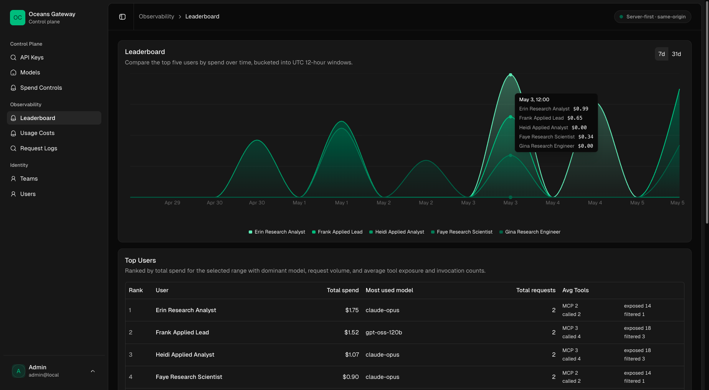
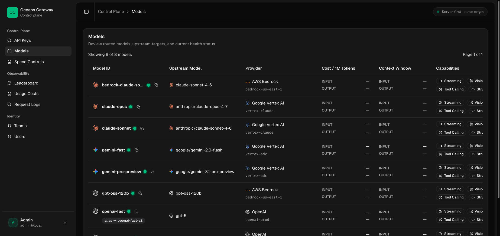
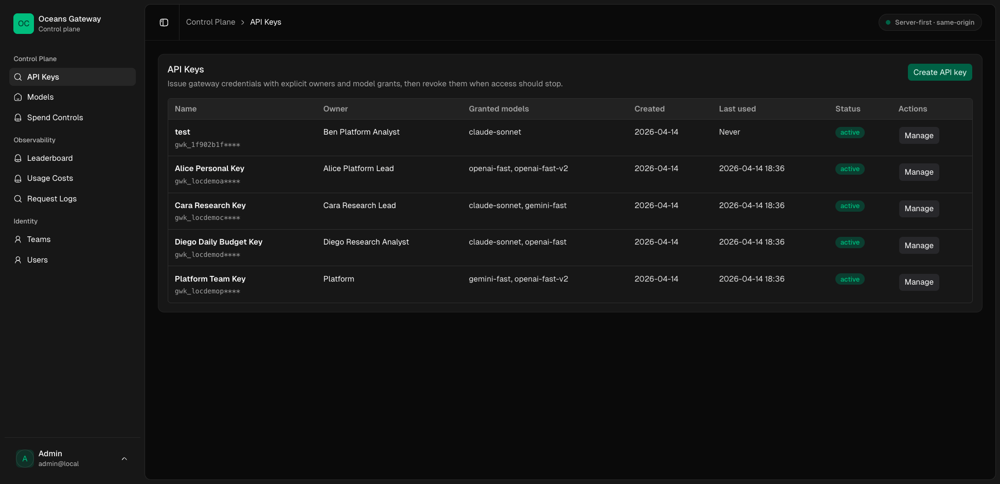
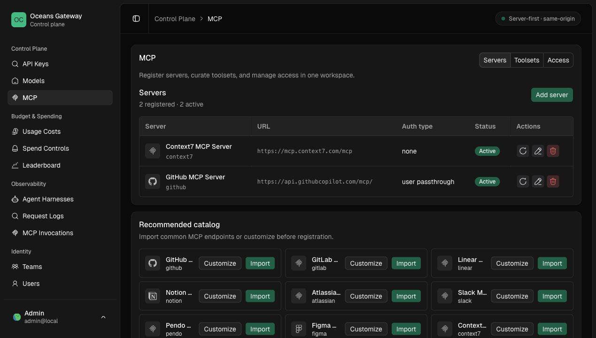
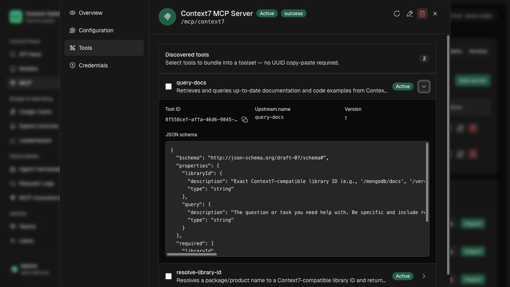
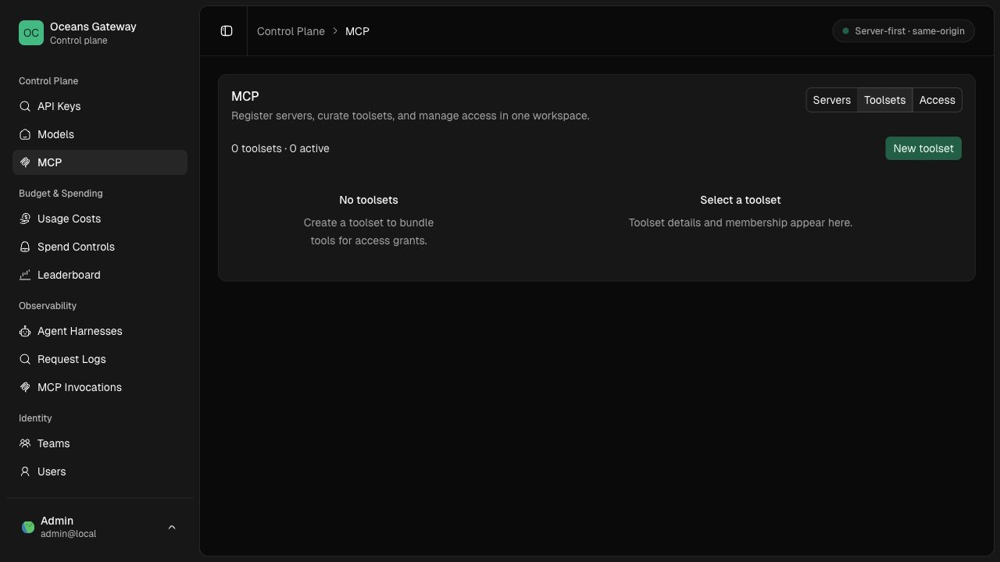
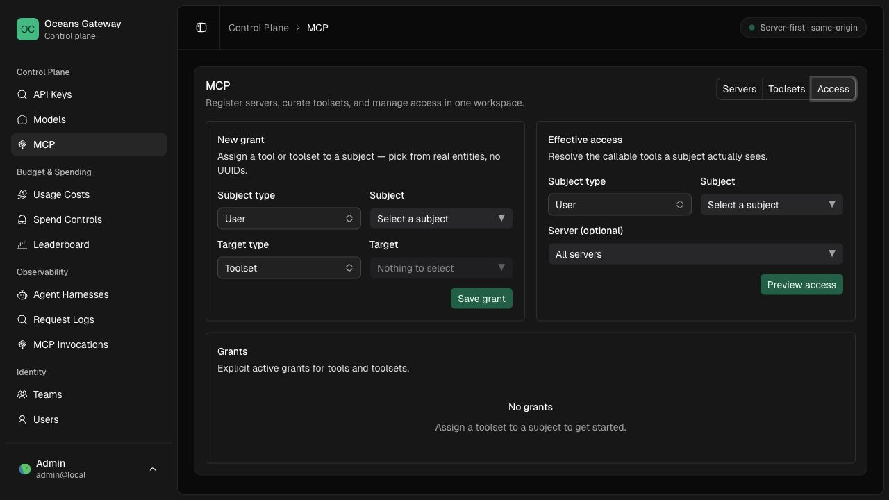
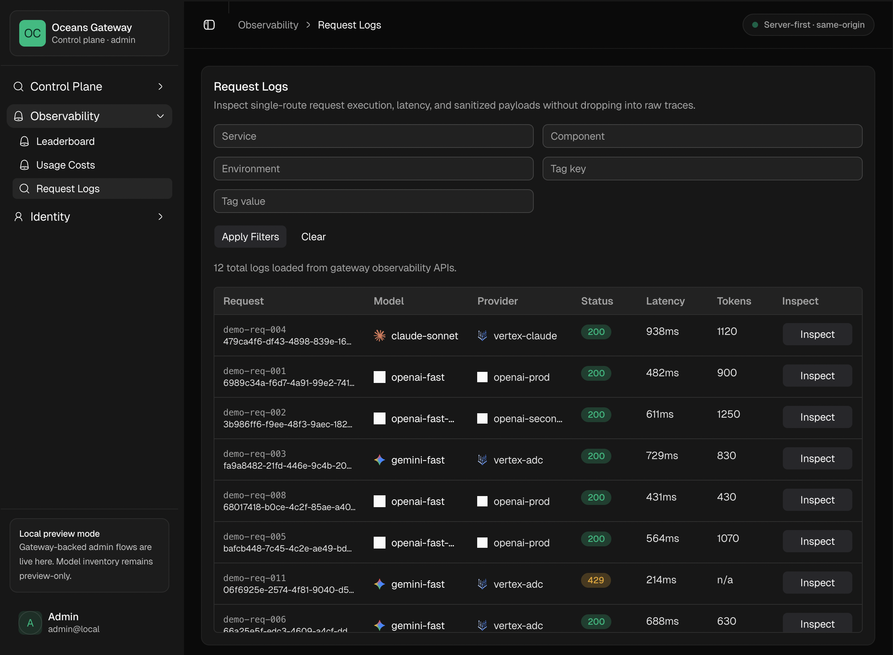
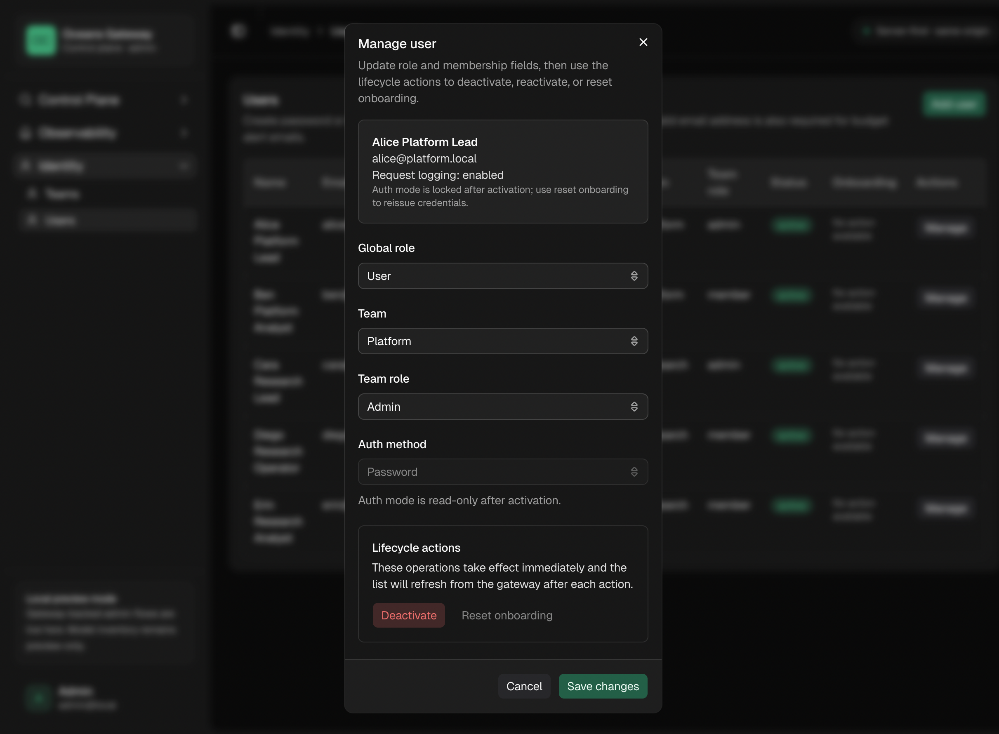

# Screenshots

`See also`: [Admin Control Plane](../access/admin-control-plane.md), [Observability and Request Logs](../operations/observability-and-request-logs.md), [Admin API Contract Workflow](admin-api-contract-workflow.md)

Reference screenshots for the admin UI. These images are useful when reviewing documentation, release notes, and user-facing workflow changes.

## Leaderboard

Shows request and usage ranking across the gateway's observed traffic.

## Models

Shows configured models, provider identity, model metadata, and routing context.

## Model Client Config

Shows generated client configuration snippets for selected models, including grouped OpenCode/Pi providers and multi-block clients such as Claude Code `settings.json`.

## API Keys

Shows API key ownership, access grants, lifecycle state, and management actions.

## MCP Servers

Shows registered MCP servers and the recommended catalog.

## MCP Server Tools

Shows the server detail dialog with discovered tools and an expanded JSON schema.

## MCP Toolsets

Shows named bundles of discovered MCP tools used for reusable grants.

## MCP Access Grants

Shows tool and toolset grants plus effective-access preview.

## Request Logs

Shows recent gateway requests with request status, routing, and observability context.

## User Editing

Shows the admin workflow for editing a user record.

