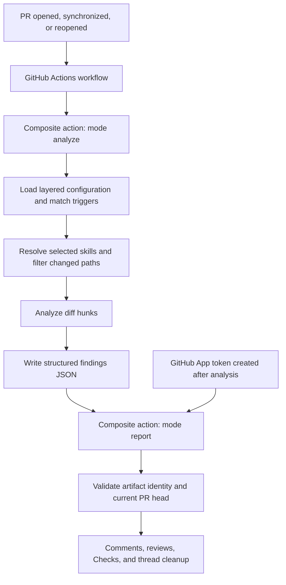
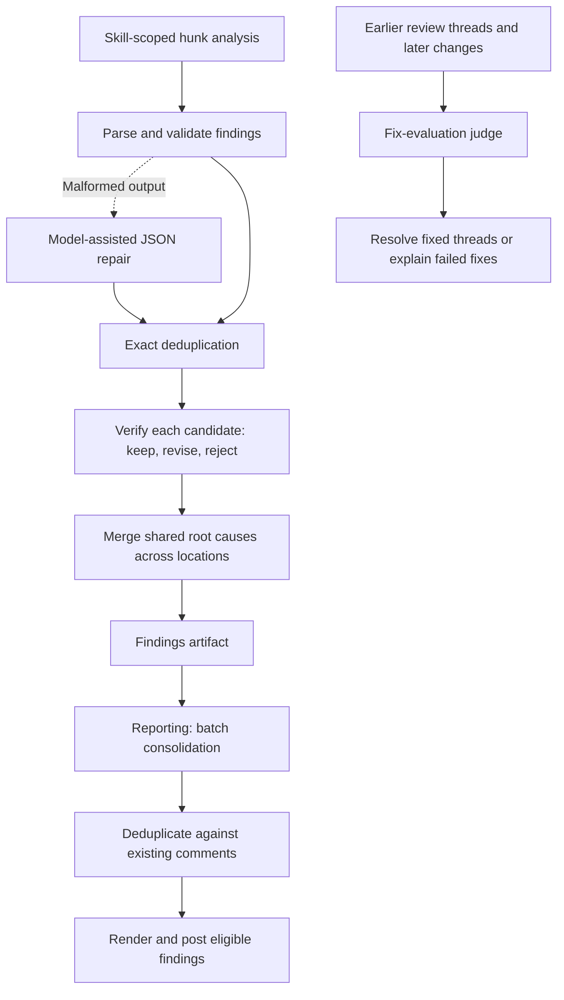

# Warden: Actions, agent, and comment flow

Source snapshot: getsentry/warden at `6d361c0473a3236cc31c4fbe4a0a281b84679eb8`. This is a source inspection, not a live Actions or provider test. Links below refer to that commit.

## Actions entry and trigger matching



The checked-in workflow listens directly to `pull_request` actions `opened`, `synchronize`, and `reopened`. It builds the action, runs `analyze`, creates a GitHub App token, then runs `report` with the findings path. The composite action executes `dist/action/index.js` under Node. The checked-in `warden.toml` selects Pi and the built-in security-review and code-review skills, with path filters and matching PR triggers. The action also retains a legacy combined `run` mode.

Source: [workflow and configuration](checked-in-workflow-and-skill-selection.md), [action.yml](https://github.com/getsentry/warden/blob/6d361c0473a3236cc31c4fbe4a0a281b84679eb8/action.yml), [PR workflow](https://github.com/getsentry/warden/blob/6d361c0473a3236cc31c4fbe4a0a281b84679eb8/packages/warden/src/action/workflow/pr-workflow.ts).

Unlike Pullfrog's service-dispatch flow, this workflow starts from GitHub PR events directly. Warden's optional service supports telemetry/findings and repository memory; it is not required as the dispatcher for this workflow.

## Prompt and skill assembly

```text
Matched skill
  Load SKILL.md frontmatter and body
  Build system prompt
    Warden role and evidence requirements
    Selected skill rubric
    Findings JSON contract
    Optional historical evidence
    Optional skill resource directory paths
  Build user prompt
    Skill name and PR context
    Other changed files
    Formatted diff hunk and line range
    Skill-scope reminder
```

Warden resolves skills itself. Named local skills are searched in `.warden/skills`, `.agents/skills`, then `.claude/skills`; local definitions override packaged defaults. Remote skill resolution is also supported. A skill's `references`, `scripts`, and `assets` directories can be exposed as paths for the agent to inspect. Baseline review skills allow `Read`, `Grep`, and `Glob`, and tell the reviewer which language or workflow references to read.

The baseline code-review rubric requires a concrete correctness failure. The security rubric requires an attacker-controlled source, vulnerable sink or missing guard, security boundary, and impact. Both exclude broad style and best-practice advice. The repository architecture-review skill is separate and is not selected by this checkout's PR configuration.

Source: [skill loader](https://github.com/getsentry/warden/blob/6d361c0473a3236cc31c4fbe4a0a281b84679eb8/packages/warden/src/skills/loader.ts), [hunk system prompt](hunk-analysis-system-prompt.md), [hunk user prompt](hunk-analysis-user-prompt.md), [code-review skill](code-review-skill.md), [security-review skill](security-review-skill.md).

## Harness and model requests

| Runtime | Review execution | Auxiliary execution |
|---|---|---|
| Pi, the default | In-memory `createAgentSession`, then `session.prompt`; model and credentials resolved by the adapter | Pi sessions with a structured-output system prompt, schema, and optional custom tools |
| Claude | Claude Agent SDK `query` with system/user prompts, read-only tool policy, model, and turn limits | Anthropic client `messages.create` through `callHaiku` or `callHaikuWithTools`; despite the helper names, callers can supply a model |

Pi's resource loader disables automatic extensions, skills, prompt templates, themes, and context files. Warden has already loaded and composed the selected skill. It also wraps file tools to constrain access to the checkout. Claude review execution denies `Task` and `TodoWrite`; its reviewer does not dispatch a hierarchy of specialists.

Source: [runtime contracts](runtime-agent-contracts.md), [Pi session definition](pi-review-agent-session-definition.md), [Claude query definition](claude-review-agent-query-definition.md), [Claude structured execution](https://github.com/getsentry/warden/blob/6d361c0473a3236cc31c4fbe4a0a281b84679eb8/packages/warden/src/sdk/runtimes/claude.ts#L135), [Anthropic calls](https://github.com/getsentry/warden/blob/6d361c0473a3236cc31c4fbe4a0a281b84679eb8/packages/warden/src/sdk/haiku.ts).

## Review and auxiliary agents



These are code-scheduled roles, not named specialist subagents selected by a lead reviewer. Hunk execution uses bounded concurrency. Post-processing performs exact deduplication, candidate verification by default, then root-cause merging. The verifier gets the same skill rubric and read-only code tools.

Verification is not a strict proof gate: its prompt says to keep or narrow plausible findings when broader context is incomplete. Invalid verdicts preserve the original finding, and ordinary verification errors can also preserve it. The verifier cannot move an already validated finding's anchor. Merge or semantic-deduplication failures generally retain findings or fall back to deterministic matching.

Source: [analysis pipeline](https://github.com/getsentry/warden/blob/6d361c0473a3236cc31c4fbe4a0a281b84679eb8/packages/warden/src/sdk/analyze.ts), [post-processing](https://github.com/getsentry/warden/blob/6d361c0473a3236cc31c4fbe4a0a281b84679eb8/packages/warden/src/sdk/post-process.ts), [verifier prompt](finding-verifier-system-prompt.md), [verifier implementation](https://github.com/getsentry/warden/blob/6d361c0473a3236cc31c4fbe4a0a281b84679eb8/packages/warden/src/sdk/verify.ts), [fix judge](fix-evaluation-judge-prompt.md).

## How comments are posted

Analysis returns JSON. The model does not directly post GitHub comments through a tool. The report phase reads the artifact, validates repository/event/PR/head identity, and applies current reporting configuration. It does not rerun the review skills, but it can still make auxiliary model calls for deduplication and fix evaluation.

Reporting filters by severity and confidence, consolidates findings, and compares them with existing comments. The renderer creates a bold title, short description, collapsible Evidence block, optional additional locations, skill attribution, and hidden deduplication metadata. The poster calls `octokit.pulls.createReview`, anchored to the analyzed head SHA, after checking that the run can still write to the current PR head.

Non-blocking reviews with no inline comments are kept in Checks rather than posted as body-only timeline entries. Blocking review behavior requires the request-changes setting. Report thresholds and failure thresholds are separate; the action defaults are `report-on: medium`, `fail-on: high`, `request-changes: false`, and `fail-check: false`.

Later runs inspect previous threads. A judge distinguishes `resolved`, `attempted_failed`, and `not_attempted`; cleanup can resolve stale/fixed threads, reply to failed fixes, or dismiss an earlier changes-requested review when appropriate. Writes are performed by deterministic GitHub integration code using the workflow token.

Source: [renderer](https://github.com/getsentry/warden/blob/6d361c0473a3236cc31c4fbe4a0a281b84679eb8/packages/warden/src/output/renderer.ts), [poster](https://github.com/getsentry/warden/blob/6d361c0473a3236cc31c4fbe4a0a281b84679eb8/packages/warden/src/action/review/poster.ts), [feedback gate](https://github.com/getsentry/warden/blob/6d361c0473a3236cc31c4fbe4a0a281b84679eb8/packages/warden/src/action/review/review-feedback-gate.ts), [thread cleanup](https://github.com/getsentry/warden/blob/6d361c0473a3236cc31c4fbe4a0a281b84679eb8/packages/warden/src/action/workflow/pr-workflow.ts#L876).
